# Generics & Collections


### toString(), hashCode(), and equals() 

Some important methods in class java.lang.Object :

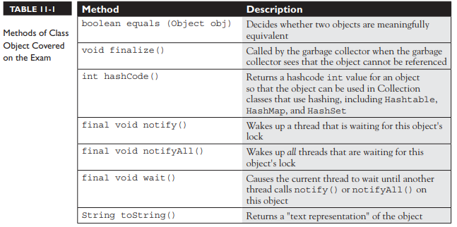


### The toString() Method

Code calls toString() on your object when it wants to read useful details about your object. For eg, it is invoked when you pass an object reference to the System.out.println() method.

```java

public class HardToRead {
    public static void main(String[] args) {
        HardToRead h = new HardToRead();
        System.out.println(h);
    }
}

//Running the HardToRead class gives us the lovely and meaningful
%java HardToRead
HardToRead @a47e0

```
Because you don’t override the toString() method of class Object, the output is class name followed by the @ symbol, followed by the unsigned hexadecimal representation of the object’s hashcode.

By overriding the toString() method in your classes, we can get a readable output, for example:
```java
public class BobTest {
    public static void main(String[] args) {
        Bob f = new Bob("GoBobGo", 19);
        System.out.println(f);
    }
}
class Bob {
    int shoeSize;
    String nickName;
    Bob(String nickName, int shoeSize) {
        this.shoeSize = shoeSize;
        this.nickName = nickName;
    }
    public String toString() {
        return ("I am a Bob, but you can call me " + nickName +
            ". My shoe size is " + shoeSize);
    }
}

//This ought to be a bit more readable:
%java BobTest
I am a Bob, but you can call me GoBobGo.My shoe size is 19

```

### Overriding equals()
Common uses of the equals() method:

- To sort or search through a collection of objects, the equals() and hashCode() methods are essential. 

- String class has overridden the equals() method (inherited from the class Object), so you could compare two different String objects to see if their contents are equivalent. 

- There is a wrapper class for every kind of primitive. The folks who created the Integer class decided that if two different Integer instances both hold the int value 5, they are equal. The fact that the value 5 lives in two separate objects doesn't matter.

- To know if two object references are identical, use ==. But to know if the attributes of the objects themselves (not the references) are equal, use the equals() method. 

For each class you write, you must decide if it makes sense to consider two different instances equal. 

### What It Means If You Don't Override equals()

Unless you override equals(), two objects are considered equal only if the two references refer to the same object, since the equals() method in class Object uses only the == operator for comparisons.

- You won't be able to use those objects as a key in a hashtable 
- You won't get accurate Sets such that there are no conceptual duplicates. 

**Let's look at what it means to not be able to use an object as a hashtable key.**  
Imagine you have a car (say, John's red Subaru Outback as opposed to Mary's purple Mini). Let’s say you add a car instance as the key to the HashMap (along with a corresponding Person object as the value). But now what happens when you want to search a Person given a car. But now you're in trouble unless you still have a reference to the exact object you used as the key when you added it to the Collection. In other words, you can't make an identical Car object and use it for the search.

**If you want objects of your class to be used as keys for a hashtable (or as elements in any data structure that uses equivalency for searching for—and/or retrieving—an object), then you must override equals() so that two different instances can be considered the same.**

So how would we fix the car? You might override the equals() method so that it compares the unique VIN (Vehicle Identification Number) as the basis of comparison. That way, you can use one instance when you add it to a Collection and essentially re-create an identical instance when you want to do a search based on that object as the key. Of course, overriding the equals() method for Car also allows the potential for more than one object representing a single unique car to exist, which might not be safe in your design. 

**Fortunately, the String and wrapper classes work well as keys in hashtables— they override the equals() method.**  
So rather than using the actual car instance as the key into the car/owner pair, you could simply use a String that represents the unique identifier for the car. That way, you'll never have more than one instance representing a specific car, but you can still use the car—or rather, one of the car's attributes—as the search key.

### Implementing an equals() Method

```java
public class EqualsTest {
    public static void main(String[] args) {
        Moof one = new Moof(8);
        Moof two = new Moof(8);
        if (one.equals(two)) {
            System.out.println("one and two are equal");
        }
    }
}
class Moof {
    private int moofValue;
    Moof(int val) {
        moofValue = val;
    }
    public int getMoofValue() {
        return moofValue;
    }
    public boolean equals(Object o) {
        if ((o instanceof Moof) && (((Moof) o).getMoofValue() ==
                this.moofValue)) {
            return true;
        } else {
            return false;
        }
    }
}
```

**Problem Statement:** Two Moof objects are the same if their moofValue is identical. So you need to override the equals() method and compare the two Moof instances. 

**What happens in the equals() method ?**  
We have to do two things in order to make a valid equality comparison of two Moof objects. 

Firstly, the object being tested comes in polymorphically as type Object, so you need to do an instanceof test on it just to be sure that you could cast the object argument to the correct type. If you skip the instanceof test, then you'll get a runtime ClassCastException when the (Moof)o cast will fail if o doesn't refer to something that IS-A Moof. 

Second, compare the attributes we care about (in this case, just moofValue). 

Casting the object reference, o, is necessary so that you can access its methods or variables in to do the comparison. Without the cast, you can't compile because the compiler would see the object referenced by o as an Object and the Object class doesn't have a getMoofValue().

**A Java contract is a set of rules that must be followed if you want to provide a "correct" implementation as others will expect it to be. If you don't follow the contract, your code may still compile and run, but your code (or someone else's) may break at runtime in some unexpected way.**

**The equals() contract says**
- It is reflexive. For any reference value x, x.equals(x) should return true. 
- It is symmetric. For any reference values x and y, x.equals(y) should return true if and only if y.equals(x) returns true. 
- It is transitive. For any reference values x, y, and z, if x.equals(y) returns true and y.equals(z) returns true, then x.equals(z) must return true. 
- It is consistent. For any reference values x and y, multiple invocations of x.equals(y) consistently return true or consistently return false, provided no information used in equals() comparisons on the object is modified. 
- For any non-null reference value x, x.equals(null) should return false. 


### Overriding hashCode()
The hashcode value of an object is used by some collection classes. Although you can think of it as kind of an object ID number, it isn't necessarily unique. 

Collections such as HashMap and HashSet use the hashcode value of an object to determine how the object should be stored in the collection, and the hashcode is used again to help locate the object in the collection. 

**Understanding Hashcodes**  
Consider the implementation of a HashMap. Basically there is an arrayList where each cell represents a bucket and each array index represents a bucketIndex. A bucket is represented using a linkedlist i.e. each cell will be storing a linkedlist.

Whenever a key value pair need to be put, Hashcode of the key determines in which bucket should the key-value pair be inserted. 
Now you need to retrieve the value that matches a given key. The hashcode tells you in which bucket you should look to find the key-value pair. 

*A hashcode is just an integer generated by an algorithm* that will always run the same way given a specific input, so the output will always be identical for any two identical inputs. 

For example, key is a string value then the a possible hashcode algorithm could be : You take the string and calculate an integer code from it by using A is 1, B is 2, and so on, adding the numeric values of all the letters in the string together. 

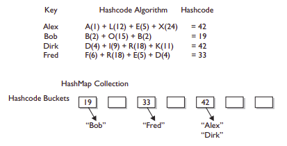

**Note:** Two different names might result in the same value. That's acceptable. The hashcode tells you only which bucket to go into and not how to locate the name once we're in that bucket.
You'll still have to search through the target bucket, reading each name until we find the desired name.

**In real-life hashing, it's common to have more than one entry in a bucket. Hashing retrieval is a two-step process.**   
**1. Find the right bucket (using hashCode()).**  
**2. Search the bucket for the right element (using equals())**  

**If two objects are equal, their hashcodes must be equal as well. Two unequal objects may or may not have different hashcodes.**

### Implementing hashCode()
```java
class HasHash {
    public int x;
    HasHash(int xVal) {
        x = xVal;
    }
    public boolean equals(Object o) {
        HasHash h = (HasHash) o; // Don't try at home without
        // instanceof test
        if (h.x == this.x) {
            return true;
        } else {
            return false;
        }
    }
    public int hashCode() {
        return (x * 17);
    }
}
```

Typically, you'll see hashCode() methods that do some combination of ^-ing (XOR-ing) a class's instance variables (in other words, twiddling their bits), along with perhaps multiplying them by a prime number. In any case, while the goal is to get a wide and random distribution of objects across buckets, **the contract requires only that two equal objects have equal hashcodes.**

So in order for an object to be located, the search object and the object in the collection must both have identical hashcode values and return true for the equals() method. 
So you must override both methods to be absolutely certain that your objects can be used in Collections that use hashing.

**The hashCode() Contract**  
**- Whenever it is invoked on the same object more than once during an execution of a Java application, the hashCode() method must consistently return the same integer, provided that no information used in equals() comparisons on the object is modified.**  

**- If two objects are equal according to the equals(Object) method, then calling the hashCode() method on each of the two objects must produce the same integer result.**  

**- It is NOT required that if two objects are unequal according to the equals(java.lang.Object) method, then calling the hashCode() method on each of the two objects must produce distinct integer results.**


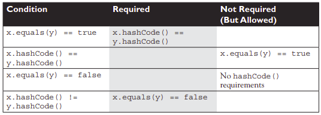

**What happens if you include a transient variable in your hashCode() method?**  
While that's legal (the compiler won't complain), under some circumstances, an object you put in a collection won't be found. As you might know, serialization saves an object so that it can be reanimated later by deserializing it back to full objectness. But transient variables are not saved when an object is serialized.

```java
class SaveMe implements Serializable {
    transient int x;
    int y;
    SaveMe(int xVal, int yVal) {
        x = xVal;
        y = yVal;
    }
    public int hashCode() {
        return (x ^ y); // Legal, but not correct to
        // use a transient variable
    }
    public boolean equals(Object o) {
        SaveMe test = (SaveMe) o;
        if (test.y == y && test.x == x) { // Legal, not correct
            return true;
        } else {
            return false;
        }
    }
}
```

Here's what could happen using code like the preceding example: 
1. Give an object some state (assign values to its instance variables). Eg: x = 9, y = 7
2. Put the object in a HashMap, using the object as a key. 
3. Save the object to a file using serialization without altering any of its state. 
4. Retrieve the object from the file through deserialization. The object's transient variable will come back with a default value x==0 rather than the value the variable had at the time it was saved
5. Use the deserialized object to get the object out of the HashMap. So the new hashcode calculation will give a different hashcode and the equals() method fails as well since x is used to determine object equality.


**Bottom line: transient variables can really mess with your equals() and hashCode() implementations. Keep variables non-transient or, if they must be marked transient, don't use them to determine hashcodes or equality.**


### Collections
The Collections Framework in Java, gives you lists, sets, maps, and queues to satisfy most of your coding needs. 

**Basic operations you'll normally use with collections:**  
- Add objects to the collection. 
- Remove objects from the collection. 
- Find out if an object (or group of objects) is in the collection. 
- Retrieve an object from the collection without removing it. 
- Iterate through the collection, looking at each element (object) one after another.


**Key Interfaces and Classes of the Collections Framework**

**The core interfaces:**
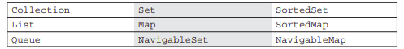

**The concrete implementation classes:**
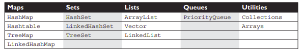


**There are really three overloaded uses of the word "collection":**  

- **collection (lowercase c)**, which represents any of the data structures in which objects are stored and iterated over. 

- **Collection (capital C)** is the java.util.Collection interface (with declarations of the methods common to most collections, including add(), remove(), contains(), size(), and iterator()) from which Set, List, and Queue extend. (That's right, extend, not implement. There are no direct implementations of Collection.) 

- **Collections (capital C and ends with s)** is the java.util.Collections class that holds a pile of static utility methods for use with collections.

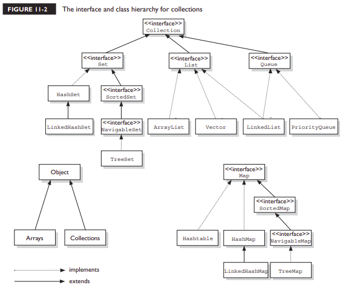


**Not all collections in the Collections Framework actually implement the Collection interface. In other words, not all collections pass IS-A test for Collection.**  

**Specifically, none of the Map-related classes and interfaces extend from Collection. So while SortedMap, Hashtable, HashMap, TreeMap, and LinkedHashMap are all thought of as collections, none are actually extended from Collection-with-a capital-C.**  

**Collections come in four basic flavors:**  
**Lists** *Lists of things (classes that implement List)*  
**Sets** *Unique things (classes that implement Set)*  
**Maps** *Things with a unique ID (classes that implement Map)*  
**Queues** *Things arranged by the order in which they are to be processed*  

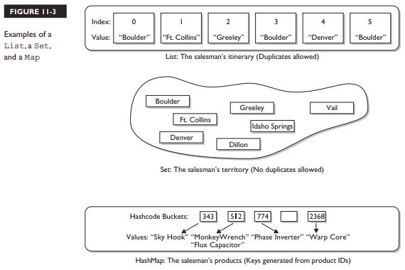


An implementation class can be unsorted and unordered, ordered but unsorted, or both ordered and sorted. But an implementation can never be sorted but unordered, because sorting is a specific type of ordering. For example, a HashSet is an unordered, unsorted set, while a LinkedHashSet is an ordered (but not sorted) set that maintains the order in which objects were inserted.

**Ordered**   
An ordered collection means you can iterate through the collection in a specific (not random) order.   
A Hashtable collection is not ordered. Although the Hashtable itself has internal logic to determine the order (based on hashcodes and the implementation of the collection itself), you won't find any order when you iterate through the Hashtable. 
An ArrayList, keeps the order established by the elements' index position (just like an array).  
LinkedHashSet keeps the order established by insertion (as opposed to an ArrayList, where you can insert an element at a specific index position). 

**Sorted**  
A sorted collection means that the collection keeps the elements in order determined according to some rule or rules, known as the sort order.  

Most commonly, the sort order used is the natural order.  
- For a collection of String objects, the natural order is alphabetical order. 
- For Integer objects, the natural order is by numeric value—1 before 2, and so on. 
- There is no natural order for custom objects unless the Foo developer provides one through an interface (Comparable or Comparator) that defines how instances of a class can be compared to one another.  
**NOTE:** sort order (including natural order) is not the same as ordering by insertion, access, or index.


**List Interface**  
A List cares about the index. The one thing that List has that non-lists don't is a set of methods related to the index like get(int index), indexOf(Object o), add(int index, Object obj), and so on. 

All three List implementations are ordered by index position—a position that you determine either by setting an object at a specific index or by adding it without specifying position, in which case the object is added to the end. 


**ArrayList**  
It’s a growable array & gives you fast iteration and fast random access. 
It is an ordered collection (by index), but not sorted. 
Choose this over a LinkedList when you need fast iteration but aren't as likely to be doing a lot of insertion and deletion. 

**Vector**   
A Vector is basically the same as an ArrayList, but Vector methods are synchronized for thread safety. You'll normally want to use ArrayList instead of Vector because the synchronized methods add a performance hit you might not need. And if you do need thread safety, there are utility methods in class Collections that can help. Vector is the only class other than ArrayList to implement RandomAccess.

**LinkedList**  
A LinkedList is ordered by index position, like ArrayList, except that the elements are doubly linked to one another. This linkage gives you new methods (beyond what you get from the List interface) for adding and removing from the beginning or end, which makes it an easy choice for implementing a stack or queue. Keep in mind that a LinkedList may iterate more slowly than an ArrayList, but it's a good choice when you need fast insertion and deletion. As of Java 5, the LinkedList class has been enhanced to implement the java.util. Queue interface & it now supports the common queue methods peek(), poll(), and offer().

**Set Interface**  
A Set cares about uniqueness—it doesn't allow duplicates. The equals() method determines whether two objects are identical (in which case, only one can be in the set). 

The three Set implementations are:  
**HashSet**  
A HashSet is an unsorted, unordered Set. It uses the hashcode of the object being inserted, so the more efficient your hashCode() implementation, the better access performance you'll get. 

**LinkedHashSet**  
A LinkedHashSet is an ordered version of HashSet that maintains the insertion order using  a doubly linked List across all elements. 

**When using HashSet or LinkedHashSet, the objects you add to them must override hashCode(). If they don't override hashCode(), the default Object.hashCode() method will allow multiple objects that you might consider "meaningfully equal" to be added to your "no duplicates allowed" set.**  

**TreeSet**  
The TreeSet is a sorted collection. It uses a Red-Black tree structure, and guarantees that the elements will be in ascending order, according to the natural order. Optionally TreeSet lets you define a custom sort order via a Comparator when you construct a TreeSet. As of Java 6, TreeSet implements NavigableSet.

**Map Interface**  
Lets you map a unique key (the ID) to a specific value, where both the key and the value are objects. The Map implementations let you do things like search for a value based on the key, ask for a collection of just the values, or ask for a collection of just the keys. 

Like Sets, Maps rely on the equals() method to determine whether two keys are the same or different.
	
**HashMap**  
The HashMap gives you an unsorted, unordered Map. Where the keys land in the Map is based on the key's hashcode, so, like HashSet, the more efficient your hashCode() implementation, the better access performance you'll get. HashMap allows one null key and multiple null values in a collection. 

**Hashtable**  
Just as Vector is a synchronized counterpart to the ArrayList, Hashtable is the synchronized counterpart to HashMap. Remember that you don't synchronize a class, so when we say that Vector and Hashtable are synchronized, we just mean that the key methods of the class are synchronized. 
Another difference, though, is that while HashMap lets you have null values as well as one null key, a Hashtable doesn't let you have anything that's null. 

**LinkedHashMap**   
Like its Set counterpart, LinkedHashSet, the LinkedHashMap collection maintains insertion order. Although it will be somewhat slower than HashMap for adding and removing elements, you can expect faster iteration with a LinkedHashMap. 

**TreeMap**   
A TreeMap is a sorted Map i.e sorted by the natural order of the elements by default. Like TreeSet, TreeMap lets you define a custom sort order via a Comparator when you construct a TreeMap. As of Java 6, TreeMap implements NavigableMap.

**Queue Interface**   
A Queue is designed to hold a list of things to be processed in some way. Queues support all of the standard Collection methods and they also have methods to add and subtract elements and review queue elements. 

**PriorityQueue**   
Since the LinkedList class has been enhanced to implement the Queue interface, basic queues can be handled with a LinkedList. The purpose of a PriorityQueue is to create a "priority-in, priority out" queue as opposed to a typical FIFO queue. A PriorityQueue's elements are ordered either by natural ordering (in which case the elements that are sorted first will be accessed first) or according to a Comparator. In either case, the elements' ordering represents their relative priority.

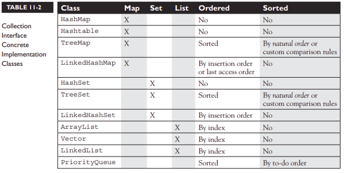


### Using Collections 

## ArrayList Basics

Let's take a look at using an ArrayList that contains strings. In practice, you'll typically want to instantiate an ArrayList polymorphically, like this: **List myList = new ArrayList();**

As of Java 5, you'll want to say: **List<**String> myList = new ArrayList<**String>();**

This kind of declaration follows the object-oriented programming principle of "coding to an interface," and it makes use of generics. (Prior to Java 5, there was no way to specify the type of a collection, and when we cover generics)

In many ways, ArrayList is similar to a String[] in that it declares a container that can hold only strings but some of the advantages ArrayList has over arrays are
- It can grow dynamically. 
- It provides more powerful insertion and search mechanisms than arrays.

```java
List<String> test = new ArrayList<String>(); 	// declare the ArrayList
String s = "hi";
test.add("string"); 				// add some strings
test.add(s);
test.add(s+s);
System.out.println(test.size()); 		// use ArrayList methods
System.out.println(test.contains(42));
System.out.println(test.contains("hihi"));
test.remove("hi");
System.out.println(test.size());

//which produces
3
false
true
2
```
Notice that when we declared the ArrayList we didn't give it a size. 
We were able to ask the ArrayList for its size and whether it contained specific objects, we removed an object right out from the middle of it, and then we rechecked its size.

## Autoboxing with Collections
In general, collections can hold Objects but not primitives. Prior to Java 5, a common use for the so-called "wrapper classes" (e.g., Integer, Float, Boolean, and so on) was to provide a way to get primitives into and out of collections. Prior to Java 5, you had to "wrap" a primitive manually before you could put it into a collection. With Java 5, primitives still have to be wrapped, but autoboxing takes care of it for you.

```java

//Prior to Java 5
List myInts = new ArrayList(); 		// pre Java 5 declaration
myInts.add(new Integer(42)); 		// Use Integer to "wrap" an int

//As of Java 5, we can say:
myInts.add(42); 			// autoboxing handles it!

```

```java

//In pre–Java 5 days, if you wanted to make a wrapper, unwrap it, use it, and then rewrap it, you might do something like this:
Integer y = new Integer(567); 		// make it
int x = y.intValue(); 			// unwrap it
x++; 					// use it
y = new Integer(x); 			// rewrap it
System.out.println("y = " + y); 	// print it

//Now, with new and improved Java 5, you can say
Integer y = new Integer(567); 		// make it
y++; 					// unwrap it, increment it,
 					// rewrap it
System.out.println("y = " + y); 	// print it

//Both examples produce the following output:
y = 568

```

The code appears to be using the postincrement operator on an object reference variable! But it's simply a convenience. Behind the scenes, the compiler does the unboxing and reassignment for you. **Earlier, we mentioned that wrapper objects are immutable…** this example appears to contradict that statement. It sure looks like y's value changed from 567 to 568. What actually happened, however, is that a second wrapper object was created and its value was set to 568.

```java
Integer y = 567; 			// make a wrapper
Integer x = y; 				// assign a second ref var to THE wrapper
				
System.out.println(y==x); 		// verify that they refer to the same object
y++; 					// unwrap, use, "rewrap"
System.out.println(x + " " + y); 	// print values

System.out.println(y==x); 		// verify that they refer to different objects

//Which produces the output:
true
 567 568
 false

//So, under the covers, when the compiler got to the line y++; it had to substitute something like this:
int x2 = y.intValue(); 			// unwrap it
x2++; 					// use it
y = new Integer(x2); 			// rewrap it
```

**How wrappers work with ==, !=, and equals() ?**
The API developers decided that for all the wrapper classes, two objects are equal if they are of the same type and have the same value. It shouldn't be surprising that

```java
Integer i1 = 1000;
Integer i2 = 1000;
if(i1 != i2) System.out.println("different objects");
if(i1.equals(i2)) System.out.println("meaningfully equal");

//output
different objects
meaningfully equal
```
It's just two wrapper objects that happen to have the same value. Because they have the same int value, the equals() method considers them to be "meaningfully equivalent," and therefore returns true. 

**How about this one:**

```java
Integer i3 = 10;
Integer i4 = 10;
if(i3 == i4) System.out.println("same object");
if(i3.equals(i4)) System.out.println("meaningfully equal");

//This example produces the output:
same object
meaningfully equal
```

**Yikes! The equals() method seems to be working, but what happened with == and !=? Why is != telling us that i1 and i2 are different objects, when == is saying that i3 and i4 are the same object?**

In order to save memory, two instances of the following wrapper objects (created through boxing) will always be == when their primitive values are the same:
- Boolean 
- Byte 
- Character from \u0000 to \u007f (7f is 127 in decimal) 
- Short and Integer from –128 to 127 

**The key to the answer is called object interning. Java interns small numbers (less than 128), so all instances of Integer(n) with n in the interned range are the same. Numbers greater than or equal to 128 are not interned, hence Integer(1000) objects are not equal to each other.**  

**When == is used to compare a primitive to a wrapper, the wrapper will be unwrapped and the comparison will be primitive to primitive.**

**Where Boxing Can Be Used**   
It's common to use wrappers in conjunction with collections. Any time you want your collection to hold objects and primitives, you'll want to use wrappers to make those primitives collection-compatible.  

The general rule is that boxing and unboxing work wherever you can normally use a primitive or a wrapped object. The following code demonstrates some legal ways to use boxing

```java
class UseBoxing {
    public static void main(String[] args) {
        UseBoxing u = new UseBoxing();
        u.go(5);
    }

    boolean go(Integer i) { 		// boxes the int it was passed
        Boolean ifSo = true; 		// boxes the literal
        Short s = 300; 			// boxes the primitive
        if (ifSo) { 			// unboxing
            System.out.println(++s); 	// unboxes, increments, reboxes
        }
        return !ifSo; 			// unboxes, returns the inverse
    }
}
 ```
 
 **Remember, wrapper reference variables can be null. That means you have to watch out for code that appears to be doing safe primitive operations but that could throw a NullPointerException:**   
 
 ```java
 class Boxing2 {
     static Integer x;
     public static void main(String[] args) {
         doStuff(x);
     }
     static void doStuff(int z) {
         int z2 = 5;
         System.out.println(z2 + z);
     }
 }
```
This code compiles fine, but the JVM throws a NullPointerException when it attempts to invoke doStuff(x) because x doesn't refer to an Integer object, so there's no value to unbox.

### The Java 7 "Diamond" Syntax
**Prior to Java 7, declaring type-safe collections before diamond syntax:**  
```java
ArrayList<String> stuff = new ArrayList<String>();
List<Dog> myDogs = new ArrayList<Dog>();
Map<String, Dog> dogMap = new HashMap<String, Dog>();
```

**As of Java 7, the type parameters duplicated in these declarations could be simplified to.**  
```java
ArrayList<String> stuff = new ArrayList<>();
List<Dog> myDogs = new ArrayList<>();
Map<String, Dog> dogMap = new HashMap<>();
```

**Notice that in the simpler Java 7 declarations, the right side of the declaration included the two characters "<>," which together make a diamond shape!**  


## Sorting Collections and Arrays
Both collections and arrays can be sorted and searched using methods in the API.

### Sorting Collections
Let's start with something simple, like sorting an ArrayList of strings alphabetically. 
The java.util.Collections class does provide some static utility methods for the same.

```java
import java.util.*;
class TestSort1 {
    public static void main(String[] args) {
        ArrayList < String > stuff = new ArrayList < String > (); 	// #1
        stuff.add("Denver");
        stuff.add("Boulder");
        stuff.add("Vail");
        stuff.add("Aspen");
        stuff.add("Telluride");
        System.out.println("unsorted " + stuff);
        Collections.sort(stuff); 					// #2
        System.out.println("sorted " + stuff);
    }
}

//This produces something like this:
unsorted[Denver, Boulder, Vail, Aspen, Telluride]
sorted[Aspen, Boulder, Denver, Telluride, Vail]
```

**Consider a DVDInfo class:**
```java
class DVDInfo {
    String title;
    String genre;
    String leadActor;
    DVDInfo(String t, String g, String a) {
        title = t;
        genre = g;
        leadActor = a;
    }
    public String toString() {
        return title + " " + genre + " " + leadActor + "\n";
    }
    // getters and setter go here
}
```

We create a list of DVDInfo instances and try to sort the collection.

```java
ArrayList<DVDInfo> dvdList = new ArrayList<DVDInfo>();
Collections.sort(dvdlist);
```

Oops! You get something like this:
```java
TestDVD.java:13: cannot find symbol
symbol : method sort(java.util.ArrayList<DVDInfo>)
location: class java.util.Collections
 Collections.sort(dvdlist);
```

**What's going on here?**
We know that the Collections class has a sort() method, yet this error implies that Collections does NOT have a sort() method that can take a dvdlist. That means there must be something wrong with the argument we're passing (dvdlist).  

When you read the description of the one-arg Collections.sort() method, you'll see that it takes a List argument, and that the objects in the List must implement an interface called Comparable. It turns out that String implements Comparable, and that's why we were able to sort a list of Strings using the Collections.sort() method.

**The Comparable Interface**
The Comparable interface is used by Collections.sort() method and java.util.Arrays.sort() method to sort Lists and arrays of objects, respectively. 

**Implementing the Comparable Interface**
```java
class DVDInfo implements Comparable < DVDInfo > { // #1
    // existing code
    public int compareTo(DVDInfo d) {
        return title.compareTo(d.getTitle()); // #2
    }
}
```

In line 1, we declare that class DVDInfo implements Comparable in such a way that DVDInfo objects can be compared to other DVDInfo objects.  

In line 2, we override the compareTo().  
The sort() method uses this compareTo() to determine how the List or object array should be sorted. The compareTo() method returns an int with the following characteristics:  

- **Negative** 	If thisObject < anotherObject 
- **Zero** 	If thisObject == anotherObject 
- **Positive** 	If thisObject > anotherObject

We override the method by comparing the two DVDInfo object's titles. 
Since we know that the titles are strings and that String implements Comparable, we can use the String class's implementation of compareTo() to sort our DVDInfo objects by title.

**Now, when we invoke Collections.sort(dvdList), our ArrayList will be sorted by title.**
```java
[2001 sci-fi ??
, Caddyshack comedy Murray, Bill
, Donnie Darko sci-fi Gyllenhall, Jake
, Lost in Translation comedy Murray, Bill
, Patriot Games action Ford, Harrison
, Raiders of the Lost Ark action Ford, Harrison
, Star Wars sci-fi Ford, Harrison
]
```

**Remember:**
When you override equals(), you MUST take an argument of type Object, but that when you override compareTo(), you should take an argument of the type you're sorting.

**But we'll probably want to sort DVD collections in lots of different ways. Since we sorted our ArrayList by implementing the compareTo() method, we seem to be stuck. We can only implement compareTo() once in a class.**  

**So how do we go about sorting our classes in an order different from what we specify in our compareTo() method?**

**Sorting with Comparator**  
There is an overloaded version of Collections.sort() method that takes both a List AND something called a Comparator. 

- The Comparator interface gives the capability to sort a given collection any number of different ways. 
- The Comparator interface can be used to sort instances of any class—even classes you can't modify—unlike the Comparable interface, which forces you to change the class whose instances you want to sort. 


**Implementing the Comparator interface**  
Here's a small class that can be used to sort a List of DVDInfo instances by genre:
```java
import java.util.*;
class GenreSort implements Comparator < DVDInfo > {
    public int compare(DVDInfo one, DVDInfo two) {
        return one.getGenre().compareTo(two.getGenre());
    }
}
```

The Comparator.compare() method returns an int whose meaning is the same as the Comparable.compareTo() method's return value.  

In this case, we're taking advantage of that by asking compareTo() to do the actual comparison work for us.  

**Testing the new Comparator code:**
```java
GenreSort gs = new GenreSort();
Collections.sort(dvdlist, gs);
System.out.println(dvdlist); // output sorted by genre

//Output
[Patriot Games action Ford, Harrison
, Raiders of the Lost Ark action Ford, Harrison
, Caddyshack comedy Murray, Bill
, Lost in Translation comedy Murray, Bill
, 2001 sci-fi ??
, Donnie Darko sci-fi Gyllenhall, Jake
, Star Wars sci-fi Ford, Harrison
]
 ```

**Sorting with the Arrays Class**
Sorting arrays of objects is just like sorting collections of objects.  

The java.util.Collections class is used to sort collections; Similarly the java.util.Arrays class can be used to sort arrays.  

The Arrays.sort() method is overloaded in the same way the Collections.sort() method is:  
Arrays.sort(arrayToSort)  
Arrays.sort(arrayToSort, Comparator)  

In addition, the Arrays.sort() method (the one argument version), is overloaded to provide sort methods for every type of primitive. The Arrays.sort(myArray) methods that sort primitives always sort based on natural order.   

**Remember:** The sort() methods for both the Collections class and the Arrays class are static methods, and that they alter the objects they are sorting instead of returning a different sorted object.  


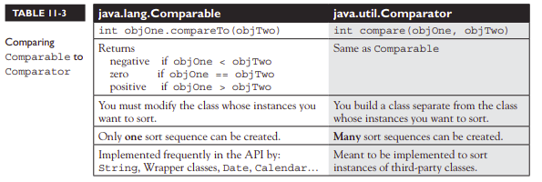

**Note:** Whenever you want to sort an array or a collection, the elements inside must all be mutually comparable. For example, if you have an Object[] and you put Cat and Dog objects into it, you won't be able to sort it. In general, objects of different types should be considered NOT mutually comparable unless specifically stated otherwise.  

### Searching Arrays and Collections
The Collections class and the Arrays class both provide methods that allow you to search for a specific element. 

**When searching through collections or arrays, the following rules apply:**

- Searches are performed using the binarySearch() method.  

- Successful searches return the int index of the element being searched.  

- Unsuccessful searches return an int index that represents the insertion point. The insertion point is the place in the collection/array where the element would be inserted to keep the collection/array properly sorted. Because positive return values and 0 indicate successful searches, the binarySearch() method uses negative numbers to indicate insertion points. Since 0 is a valid result for a successful search, the first available insertion point is -1. Therefore, the actual insertion point is represented as (-(insertion point) -1). For instance, if the insertion point of a search is at element 2, the actual insertion point returned will be -3.  

- The collection/array being searched must be sorted before you can search it.  

- If you attempt to search an array or collection that has not already been sorted, the results of the search will not be predictable.  

- If the collection/array you want to search was sorted in natural order, it must be searched in natural order. (Usually, this is accomplished by NOT sending a Comparator as an argument to the binarySearch() method.)  

- If the collection/array you want to search was sorted using a Comparator, it must be searched using the same Comparator, which is passed as the second argument to the binarySearch() method. Remember that Comparators cannot be used when searching arrays of primitives.  

Let's take a look at a code sample that exercises the binarySearch() method:
```java
import java.util.*;
class SearchObjArray {
    public static void main(String[] args) {
        String[] sa = {
            "one",
            "two",
            "three",
            "four"
        };
        Arrays.sort(sa); 					// #1
        for (String s: sa)
            System.out.print(s + " ");
        
	System.out.println("\none = " + Arrays.binarySearch(sa, "one")); 			// #2
        System.out.println("now reverse sort");
        
	ReSortComparator rs = new ReSortComparator(); 		// #3
        Arrays.sort(sa, rs);
        for (String s: sa)
            System.out.print(s + " ");
        System.out.println("\none = " + Arrays.binarySearch(sa, "one")); 			// #4
        System.out.println("one = " + Arrays.binarySearch(sa, "one", rs)); 			// #5
    }
    
    static class ReSortComparator implements Comparator < String > { 				// #6
        public int compare(String a, String b) {
            return b.compareTo(a); 								// #7
        }
    }
}

//which produces something like this:
four one three two
one = 1
now reverse sort
two three one four
one = -1
one = 2
```

**Here's what happened:**  
#1 Sort the sa array, alphabetically (the natural order). 

#2 Search for the location of element "one", which is 1. 

#3 Make a Comparator instance. On the next line, we re-sort the array using the Comparator.

#4 Attempt to search the array. We didn't pass the binarySearch() method the Comparator we used to sort the array, so we got an incorrect (undefined) answer. 

#5 Search again, passing the Comparator to binarySearch(). This time, we get the correct answer, 2. 

#6 We define the Comparator; it's okay for this to be an inner class. 

#7 By switching the use of the arguments in the invocation of compareTo(), we get an inverted sort.

**Converting Arrays to Lists OR Lists to Arrays**  

The List and Set classes have toArray() methods, and the Arrays class has a method called asList().  

The Arrays.asList() method copies an array into a List. The returned list is a fixed-size list backed by the specified array.  

**What does this mean?**  
- Add and remove methods throw UnsupportedOperationException.
- Changes to the returned list using set(index, value) method reflect in original array.

```java
String[] sa = {"one", "two", "three", "four"};
List sList = Arrays.asList(sa); 			// make a List
System.out.println("size " + sList.size());
System.out.println("idx2 " + sList.get(2));

sList.set(3, "six"); 					// change List
sa[1] = "five"; 					// change array
for (String s: sa)
    System.out.print(s + " ");
System.out.println("\nsl[1] " + sList.get(1));

//This produces
size 4
idx2 three
one five three six
sl[1] five
```

Let's take a look at the toArray() method.   
It comes in two flavors: one that returns a new Object array, and one that uses the array you send it as the destination array:  

```java
List<Integer> iL = new ArrayList<Integer>();
for(int x=0; x<3; x++)
 iL.add(x);
Object[] oa = iL.toArray(); 				// create an Object array
Integer[] ia2 = new Integer[3];
ia2 = iL.toArray(ia2); 					// create an Integer array
```

**Using Lists**
Lists are usually used to keep things in some kind of order. For eg:  
- LinkedList → To create a first-in, first-out queue. 
- ArrayList → To keep track of what locations were visited and in what order. 
 
In both the examples, duplicates might occur.  
In addition, Lists allow you to manually override the ordering of elements by adding or removing elements via the element's index.   

Before Java 5 and the enhanced for loop, Iterator was the most common way to examine a List "element by element". An Iterator is an object that's associated with a specific collection that lets you loop through the collection step by step.  

The two important Iterator methods  
- **boolean hasNext()** Returns true if there is at least one more element in the collection being traversed. Invoking hasNext() does NOT move you to the next element of the collection.  
- **Object next()** This method returns the next object in the collection AND moves you forward to the element after the element just returned.

Let's look at a code that uses a List and an Iterator:  

```java
import java.util.*;
class Dog {
    public String name;
    Dog(String n) {
        name = n;
    }
}
class ItTest {
    public static void main(String[] args) {
        List < Dog > d = new ArrayList < Dog > ();
        Dog dog = new Dog("aiko");
        d.add(dog);
        d.add(new Dog("clover"));
        d.add(new Dog("magnolia"));
        Iterator < Dog > i3 = d.iterator(); 		// make an iterator
        while (i3.hasNext()) {
            Dog d2 = i3.next(); 			// cast not required
            System.out.println(d2.name);
        }
        System.out.println("size " + d.size());
        System.out.println("get1 " + d.get(1).name);
        System.out.println("aiko " + d.indexOf(dog));
        d.remove(2);
        Object[] oa = d.toArray();
        for (Object o: oa) {
            Dog d2 = (Dog) o;
            System.out.println("oa " + d2.name);
        }
    }
}

//This produces
aiko
clover
magnolia
size 3
get1 clover
aiko 0
oa aiko
oa clover
```

We used generics syntax to create the Iterator (an Iterator of type Dog).  
Because of this, when we used the next() method, we didn't have to cast the Object returned by next() to a Dog.  

We could have declared the Iterator like this:			Iterator i3 = d.iterator();  
But then we would have had to cast the returned value: 		Dog d2 = (Dog) i3.next();

**Using Sets**
Sets are used when you don't want any duplicates in your collection. If you attempt to add a duplicate, then the element will not be added, and the add() method will return false. 

**A TreeSet, which is a Set stores elements in sorted order. But you must use caution when using a TreeSet. Why?**

```java
import java.util.*;
class SetTest {
    public static void main(String[] args) {
        boolean[] ba = new boolean[5];
        // insert code here
        ba[0] = s.add("a");
        ba[1] = s.add(new Integer(42));
        ba[2] = s.add("b");
        ba[3] = s.add("a");
        ba[4] = s.add(new Object());
        for (int x = 0; x < ba.length; x++)
            System.out.print(ba[x] + " ");
        System.out.println();
        for (Object o: s)
            System.out.print(o + " ");
    }
}

//If you insert the following line of code, 
Set s = new HashSet(); 

//you'll get output that looks something like this,
true true true false true
a java.lang.Object @e09713 42 b
```

The order of objects printed in the second for loop is not predictable: HashSets do not guarantee any ordering. Also, notice that the fourth invocation of add() failed because it attempted to insert a duplicate entry (a String with the value a) into the Set.


```java
//If you insert this line of code, 
Set s = new TreeSet(); 

//you'll get something like this:
Exception in thread "main" java.lang.ClassCastException: java.lang.
String
 at java.lang.Integer.compareTo(Integer.java:35)
 at java.util.TreeMap.compare(TreeMap.java:1093)
 at java.util.TreeMap.put(TreeMap.java:465)
 at java.util.TreeSet.add(TreeSet.java:210)
 ```

The issue is that whenever you want a collection to be sorted, its elements must be mutually comparable. Remember that unless otherwise specified, objects of different types are not mutually comparable.


**Using Maps**  

Whenever you use an implementation of a Map, any classes that you use as a part of the keys for that map must override the hashCode() and equals() methods.  

(Well, you only have to override them if you're interested in retrieving stuff from your Map. Seriously, it's legal to use a class that doesn't override equals() and hashCode() as a key in a Map; your code will compile and run, you just won't find your stuff.)  

Here's some crude code demonstrating the use of a HashMap:  

```java
import java.util.*;

class Dog {

    public Dog(String n) {
        name = n;
    }
    
    public String name;
    
    public boolean equals(Object o) {
        if ((o instanceof Dog) &&
            (((Dog) o).name == name)) {
            return true;
        } else {
            return false;
        }
    }
    
    public int hashCode() {
        return name.length();
    }
}

class Cat {}

enum Pets {
    DOG,
    CAT,
    HORSE
}

class MapTest {
    public static void main(String[] args) {
        Map < Object, Object > m = new HashMap < Object, Object > ();
        m.put("k1", new Dog("aiko")); 			// add some key/value pairs
        m.put("k2", Pets.DOG);
        m.put(Pets.CAT, "CAT key");
	
        Dog d1 = new Dog("clover"); 			// let's keep this reference
        m.put(d1, "Dog key");
        m.put(new Cat(), "Cat key");
        System.out.println(m.get("k1")); 		// #1
        
	String k2 = "k2";
        System.out.println(m.get(k2)); 			// #2
        
	Pets p = Pets.CAT;
        
	System.out.println(m.get(p)); 			// #3
        System.out.println(m.get(d1)); 			// #4
        System.out.println(m.get(new Cat())); 		// #5
        System.out.println(m.size()); 			// #6
    }
}

//which produces something like this:
Dog @1c
DOG
CAT key
Dog key
null
5
```

Let's review the output. 
**The first value** retrieved is a Dog object (your value will vary). 
**The second value** retrieved is an enum value (DOG). 
**The third value** retrieved is a String; note that the key was an enum value.  

---

**Pop quiz: What's the implication of the fact that we were able to successfully use an enum as a key?**
The implication of this is that java.lang.Enum class overrides equals() and hashCode(). 

---

**The fourth output** is a String. The important point about this output is that the key used to retrieve the String was made of a Dog object. 

**The fifth output** is null. The important point here is that the get() method failed to find the Cat object that was inserted earlier. (The last line of output confirms that, indeed, 5 key/value pairs exist in the Map.) 

---

**Why didn't we find the Cat key String? Why did it work to use an instance of Dog as a key, when using an instance of Cat as a key failed?**
Dog class overrides equals() and hashCode() while Cat didn't. 

---

We used a simplistic hashcode formula in the Dog class—the hashcode of a Dog object is the length of the instance's name. So in this example, hashcode = 6 (length of Dog clover). 

Let's compare the following two hashCode() methods:
```java
public int hashCode() {return name.length(); } 			// #1 
public int hashCode() {return 4; } 				// #2
```

**Are the preceding two hashcodes legal? Will they successfully retrieve objects from a Map? Which will be faster?**  

The answer to the first two questions is Yes and Yes. 
The answer to the last question is that the first hashcode will be a little bit faster than the second hashcode. In general, the more unique hashcodes a formula creates, the faster the retrieval will be. The first hashcode formula will generate a different code for each name length. The second hashcode formula will always produce the same result, 4, so it will be slower than the first.  

---

**What happens when an object used as a key has its values changed? 
Determine the output for the following lines of code if they're added to the end of MapTest.main():**

```java
d1.name = "magnolia";
System.out.println(m.get(d1)); 				// #1
d1.name = "clover";
System.out.println(m.get(new Dog("clover"))); 		// #2
d1.name = "arthur";
System.out.println(m.get(new Dog("clover"))); 		// #3
```

Because hashcode is equal to the length of the name variable, thus, changing the name changed the value of the hashcode.  

When you study a problem like this, it can be useful to think of the two stages of retrieval:  
1. Use the hashCode() method to find the correct bucket. 
2. Use the equals() method to find the object in the bucket.

**In the first call to get(),** the hashcode is 8 (magnolia) and it should be 6 (clover), so the retrieval fails at step 1 and we get null. 

**In the second call to get(),** the hashcodes are both 6, so step 1 succeeds. Once in the correct bucket (the "length of name = 6" bucket), the equals() method is invoked, and since Dog's equals() method compares names, equals() succeeds, and the output is Dog key. 

**In the third invocation of get(),** the hashcode test succeeds, but the equals() test fails because arthur is NOT equal to clover.


**Navigating (Searching) - TreeSets and TreeMaps**
We've talked about searching lists and arrays. Let's turn our attention to searching TreeSets and TreeMaps. 

Java 6 introduced two new interfaces: java.util.NavigableSet and java.util.NavigableMap. 
How does TreeSet and TreeMap implement these interfaces?

**Imagine that the Santa Cruz–Monterey ferry has an irregular schedule & the daily departure times are stored in military time in a TreeSet.  
(1205), (1505), (1545), (1830), (2010), (2100)**

**We need code that determines two things:**    
**1. The last ferry that leaves before 4 pm (1600 hours)**  
**2. The first ferry that leaves after 8 pm (2000 hours)**  

```java
import java.util.*;
public class Ferry {
    public static void main(String[] args) {
        TreeSet < Integer > times = new TreeSet < Integer > ();
        times.add(1205); 						// add some departure times
        times.add(1505);
        times.add(1545);
        times.add(1830);
        times.add(2010);
        times.add(2100);
	
        // Java 5 version
        TreeSet < Integer > subset = new TreeSet < Integer > ();
        subset = (TreeSet) times.headSet(1600);
        System.out.println("J5 - last before 4pm is: " + subset.last());
	
        TreeSet < Integer > sub2 = new TreeSet < Integer > ();
        sub2 = (TreeSet) times.tailSet(2000);
        System.out.println("J5 - first after 8pm is: " + sub2.first());
	
        // Java 6 version using the new lower() and higher() methods
        System.out.println("J6 - last before 4pm is: " + times.lower(1600));
        System.out.println("J6 - first after 8pm is: " + times.higher(2000));
    }
}

//This should produce the following:
J5 - last before 4 pm is: 1545
J5 - first after 8 pm is: 2010
J6 - last before 4 pm is: 1545
J6 - first after 8 pm is: 2010
```

**Before the addition of the NavigableSet interface, zeroing in on an arbitrary spot in a Set—using the methods available in Java 5—was a compute-expensive and clunky proposition.**  

**On the other hand, using the new Java 6 methods lower() and higher(), the code becomes a lot cleaner.**

The NavigableSet methods related to this type of navigation are lower(), floor(), higher(), and ceiling(), and the mostly parallel NavigableMap methods are lowerKey(), floorKey(), ceilingKey(), and higherKey().  

The difference between lower() and floor() is that lower() returns the element less than the given element, and floor() returns the element less than or equal to the given element.  

Similarly, higher() returns the element greater than the given element, and ceiling() returns the element greater than or equal to the given element.  

**Other Navigation Methods (New to Java 6 for TreeSet and TreeMap)**
**Polling**  
In the case of TreeSet, pollFirst() returns and removes the first entry in the set, and pollLast() returns and removes the last. 
Similarly, TreeMap now provides pollFirstEntry() and pollLastEntry() to retrieve and remove key/value pairs. 

**Descending Order**  
The important methods are TreeSet.descendingSet() and TreeMap.descendingMap() that return a collection in the reverse order of the collection on which the method was invoked. 


**Backed Collections**  
Some of the classes in the java.util package support the concept of "backed collections." Let’s go through an example:

```java
TreeMap < String, String > map = new TreeMap < String, String > ();
map.put("a", "ant");
map.put("d", "dog");
map.put("h", "horse");

SortedMap < String, String > submap;
submap = map.subMap("b", "g"); 				// #1 create a backed collection
System.out.println(map + " " + submap); 		// #2 show contents

map.put("b", "bat"); 					// #3 add to original
submap.put("f", "fish"); 				// #4 add to copy
map.put("r", "raccoon"); 				// #5 add to original - out of range
// submap.put("p", "pig"); 				// #6 add to copy - out of range
System.out.println(map + " " + submap); 		// #7 show final contents


//This should produce something like this:
{a = ant, d = dog, h = horse} {d = dog} 
{a = ant, b = bat, d = dog, f = fish, h = horse, r = raccoon} {b = bat, d = dog, f = fish}
```

**The subMap() method is making a copy of a portion of the TreeMap named map. The first line of output verifies the conclusions we've just drawn.**  

**Why called backed collections ?**  
When we add key/value pairs to either the original TreeMap or the partial-copy SortedMap, the new entries were automatically added to the other collection—sometimes.  

When submap was created, we provided a value range for the new collection that defines:  
1) What should be included when the partial copy is created  
2) The range of values that can be added to the copy  

**Adding new entries within range of copy**
As we can verify by looking at the second line of output, we can add new entries to either collection within the range of the copy, and the new entries will show up in both collections. 

**Adding new entries outside range of copy**
We can add a new entry to the original collection, even if it's outside the range of the copy. In this case, the new entry will show up only in the original but it won't be added to the copy because it's outside the copy's range.  

Notice that we commented out line 6. If you attempt to add an out-of-range entry to the copied collection, an exception will be thrown.  

**As with the navigation-oriented methods we just discussed, we can see a lot of parallels between the TreeSet and the TreeMap methods.**

**The headSet()/headMap()** methods create a subset that starts at the beginning of the original collection and ends at the point specified by the method's argument. 

**The tailSet()/tailMap()** methods create a subset that starts at the point specified by the method's argument and goes to the end of the original collection. 

**The subSet()/subMap()** methods allow you to specify both the start and end points for the subset collection you're creating.

---

**Whether the subsetted collection's end points are inclusive or exclusive ?**
All of the methods we've been discussing here have an overloaded version that's new to Java 6. The older methods return either a SortedSet or a SortedMap; the new Java 6 methods return either a NavigableSet or a NavigableMap.  

When these methods are invoked with end point and boolean arguments, the boolean always means "is inclusive". Unless specifically indicated by a boolean argument, a subset's starting point will always be inclusive. 

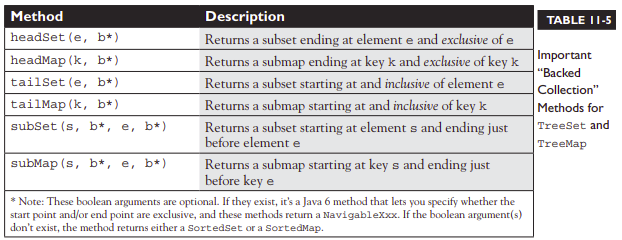

**Note:** Let’s say that you’ve created a backed collection using either a tailXxx() or subXxx() method. Remember that the pollFirstXxx() methods will always remove the first entry from the collection on which they’re invoked, but they will remove an element from the other collection only if it has the same value. 

**Using the PriorityQueue Class and the Deque Interface**  
Unlike basic FIFO queue structures, a PriorityQueue orders its elements using a user-defined priority.   

The priority can be as simple as natural ordering (in which, for instance, an entry of 1 would be a higher priority than an entry of 2). In addition, a PriorityQueue can be ordered using a Comparator, which lets you define any ordering you want.   

Queues have a few methods not found in other collection interfaces: peek(), poll(), offer()  

```java
import java.util.*;
class PQ {
    static class PQsort implements Comparator < Integer > { 		// inverse sort
        public int compare(Integer one, Integer two) {
            return two - one; 						// unboxing
        }
    }
    
    public static void main(String[] args) {
        int[] ia = {1,5,3,7,6,9,8}; 						// unordered data
	
        PriorityQueue < Integer > pq1 = new PriorityQueue < Integer > (); 	// use natural order
        for (int x: ia) 							// load queue
            pq1.offer(x);
        for (int x: ia) 							// review queue
            System.out.print(pq1.poll() + " ");
	    
        System.out.println("");
	
        PQsort pqs = new PQsort(); 							// get a Comparator
        PriorityQueue < Integer > pq2 = new PriorityQueue < Integer > (10, pqs); 	// use Comparator
        for (int x: ia) 								// load queue
            pq2.offer(x);
	    
        System.out.println("size " + pq2.size());
        System.out.println("peek " + pq2.peek());
        System.out.println("size " + pq2.size());
        System.out.println("poll " + pq2.poll());
        System.out.println("size " + pq2.size());
	
        for (int x: ia) 								// review queue
            System.out.print(pq2.poll() + " ");
    }
}

//This code produces something like this:
1 3 5 6 7 8 9
size 7
peek 9
size 7
poll 9
size 6
8 7 6 5 3 1 null
```

**Let's look at this in detail.**
The first for loop iterates through the ia array and uses the offer() method to add elements to the PriorityQueue named pq1.  
The second for loop iterates through pq1 using poll() method, which returns the highest-priority entry in pq1 AND removes the entry from the queue.  

Next, we create a Comparator that orders elements in the opposite of natural order & use it to build a second PriorityQueue, pq2, and we load it with the same array we used earlier.  

Finally, we check the size of pq2 before and after calls to peek() and poll().  
This confirms that peek() returns the highest-priority element in the queue without removing it, and poll() returns the highest-priority element AND removes it from the queue.  
 
Finally, we review the remaining elements in the queue.  


**NOTE:** The important PriorityQueue methods are offer() (which is similar to add()), peek() (which retrieves the element at the head of the queue but doesn’t delete it), and poll() (which retrieves the head element and removes it from the queue).


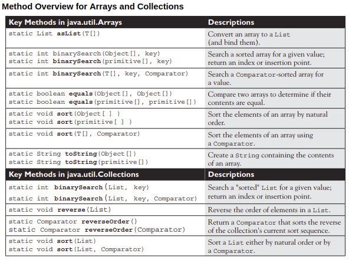

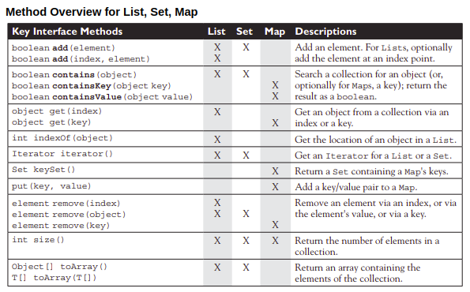


