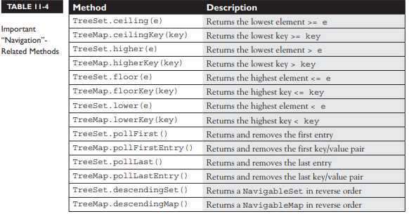

# Generics & Collections


## toString(), hashCode(), and equals() 

Some important methods in class java.lang.Object :


### :point_right: The toString() Method

Code calls toString() on your object when it wants to read useful details about your object. For eg, it is invoked when you pass an object reference to the System.out.println() method.

```java

public class HardToRead {
    public static void main(String[] args) {
        HardToRead h = new HardToRead();
        System.out.println(h);
    }
}

//Running the HardToRead class gives us the lovely and meaningful
%java HardToRead
HardToRead @a47e0

```
Because you don’t override the toString() method of class Object, the output is class name followed by the @ symbol, followed by the unsigned hexadecimal representation of the object’s hashcode.

By overriding the toString() method in your classes, we can get a readable output, for example:
```java
public class BobTest {
    public static void main(String[] args) {
        Bob f = new Bob("GoBobGo", 19);
        System.out.println(f);
    }
}
class Bob {
    int shoeSize;
    String nickName;
    Bob(String nickName, int shoeSize) {
        this.shoeSize = shoeSize;
        this.nickName = nickName;
    }
    public String toString() {
        return ("I am a Bob, but you can call me " + nickName +
            ". My shoe size is " + shoeSize);
    }
}

//This ought to be a bit more readable:
%java BobTest
I am a Bob, but you can call me GoBobGo.My shoe size is 19

```

### :point_right: The equals() Method
Common uses of overriding the equals() method:

- To sort or search through a collection of objects, the equals() and hashCode() methods are essential. 

- String class has overridden the equals() method (inherited from the class Object), so you could compare two different String objects to see if their contents are equivalent. 

- There is a wrapper class for every kind of primitive. The folks who created the Integer class decided that if two different Integer instances both hold the int value 5, they are equal. 

- To know if two object references are identical, use ==. But to know if the attributes of the objects themselves (not the references) are equal, use the equals() method. 

For each class you write, you must decide if it makes sense to consider two different instances equal. 

**What It Means If You Don't Override equals()?**  
Unless you override equals(), two objects are considered equal only if the two references refer to the same object, since the equals() method in class Object uses only the == operator for comparisons.

- You won't be able to use those objects as a key in a hashtable 
- You won't get accurate Sets such that there are no conceptual duplicates. 

**Let's look at what it means to not be able to use an object as a hashtable key.**  
Imagine you have a car (say, John's red Subaru Outback as opposed to Mary's purple Mini). Let’s say you add a car instance as the key to the HashMap (along with a corresponding Person object as the value). But now what happens when you want to search a Person given a car. But now you're in trouble unless you still have a reference to the exact object you used as the key when you added it to the Collection. In other words, you can't make an identical Car object and use it for the search.

**If you want objects of your class to be used as keys for a hashtable (or as elements in any data structure that uses equivalency for searching for—and/or retrieving—an object), then you must override equals() so that two different instances can be considered the same.**

Override the equals() method so that it compares the unique VIN (Vehicle Identification Number) as the basis of comparison. That way, you can use one instance when you add it to a Collection and essentially re-create an identical instance when you want to do a search based on that object as the key. Of course, overriding the equals() method for Car also allows the potential for more than one object representing a single unique car to exist, which might not be safe in your design. 

**Fortunately, the String and wrapper classes work well as keys in hashtables— they override the equals() method.**  
So rather than using the actual car instance as the key into the car/owner pair, you could simply use a String that represents the unique identifier for the car. That way, you'll never have more than one instance representing a specific car, but you can still use the car—or rather, one of the car's attributes—as the search key.

**Implementing an equals() Method**  
```java
public class EqualsTest {
    public static void main(String[] args) {
        Moof one = new Moof(8);
        Moof two = new Moof(8);
        if (one.equals(two)) {
            System.out.println("one and two are equal");
        }
    }
}
class Moof {
    private int moofValue;
    Moof(int val) {
        moofValue = val;
    }
    public int getMoofValue() {
        return moofValue;
    }
    public boolean equals(Object o) {
        if ((o instanceof Moof) && (((Moof) o).getMoofValue() ==
                this.moofValue)) {
            return true;
        } else {
            return false;
        }
    }
}
```

**Problem Statement:** Two Moof objects are the same if their moofValue is identical. So you need to override the equals() method and compare the two Moof instances. 

**What happens in the equals() method ?** Two things to make a valid equality comparison of two Moof objects: 

1) The object being tested comes in polymorphically as type Object, so you need to do an instanceof test on it just to be sure that you could cast the object argument to the correct type, otherwise, you'll get a runtime ClassCastException when the (Moof)o cast fails if o doesn't refer to something that IS-A Moof. 

2) Compare the attributes we care about (in this case, just moofValue). 

Casting the object reference, o, is necessary so that you can access its methods or variables in to do the comparison. Without the cast, you can't compile because the compiler would see the object referenced by o as an Object and the Object class doesn't have a getMoofValue().

**A Java contract is a set of rules that must be followed if you want to provide a "correct" implementation as others will expect it to be. If you don't follow the contract, your code may still compile and run, but your code (or someone else's) may break at runtime in some unexpected way.**

**The equals() contract says**
- It is reflexive. For any reference value x, x.equals(x) should return true. 
- It is symmetric. For any reference values x and y, x.equals(y) should return true if and only if y.equals(x) returns true. 
- It is transitive. For any reference values x, y, and z, if x.equals(y) returns true and y.equals(z) returns true, then x.equals(z) must return true. 
- It is consistent. For any reference values x and y, multiple invocations of x.equals(y) consistently return true or consistently return false, provided no information used in equals() comparisons on the object is modified. 
- For any non-null reference value x, x.equals(null) should return false. 


### :point_right: The hashCode() Method
You can think of hashcode as a kind of an object ID number, it isn't necessarily unique. 

Collections such as HashMap and HashSet use the hashcode value of an object to determine how the object should be stored in the collection, and the hashcode is used again to help locate the object in the collection. 

**Understanding Hashcodes**  
Consider the implementation of a HashMap. Basically there is an arrayList where each cell represents a bucket and each array index represents a bucketIndex. A bucket is represented using a linkedlist i.e. each cell will be storing a linkedlist.

Whenever a key value pair need to be put, Hashcode of the key determines in which bucket should the key-value pair be inserted. 
Now you need to retrieve the value that matches a given key. The hashcode tells you in which bucket you should look to find the key-value pair. 

**A hashcode is just an integer generated by an algorithm** that will always run the same way given a specific input, so the output will always be identical for any two identical inputs. 

For example, key is a string value then the a possible hashcode algorithm could be : You take the string and calculate an integer code from it by using A is 1, B is 2, and so on, adding the numeric values of all the letters in the string together. 


**Note:** Two different names might result in the same value. That's acceptable. The hashcode tells you only which bucket to go into. You'll still have to search through the target bucket, reading each name until we find the desired name.

**In real-life hashing, it's common to have more than one entry in a bucket. Hashing retrieval is a two-step process.**   
**1. Find the right bucket (using hashCode()).**  
**2. Search the bucket for the right element (using equals())**  

**If two objects are equal, their hashcodes must be equal as well. Two unequal objects may or may not have different hashcodes.**

**Implementing hashCode()**
```java
class HasHash {
    public int x;
    HasHash(int xVal) {
        x = xVal;
    }
    public boolean equals(Object o) {
        HasHash h = (HasHash) o; // Don't try at home without
        // instanceof test
        if (h.x == this.x) {
            return true;
        } else {
            return false;
        }
    }
    public int hashCode() {
        return (x * 17);
    }
}
```

Typically, you'll see hashCode() methods that do some combination of ^-ing (XOR-ing) a class's instance variables (in other words, twiddling their bits), along with perhaps multiplying them by a prime number. In any case, while the goal is to get a wide and random distribution of objects across buckets, **the contract requires only that two equal objects have equal hashcodes.**

So in order for an object to be located, the search object and the object in the collection must both have identical hashcode values and return true for the equals() method. 
So you must override both methods to be absolutely certain that your objects can be used in Collections that use hashing.

**The hashCode() Contract**  
- Whenever it is invoked on the same object more than once during an execution of a Java application, the hashCode() method must consistently return the same integer, provided that no information used in equals() comparisons on the object is modified. 
**Eg: The custom hashcode() method can generate different hashcode for an object during an execution of a Java application if the object is mutable OR the object contains some transient attributes**

- If two objects are equal according to the equals(Object) method, then calling the hashCode() method on each of the two objects must produce the same integer result.  

- It is NOT required that if two objects are unequal according to the equals(java.lang.Object) method, then calling the hashCode() method on each of the two objects must produce distinct integer results.


**What happens if you include a transient variable in your hashCode() method?**  
As you might know, serialization saves an object so that it can be reanimated later by deserializing it back to full objectness. But transient variables are not saved when an object is serialized.

While that's legal (the compiler won't complain), under some circumstances, an object put in a collection won't be found.
```java
class SaveMe implements Serializable {
    transient int x;
    int y;
    SaveMe(int xVal, int yVal) {
        x = xVal;
        y = yVal;
    }
    public int hashCode() {
        return (x ^ y); // Legal, but not correct to
        // use a transient variable
    }
    public boolean equals(Object o) {
        SaveMe test = (SaveMe) o;
        if (test.y == y && test.x == x) { // Legal, not correct
            return true;
        } else {
            return false;
        }
    }
}
```
 
Here's what could happen using code like the preceding example: 
1. Give an object some state (assign values to its instance variables). Eg: x = 9, y = 7
2. Put the object in a HashMap, using the object as a key. 
3. Save the object to a file using serialization without altering any of its state. 
4. Retrieve the object from the file through deserialization. The object's transient variable will come back with a default value x==0 rather than the value the variable had at the time it was saved
5. Use the deserialized object to get the object out of the HashMap. So the new hashcode calculation will give a different hashcode and the equals() method fails as well since x is used to determine object equality.


**Bottom line: transient variables can really mess with your equals() and hashCode() implementations. Keep variables non-transient or, if they must be marked transient, don't use them to determine hashcodes or equality.**


## Collections
The Collections Framework in Java, gives you lists, sets, maps, and queues to satisfy most of your coding needs. 

**Basic operations you'll normally use with collections:**  
- Add objects to the collection. 
- Remove objects from the collection. 
- Find out if an object (or group of objects) is in the collection. 
- Retrieve an object from the collection without removing it. 
- Iterate through the collection, looking at each element (object) one after another.


**Key Interfaces and Classes of the Collections Framework**

**The core interfaces:**  


**The concrete implementation classes:**  


**There are really three overloaded uses of the word "collection":**  

- **collection (lowercase c)**, which represents any of the data structures in which objects are stored and iterated over. 

- **Collection (capital C)** is the java.util.Collection interface (with declarations of the methods common to most collections, including add(), remove(), contains(), size(), and iterator()) from which Set, List, and Queue extend. (That's right, extend, not implement. There are no direct implementations of Collection.) 

- **Collections (capital C and ends with s)** is the java.util.Collections class that holds a pile of static utility methods for use with collections.


**:question: Why do the List and Collection interfaces declare the same methods?**  
As to why List repeats the declarations of the Collection methods, that is because it refines the contracts of many of those methods. For example, the boolean add(E element) method in Collection interface only guarantees that after being called the collection will contain the element. The List interface refines this contract, specifying that the element will be added to the end of the list.  

The other methods in the Collection interface that are refined in the List interface are  

```java
Iterator<E> iterator();
Object[] toArray();
<T extends Object> T[] toArray(T[]);
boolean remove(Object);
boolean addAll(Collection<? extends E>);
boolean equals(Object);
int hashCode();
```
Most of the refinements are simply dealing with the fact that Lists are guaranteed to be ordered, while Collections are not.


**Not all collections in the Collections Framework actually implement the Collection interface. In other words, not all collections pass IS-A test for Collection.**  

**Specifically, none of the Map-related classes and interfaces extend from Collection. So while SortedMap, Hashtable, HashMap, TreeMap, and LinkedHashMap are all thought of as collections, none are actually extended from Collection-with-a capital-C.**  

**Collections come in four basic flavors:**  
**Lists** *Lists of things (classes that implement List)*  
**Sets** *Unique things (classes that implement Set)*  
**Maps** *Things with a unique ID (classes that implement Map)*  
**Queues** *Things arranged by the order in which they are to be processed*  


### :point_right: Ordered & Sorted Collections
An implementation class can be unsorted and unordered, ordered but unsorted, or both ordered and sorted. But an implementation can never be sorted but unordered, because sorting is a specific type of ordering. For example, a HashSet is an unordered, unsorted set, while a LinkedHashSet is an ordered (but not sorted) set that maintains the order in which objects were inserted.

**Ordered**   
An ordered collection means you can iterate through the collection in a specific (not random) order.   
- A Hashtable collection is not ordered. Although the Hashtable itself has internal logic to determine the order (based on hashcodes and the implementation of the collection itself), you won't find any order when you iterate through the Hashtable. 
- An ArrayList, keeps the order established by the elements' index position (just like an array).  
- LinkedHashSet keeps the order established by insertion. 

**Sorted**  
A sorted collection means that the collection keeps the elements in order determined according to some rule or rules, known as the sort order.  

Most commonly, the sort order used is the natural order.  
- For a collection of String objects, the natural order is alphabetical order. 
- For Integer objects, the natural order is by numeric value—1 before 2, and so on. 
- There is no natural order for custom objects unless the Foo developer provides one through an interface (Comparable or Comparator) that defines how instances of a class can be compared to one another.  
**NOTE:** sort order (including natural order) is not the same as ordering by insertion, access, or index.

---

### :point_right: List Interface
A List cares about the index. The one thing that List has that non-lists don't is a set of methods related to the index like get(int index), indexOf(Object o), add(int index, Object obj), and so on. 

All three List implementations are ordered by index position—a position that you determine either by setting an object at a specific index or by adding it without specifying position, in which case the object is added to the end. 


**_ArrayList_**  
It’s a growable array & gives you fast iteration and fast random access. 
It is an ordered collection (by index), but not sorted. 
Choose this over a LinkedList when you need fast iteration but aren't as likely to be doing a lot of insertion and deletion. 

**_Vector_**   
A Vector is basically the same as an ArrayList, but Vector methods are synchronized for thread safety. The synchronized methods add a performance hit you might not need. Vector is the only class other than ArrayList to implement RandomAccess.

**_LinkedList_**  
A LinkedList is ordered by index position, like ArrayList, except that the elements are doubly linked to one another. This linkage gives you new methods (beyond what you get from the List interface) for adding and removing from the beginning or end, which makes it an easy choice for implementing a stack or queue. Keep in mind that a LinkedList may iterate more slowly than an ArrayList, but it's a good choice when you need fast insertion and deletion. As of Java 5, the LinkedList class has been enhanced to implement the java.util. Queue interface & it now supports the common queue methods peek(), poll(), and offer().

---

### :point_right: Set Interface
A Set cares about uniqueness—it doesn't allow duplicates. The equals() method determines whether two objects are identical (in which case, only one can be in the set). 

The three Set implementations are:  
**_HashSet_**  
A HashSet is an unsorted, unordered Set. It uses the hashcode of the object being inserted, so the more efficient your hashCode() implementation, the better access performance you'll get. 

**_LinkedHashSet_**  
A LinkedHashSet is an ordered version of HashSet that maintains the insertion order using a doubly linked List across all elements. 

**When using HashSet or LinkedHashSet, the objects you add to them must override hashCode(). If they don't override hashCode(), the default Object.hashCode() method will allow multiple objects that you might consider "meaningfully equal" to be added to your "no duplicates allowed" set.**  

**_TreeSet_**  
The TreeSet is a sorted collection. It uses a Red-Black tree structure, and guarantees that the elements will be in ascending order, according to the natural order. Optionally TreeSet lets you define a custom sort order via a Comparator when you construct a TreeSet. As of Java 6, TreeSet implements NavigableSet.

---

### :point_right: Map Interface 
Lets you map a unique key (the ID) to a specific value, where both the key and the value are objects. The Map implementations let you do things like search for a value based on the key, ask for a collection of just the values, or ask for a collection of just the keys. 

Like Sets, Maps rely on the equals() method to determine whether two keys are the same or different.
	
**_HashMap_**  
The HashMap gives you an unsorted, unordered Map. Where the keys land in the Map is based on the key's hashcode, so, like HashSet, the more efficient your hashCode() implementation, the better access performance you'll get. HashMap allows one null key and multiple null values in a collection. 

**_Hashtable_**  
Just as Vector is a synchronized counterpart to the ArrayList, Hashtable is the synchronized counterpart to HashMap. Remember that you don't synchronize a class, we just mean that the key methods of the class are synchronized. 
Another difference, though, is that while HashMap lets you have null values as well as one null key, a Hashtable doesn't let you have anything that's null. 

**_LinkedHashMap_**   
Like its Set counterpart, LinkedHashSet, the LinkedHashMap collection maintains insertion order. Although it will be somewhat slower than HashMap for adding and removing elements, you can expect faster iteration with a LinkedHashMap. 

**_TreeMap_**   
A TreeMap is a sorted Map i.e sorted by the natural order of the elements by default. Like TreeSet, TreeMap lets you define a custom sort order via a Comparator when you construct a TreeMap. As of Java 6, TreeMap implements NavigableMap.

---

### :point_right: Queue Interface 
A Queue is designed to hold a list of things to be processed in some way. Queues support all of the standard Collection methods and they also have methods to add and subtract elements and review queue elements. 

**_PriorityQueue_**   
Since the LinkedList class has been enhanced to implement the Queue interface, basic queues can be handled with a LinkedList. The purpose of a PriorityQueue is to create a "priority-in, priority out" queue as opposed to a typical FIFO queue. A PriorityQueue's elements are ordered either by natural ordering (in which case the elements that are sorted first will be accessed first) or according to a Comparator. In either case, the elements' ordering represents their relative priority.


## ArrayList Basics

Let's take a look at using an ArrayList that contains strings. In practice, you'll typically want to instantiate an ArrayList polymorphically, like this: **List myList = new ArrayList();**

As of Java 5, you'll want to say: **List<**__String> myList = new ArrayList<__**String>();**

This kind of declaration follows the object-oriented programming principle of "coding to an interface," and it makes use of generics. (Prior to Java 5, there was no way to specify the type of a collection, and when we cover generics)

In many ways, ArrayList is similar to a String[] in that it declares a container that can hold only strings but some of the advantages ArrayList has over arrays are
- It can grow dynamically. 
- It provides more powerful insertion and search mechanisms than arrays.

```java
List<String> test = new ArrayList<String>(); 	// declare the ArrayList
String s = "hi";
test.add("string"); 				// add some strings
test.add(s);
test.add(s+s);
System.out.println(test.size()); 		// use ArrayList methods
System.out.println(test.contains(42));
System.out.println(test.contains("hihi"));
test.remove("hi");
System.out.println(test.size());

//which produces
3
false
true
2
```
Notice that when we declared the ArrayList we didn't give it a size. 
We were able to ask the ArrayList for its size and whether it contained specific objects, we removed an object right out from the middle of it, and then we rechecked its size.

## Autoboxing with Collections
Collections can hold Objects but not primitives.  

Prior to Java 5, a common use for the so-called "wrapper classes" (e.g., Integer, Float, Boolean, and so on) was to provide a way to get primitives into and out of collections. Prior to Java 5, you had to "wrap" a primitive manually before you could put it into a collection.  

With Java 5, primitives still have to be wrapped, but autoboxing takes care of it for you.

```java

//Prior to Java 5
List myInts = new ArrayList(); 		// pre Java 5 declaration
myInts.add(new Integer(42)); 		// Use Integer to "wrap" an int

//As of Java 5, we can say:
myInts.add(42); 			// autoboxing handles it!

```

```java

//In pre–Java 5 days, if you wanted to make a wrapper, unwrap it, use it, and then rewrap it, you might do something like this:
Integer y = new Integer(567); 		// make it
int x = y.intValue(); 			// unwrap it
x++; 					// use it
y = new Integer(x); 			// rewrap it
System.out.println("y = " + y); 	// print it

//Now, with new and improved Java 5, you can say
Integer y = new Integer(567); 		// make it
y++; 					// unwrap it, increment it,
 					// rewrap it
System.out.println("y = " + y); 	// print it

//Both examples produce the following output:
y = 568

```

The code appears to be using the postincrement operator on an object reference variable! But it's simply a convenience. Behind the scenes, the compiler does the unboxing and reassignment for you. **Earlier, we mentioned that wrapper objects are immutable…** this example appears to contradict that statement. It sure looks like y's value changed from 567 to 568. What actually happened, however, is that a second wrapper object was created and its value was set to 568.

```java
Integer y = 567; 			// make a wrapper
Integer x = y; 				// assign a second ref var to THE wrapper
				
System.out.println(y==x); 		// verify that they refer to the same object
y++; 					// unwrap, use, "rewrap"
System.out.println(x + " " + y); 	// print values

System.out.println(y==x); 		// verify that they refer to different objects

//Which produces the output:
true
 567 568
 false

//So, under the covers, when the compiler got to the line y++; it had to substitute something like this:
int x2 = y.intValue(); 			// unwrap it
x2++; 					// use it
y = new Integer(x2); 			// rewrap it
```

**How wrappers work with ==, !=, and equals() ?**
The API developers decided that for all the wrapper classes, two objects are equal if they are of the same type and have the same value. It shouldn't be surprising that

```java
Integer i1 = 1000;
Integer i2 = 1000;
if(i1 != i2) System.out.println("different objects");
if(i1.equals(i2)) System.out.println("meaningfully equal");

//output
different objects
meaningfully equal
```
It's just two wrapper objects that happen to have the same value. Because they have the same int value, the equals() method considers them to be "meaningfully equivalent," and therefore returns true. 

**How about this one:**

```java
Integer i3 = 10;
Integer i4 = 10;
if(i3 == i4) System.out.println("same object");
if(i3.equals(i4)) System.out.println("meaningfully equal");

//This example produces the output:
same object
meaningfully equal
```

**Yikes! The equals() method seems to be working, but what happened with == and !=? Why is != telling us that i1 and i2 are different objects, when == is saying that i3 and i4 are the same object?**

In order to save memory, two instances of the following wrapper objects (created through boxing) will always be == when their primitive values are the same:
- Boolean 
- Byte 
- Character from \u0000 to \u007f (7f is 127 in decimal) 
- Short and Integer from –128 to 127 

**The key to the answer is called object interning. Java interns small numbers (less than 128), so all instances of Integer(n) with n in the interned range are the same. Numbers greater than or equal to 128 are not interned, hence Integer(1000) objects are not equal to each other.**  

**When == is used to compare a primitive to a wrapper, the wrapper will be unwrapped and the comparison will be primitive to primitive.**

**Where Boxing Can Be Used?**   
It's common to use wrappers in conjunction with collections. Any time you want your collection to hold objects and primitives, you'll want to use wrappers to make those primitives collection-compatible.  

The general rule is that boxing and unboxing work wherever you can normally use a primitive or a wrapped object. The following code demonstrates some legal ways to use boxing

```java
class UseBoxing {
    public static void main(String[] args) {
        UseBoxing u = new UseBoxing();
        u.go(5);
    }

    boolean go(Integer i) { 		// boxes the int it was passed
        Boolean ifSo = true; 		// boxes the literal
        Short s = 300; 			// boxes the primitive
        if (ifSo) { 			// unboxing
            System.out.println(++s); 	// unboxes, increments, reboxes
        }
        return !ifSo; 			// unboxes, returns the inverse
    }
}
 ```
 
 **Remember, wrapper reference variables can be null. That means you have to watch out for code that appears to be doing safe primitive operations but that could throw a NullPointerException:**   
 
 ```java
 class Boxing2 {
     static Integer x;
     public static void main(String[] args) {
         doStuff(x);
     }
     static void doStuff(int z) {
         int z2 = 5;
         System.out.println(z2 + z);
     }
 }
```
This code compiles fine, but the JVM throws a NullPointerException when it attempts to invoke doStuff(x) because x doesn't refer to an Integer object, so there's no value to unbox.

## The Java 7 "Diamond" Syntax
**Prior to Java 7, declaring type-safe collections before diamond syntax:**  
```java
ArrayList<String> stuff = new ArrayList<String>();
List<Dog> myDogs = new ArrayList<Dog>();
Map<String, Dog> dogMap = new HashMap<String, Dog>();
```

**As of Java 7, the type parameters duplicated in these declarations could be simplified to.**  
```java
ArrayList<String> stuff = new ArrayList<>();
List<Dog> myDogs = new ArrayList<>();
Map<String, Dog> dogMap = new HashMap<>();
```

**Notice that in the simpler Java 7 declarations, the right side of the declaration included the two characters "<>," which together make a diamond shape!**  


## Sorting Collections and Arrays
Both collections and arrays can be sorted and searched using methods in the API.

### :point_right: Sorting with the Collections class
Let's start with sorting an ArrayList of strings alphabetically. 
The java.util.Collections class does provide some static utility methods for the same.

```java
import java.util.*;
class TestSort1 {
    public static void main(String[] args) {
        ArrayList < String > stuff = new ArrayList < String > (); 	// #1
        stuff.add("Denver");
        stuff.add("Boulder");
        stuff.add("Vail");
        stuff.add("Aspen");
        stuff.add("Telluride");
	
        System.out.println("unsorted " + stuff);
        Collections.sort(stuff); 					// #2
        System.out.println("sorted " + stuff);
    }
}

//This produces something like this:
unsorted[Denver, Boulder, Vail, Aspen, Telluride]
sorted[Aspen, Boulder, Denver, Telluride, Vail]
```

**Consider a DVDInfo class:**
```java
class DVDInfo {
    String title;
    String genre;
    String leadActor;
    DVDInfo(String t, String g, String a) {
        title = t;
        genre = g;
        leadActor = a;
    }
    public String toString() {
        return title + " " + genre + " " + leadActor + "\n";
    }
    // getters and setter go here
}
```

We create a list of DVDInfo instances and try to sort the collection.

```java
ArrayList<DVDInfo> dvdList = new ArrayList<DVDInfo>();
Collections.sort(dvdlist);
```

Oops! You get something like this:
```java
TestDVD.java:13: cannot find symbol
symbol : method sort(java.util.ArrayList<DVDInfo>)
location: class java.util.Collections
 Collections.sort(dvdlist);
```

**What's going on here?**
We know that the Collections class has a sort() method, yet this error implies that Collections does NOT have a sort() method that can take a dvdlist. The description of the one-arg Collections.sort() method, says that it takes a List argument, and that the objects in the List must implement an interface called Comparable. 

It turns out that String implements Comparable, and that's why we were able to sort a list of Strings using the Collections.sort() method.

**The Comparable Interface**
It's used by Collections.sort() method and java.util.Arrays.sort() method to sort Lists and arrays of objects, respectively. 

**Implementing the Comparable Interface**
```java
class DVDInfo implements Comparable < DVDInfo > { // #1
    // existing code
    public int compareTo(DVDInfo d) {
        return title.compareTo(d.getTitle()); // #2
    }
}
```

In line 1, we declare that class DVDInfo implements Comparable in such a way that DVDInfo objects can be compared to other DVDInfo objects.  

In line 2, we override the compareTo().  
The sort() method uses this compareTo() to determine how the List or object array should be sorted. The compareTo() method returns an int with the following characteristics:  

- **Negative** 	If thisObject < anotherObject 
- **Zero** 	If thisObject == anotherObject 
- **Positive** 	If thisObject > anotherObject

We override the method by comparing the two DVDInfo object's titles. 
Since we know that the titles are strings and that String implements Comparable, we can use the String class's implementation of compareTo() to sort our DVDInfo objects by title.

**Now, when we invoke Collections.sort(dvdList), our ArrayList will be sorted by title.**
```java
[2001 sci-fi ??
, Caddyshack comedy Murray, Bill
, Donnie Darko sci-fi Gyllenhall, Jake
, Lost in Translation comedy Murray, Bill
, Patriot Games action Ford, Harrison
, Raiders of the Lost Ark action Ford, Harrison
, Star Wars sci-fi Ford, Harrison
]
```

**Remember:** When you override equals(), you MUST take an argument of type Object, but when you override compareTo(), you should take an argument of the type you're sorting.

**But we'll probably want to sort DVD collections in lots of different ways. Since we sorted our ArrayList by implementing the compareTo() method, we seem to be stuck. We can only implement compareTo() once in a class.**  

**So how do we go about sorting our classes in an order different from what we specify in our compareTo() method?**

**Sorting with Comparator**  
There is an overloaded version of Collections.sort() method that takes both a List AND something called a Comparator. 

- The Comparator interface gives the capability to sort a given collection any number of different ways. 
- The Comparator interface can be used to sort instances of any class—even classes you can't modify—unlike the Comparable interface, which forces you to change the class whose instances you want to sort. 

**Implementing the Comparator interface**  
Here's a small class that can be used to sort a List of DVDInfo instances by genre:
```java
import java.util.*;
class GenreSort implements Comparator < DVDInfo > {
    public int compare(DVDInfo one, DVDInfo two) {
        return one.getGenre().compareTo(two.getGenre());
    }
}
```
The Comparator.compare() method returns an int whose meaning is same as the Comparable.compareTo() method's return value.  
In this case, we're taking advantage of that by asking compareTo() to do the actual comparison work for us.  


**Testing the new Comparator code:**
```java
GenreSort gs = new GenreSort();
Collections.sort(dvdlist, gs);
System.out.println(dvdlist); // output sorted by genre

//Output
[Patriot Games action Ford, Harrison
, Raiders of the Lost Ark action Ford, Harrison
, Caddyshack comedy Murray, Bill
, Lost in Translation comedy Murray, Bill
, 2001 sci-fi ??
, Donnie Darko sci-fi Gyllenhall, Jake
, Star Wars sci-fi Ford, Harrison
]
 ```

### :point_right: Sorting with the Arrays Class
The java.util.Collections class is used to sort collections; Similarly, java.util.Arrays class can be used to sort arrays.  

The Arrays.sort() method is overloaded in the same way the Collections.sort() method is:  
Arrays.sort(arrayToSort)  
Arrays.sort(arrayToSort, Comparator)  

In addition, the Arrays.sort() method (the one argument version), is overloaded to provide sort methods for every type of primitive. The Arrays.sort(myArray) methods that sort primitives always sort based on natural order.   

**Remember:** The sort() methods for both the Collections class and the Arrays class are static methods, and that they alter the objects they are sorting instead of returning a different sorted object.  


**Note:** Whenever you want to sort an array or a collection, the elements inside must all be mutually comparable. For example, if you have an Object[] and you put Cat and Dog objects into it, you won't be able to sort it. In general, objects of different types should be considered NOT mutually comparable unless specifically stated otherwise.  


## Searching Arrays and Collections
The Collections class and the Arrays class both provide methods that allow you to search for a specific element. 

**When searching through collections or arrays, the following rules apply:**

- Searches are performed using the binarySearch() method.  

- Successful searches return the int index of the element being searched.  

- Unsuccessful searches return an int index that represents the insertion point. The insertion point is the place in the collection/array where the element would be inserted to keep the collection/array properly sorted. Because positive return values and 0 indicate successful searches, the binarySearch() method uses negative numbers to indicate insertion points. Since 0 is a valid result for a successful search, the first available insertion point is -1. Therefore, the actual insertion point is represented as (-(insertion point) -1). For instance, if the insertion point of a search is at element 2, the actual insertion point returned will be -3.  

- The collection/array being searched must be sorted before you can search it.  

- If you attempt to search an array or collection that has not already been sorted, the results of the search will not be predictable.  

- If the collection/array you want to search was sorted in natural order, it must be searched in natural order. (Usually, this is accomplished by NOT sending a Comparator as an argument to the binarySearch() method.)  

- If the collection/array you want to search was sorted using a Comparator, it must be searched using the same Comparator, which is passed as the second argument to the binarySearch() method. Remember that Comparators cannot be used when searching arrays of primitives.  

Let's take a look at a code sample that exercises the binarySearch() method:

```java
import java.util.*;
class SearchObjArray {
    public static void main(String[] args) {
        String[] sa = {"one", "two", "three", "four"};
        Arrays.sort(sa); 							// #1
        for (String s: sa)
            System.out.print(s + " ");
        
	System.out.println("\none = " + Arrays.binarySearch(sa, "one"));	// #2
        System.out.println("now reverse sort");
        
	ReSortComparator rs = new ReSortComparator(); 				// #3
        Arrays.sort(sa, rs);
        for (String s: sa)
            System.out.print(s + " ");
        System.out.println("\none = " + Arrays.binarySearch(sa, "one")); 	// #4
        System.out.println("one = " + Arrays.binarySearch(sa, "one", rs)); 	// #5
    }
    
    static class ReSortComparator implements Comparator < String > { 		// #6
        public int compare(String a, String b) {
            return b.compareTo(a); 						// #7
        }
    }
}

//which produces something like this:
four one three two
one = 1
now reverse sort
two three one four
one = -1
one = 2
```

**Here's what happened:**  
#1 Sort the sa array, alphabetically (the natural order). 

#2 Search for the location of element "one", which is 1. 

#3 Make a Comparator instance. On the next line, we re-sort the array using the Comparator.

#4 Attempt to search the array. We didn't pass the binarySearch() method the Comparator we used to sort the array, so we got an incorrect (undefined) answer. 

#5 Search again, passing the Comparator to binarySearch(). This time, we get the correct answer, 2. 

#6 We define the Comparator; it's okay for this to be an inner class. 

#7 By switching the use of the arguments in the invocation of compareTo(), we get an inverted sort.

**Converting Arrays to Lists OR Lists to Arrays**  
The List and Set classes have toArray() methods, and the Arrays class has a method called asList(). The Arrays.asList() method copies an array into a List. The returned list is a fixed-size list backed by the specified array.  

**What does this mean?**  
- Add and remove methods throw UnsupportedOperationException.
- Changes to the returned list using set(index, value) method reflect in original array.

**Note: The Arrays.asList() returns an instance of the inner class of Arrays (This inner class extends List) and not the ArrayList we saw in collections.**

```java
String[] sa = {"one", "two", "three", "four"};
List sList = Arrays.asList(sa); 			// make a List
System.out.println("size " + sList.size());
System.out.println("idx2 " + sList.get(2));

sList.set(3, "six"); 					// change List
sa[1] = "five"; 					// change array
for (String s: sa)
    System.out.print(s + " ");
System.out.println("\nsl[1] " + sList.get(1));

//This produces
size 4
idx2 three
one five three six
sl[1] five
```

The toArray() method comes in two flavors: one that returns a new Object array, and one that uses the array you send it as the destination array:  

```java
List<Integer> iL = new ArrayList<Integer>();
for(int x=0; x<3; x++)
 iL.add(x);
Object[] oa = iL.toArray(); 				// create an Object array
Integer[] ia2 = new Integer[3];
ia2 = iL.toArray(ia2); 					// create an Integer array
```

## Using Collections

### :point_right: Using Lists
Lists are usually used to keep things in some kind of order. For eg:  
- LinkedList → To create a first-in, first-out queue. 
- ArrayList → To keep track of what locations were visited and in what order. 
 
In both the examples, duplicates might occur.  
In addition, Lists allow you to manually override the ordering of elements by adding or removing elements via the element's index.   

Before Java 5 and the enhanced for loop, Iterator was the most common way to examine a List "element by element". An Iterator is an object that's associated with a specific collection that lets you loop through the collection step by step.  

The two important Iterator methods  
- **boolean hasNext()** Returns true if there is at least one more element in the collection being traversed. Invoking hasNext() does NOT move you to the next element of the collection.  
- **Object next()** This method returns the next object in the collection AND moves you forward to the element after the element just returned.

Let's look at a code that uses a List and an Iterator:  

```java
import java.util.*;
class Dog {
    public String name;
    Dog(String n) {
        name = n;
    }
}
class ItTest {
    public static void main(String[] args) {
        List < Dog > d = new ArrayList < Dog > ();
        Dog dog = new Dog("aiko");
        d.add(dog);
        d.add(new Dog("clover"));
        d.add(new Dog("magnolia"));
	
        Iterator < Dog > i3 = d.iterator(); 		// make an iterator
        while (i3.hasNext()) {
            Dog d2 = i3.next(); 			// cast not required
            System.out.println(d2.name);
        }
	
        System.out.println("size " + d.size());
        System.out.println("get1 " + d.get(1).name);
        System.out.println("aiko " + d.indexOf(dog));
	
        d.remove(2);
	
        Object[] oa = d.toArray();
        for (Object o: oa) {
            Dog d2 = (Dog) o;
            System.out.println("oa " + d2.name);
        }
    }
}

//This produces
aiko
clover
magnolia
size 3
get1 clover
aiko 0
oa aiko
oa clover
```

We used generics syntax to create the Iterator (an Iterator of type Dog).  
Because of this, when we used the next() method, we didn't have to cast the Object returned by next() to a Dog.  

We could have declared the Iterator like this:			Iterator i3 = d.iterator();  
But then we would have had to cast the returned value: 		Dog d2 = (Dog) i3.next();

### :point_right: Using Sets
Sets are used when you don't want any duplicates in your collection. If you attempt to add a duplicate, then the element will not be added, and the add() method will return false. 

**A TreeSet, which is a Set stores elements in sorted order. But you must use caution when using a TreeSet. Why?**

```java
import java.util.*;
class SetTest {
    public static void main(String[] args) {
        boolean[] ba = new boolean[5];
        // insert code here
        ba[0] = s.add("a");
        ba[1] = s.add(new Integer(42));
        ba[2] = s.add("b");
        ba[3] = s.add("a");
        ba[4] = s.add(new Object());
	
        for (int x = 0; x < ba.length; x++)
            System.out.print(ba[x] + " ");
	    
        System.out.println();
	
        for (Object o: s)
            System.out.print(o + " ");
    }
}

//If you insert the following line of code, 
Set s = new HashSet(); 

//you'll get output that looks something like this,
true true true false true
a java.lang.Object @e09713 42 b
```

The order of objects printed in the second for loop is not predictable: HashSets do not guarantee any ordering. Also, notice that the fourth invocation of add() failed because it attempted to insert a duplicate entry (a String with the value a) into the Set.


```java
//If you insert this line of code, 
Set s = new TreeSet(); 

//you'll get something like this:
Exception in thread "main" java.lang.ClassCastException: java.lang.
String
 at java.lang.Integer.compareTo(Integer.java:35)
 at java.util.TreeMap.compare(TreeMap.java:1093)
 at java.util.TreeMap.put(TreeMap.java:465)
 at java.util.TreeSet.add(TreeSet.java:210)
 ```

The issue is that whenever you want a collection to be sorted, its elements must be mutually comparable. Remember that unless otherwise specified, objects of different types are not mutually comparable.


### :point_right: Using Maps
Whenever you use an implementation of a Map, any classes that you use as a part of the keys for that map must override the hashCode() and equals() methods.  

(Well, you only have to override them if you're interested in retrieving stuff from your Map. Seriously, it's legal to use a class that doesn't override equals() and hashCode() as a key in a Map; your code will compile and run, you just won't find your stuff.)  

Here's some crude code demonstrating the use of a HashMap:  

```java
import java.util.*;

class Dog {

    public Dog(String n) {
        name = n;
    }
    
    public String name;
    
    public boolean equals(Object o) {
        if ((o instanceof Dog) &&
            (((Dog) o).name == name)) {
            return true;
        } else {
            return false;
        }
    }
    
    public int hashCode() {
        return name.length();
    }
}

class Cat {}

enum Pets {
    DOG,
    CAT,
    HORSE
}

class MapTest {
    public static void main(String[] args) {
        Map < Object, Object > m = new HashMap < Object, Object > ();
        m.put("k1", new Dog("aiko")); 			// add some key/value pairs
        m.put("k2", Pets.DOG);
        m.put(Pets.CAT, "CAT key");
	
        Dog d1 = new Dog("clover"); 			// let's keep this reference
        m.put(d1, "Dog key");
        m.put(new Cat(), "Cat key");
        System.out.println(m.get("k1")); 		// #1
        
	String k2 = "k2";
        System.out.println(m.get(k2)); 			// #2
        
	Pets p = Pets.CAT;
        
	System.out.println(m.get(p)); 			// #3
        System.out.println(m.get(d1)); 			// #4
        System.out.println(m.get(new Cat())); 		// #5
        System.out.println(m.size()); 			// #6
    }
}

//which produces something like this:
Dog @1c
DOG
CAT key
Dog key
null
5
```

Let's review the output. 
**The first value** retrieved is a Dog object (your value will vary). 
**The second value** retrieved is an enum value (DOG). 
**The third value** retrieved is a String; note that the key was an enum value.  

---

**Pop quiz: What's the implication of the fact that we were able to successfully use an enum as a key?**
The implication of this is that java.lang.Enum class overrides equals() and hashCode(). 

---

**The fourth output** is a String. The important point about this output is that the key used to retrieve the String was made of a Dog object. 

**The fifth output** is null. The important point here is that the get() method failed to find the Cat object that was inserted earlier. (The last line of output confirms that, indeed, 5 key/value pairs exist in the Map.) 

---

**Why didn't we find the Cat key String? Why did it work to use an instance of Dog as a key, when using an instance of Cat as a key failed?**
Dog class overrides equals() and hashCode() while Cat didn't. 

---

We used a simplistic hashcode formula in the Dog class—the hashcode of a Dog object is the length of the instance's name. So in this example, hashcode = 6 (length of Dog clover). 

Let's compare the following two hashCode() methods:
```java
public int hashCode() {return name.length(); } 			// #1 
public int hashCode() {return 4; } 				// #2
```

**Are the preceding two hashcodes legal? Will they successfully retrieve objects from a Map? Which will be faster?**  

The answer to the first two questions is Yes and Yes. 
The answer to the last question is that the first hashcode will be a little bit faster than the second hashcode. In general, the more unique hashcodes a formula creates, the faster the retrieval will be. The first hashcode formula will generate a different code for each name length. The second hashcode formula will always produce the same result, 4, so it will be slower than the first.  

---

**What happens when an object used as a key has its values changed? 
Determine the output for the following lines of code if they're added to the end of MapTest.main():**

```java
d1.name = "magnolia";
System.out.println(m.get(d1)); 				// #1
d1.name = "clover";
System.out.println(m.get(new Dog("clover"))); 		// #2
d1.name = "arthur";
System.out.println(m.get(new Dog("clover"))); 		// #3
```

Because hashcode is equal to the length of the name variable, thus, changing the name changed the value of the hashcode.  

When you study a problem like this, it can be useful to think of the two stages of retrieval:  
1. Use the hashCode() method to find the correct bucket. 
2. Use the equals() method to find the object in the bucket.

**In the first call to get(),** the hashcode is 8 (magnolia) and it should be 6 (clover), so the retrieval fails at step 1 and we get null. 

**In the second call to get(),** the hashcodes are both 6, so step 1 succeeds. Once in the correct bucket (the "length of name = 6" bucket), the equals() method is invoked, and since Dog's equals() method compares names, equals() succeeds, and the output is Dog key. 

**In the third invocation of get(),** the hashcode test succeeds, but the equals() test fails because arthur is NOT equal to clover.


**Navigating (Searching) - TreeSets and TreeMaps**
We've talked about searching lists and arrays. Let's turn our attention to searching TreeSets and TreeMaps. 

Java 6 introduced two new interfaces: java.util.NavigableSet and java.util.NavigableMap. 
How does TreeSet and TreeMap implement these interfaces?

**Imagine that the Santa Cruz–Monterey ferry has an irregular schedule & the daily departure times are stored in military time in a TreeSet.  
(1205), (1505), (1545), (1830), (2010), (2100)**

**We need code that determines two things:**    
**1. The last ferry that leaves before 4 pm (1600 hours)**  
**2. The first ferry that leaves after 8 pm (2000 hours)**  

```java
import java.util.*;
public class Ferry {
    public static void main(String[] args) {
        TreeSet < Integer > times = new TreeSet < Integer > ();
        times.add(1205); 						// add some departure times
        times.add(1505);
        times.add(1545);
        times.add(1830);
        times.add(2010);
        times.add(2100);
	
        // Java 5 version
        TreeSet < Integer > subset = new TreeSet < Integer > ();
        subset = (TreeSet) times.headSet(1600);
        System.out.println("J5 - last before 4pm is: " + subset.last());
	
        TreeSet < Integer > sub2 = new TreeSet < Integer > ();
        sub2 = (TreeSet) times.tailSet(2000);
        System.out.println("J5 - first after 8pm is: " + sub2.first());
	
        // Java 6 version using the new lower() and higher() methods
        System.out.println("J6 - last before 4pm is: " + times.lower(1600));
        System.out.println("J6 - first after 8pm is: " + times.higher(2000));
    }
}

//This should produce the following:
J5 - last before 4 pm is: 1545
J5 - first after 8 pm is: 2010
J6 - last before 4 pm is: 1545
J6 - first after 8 pm is: 2010
```

**Before the addition of the NavigableSet interface, zeroing in on an arbitrary spot in a Set—using the methods available in Java 5—was a compute-expensive and clunky proposition.**  

**On the other hand, using the new Java 6 methods lower() and higher(), the code becomes a lot cleaner.**

The NavigableSet methods related to this type of navigation are lower(), floor(), higher(), and ceiling(), and the mostly parallel NavigableMap methods are lowerKey(), floorKey(), ceilingKey(), and higherKey().  

The difference between lower() and floor() is that lower() returns the element less than the given element, and floor() returns the element less than or equal to the given element.  

Similarly, higher() returns the element greater than the given element, and ceiling() returns the element greater than or equal to the given element.  

**Other Navigation Methods (New to Java 6 for TreeSet and TreeMap)**
**Polling**  
In a TreeSet, pollFirst() returns and removes the first entry in the set, and pollLast() returns and removes the last. 
Similarly, TreeMap provides pollFirstEntry() and pollLastEntry() to retrieve and remove key/value pairs. 

**Descending Order**  
The important methods are TreeSet.descendingSet() and TreeMap.descendingMap() that return a collection in the reverse order of the collection on which the method was invoked. 



#### Backed Collections
Some of the classes in the java.util package support the concept of "backed collections." Let’s go through an example:

```java
TreeMap < String, String > map = new TreeMap < String, String > ();
map.put("a", "ant");
map.put("d", "dog");
map.put("h", "horse");

SortedMap < String, String > submap;
submap = map.subMap("b", "g"); 				// #1 create a backed collection
System.out.println(map + " " + submap); 		// #2 show contents

map.put("b", "bat"); 					// #3 add to original
submap.put("f", "fish"); 				// #4 add to copy
map.put("r", "raccoon"); 				// #5 add to original - out of range
// submap.put("p", "pig"); 				// #6 add to copy - out of range
System.out.println(map + " " + submap); 		// #7 show final contents


//This should produce something like this:
{a = ant, d = dog, h = horse} {d = dog} 
{a = ant, b = bat, d = dog, f = fish, h = horse, r = raccoon} {b = bat, d = dog, f = fish}
```

**The subMap() method is making a copy of a portion of the TreeMap named map. The first line of output verifies the conclusions we've just drawn.**  

**Why called backed collections ?**  
When we add key/value pairs to either the original TreeMap or the partial-copy SortedMap, the new entries were automatically added to the other collection—sometimes.  

When submap was created, we provided a value range for the new collection that defines:  
1) What should be included when the partial copy is created  
2) The range of values that can be added to the copy  

**Adding new entries within range of copy**
As we can verify by looking at the second line of output, we can add new entries to either collection within the range of the copy, and the new entries will show up in both collections. 

**Adding new entries outside range of copy**
We can add a new entry to the original collection, even if it's outside the range of the copy. In this case, the new entry will show up only in the original but it won't be added to the copy because it's outside the copy's range.  

Notice that we commented out line 6. If you attempt to add an out-of-range entry to the copied collection, an exception will be thrown.  

**As with the navigation-oriented methods we just discussed, we can see a lot of parallels between the TreeSet and the TreeMap methods.**

**The headSet()/headMap()** methods create a subset that starts at the beginning of the original collection and ends at the point specified by the method's argument. 

**The tailSet()/tailMap()** methods create a subset that starts at the point specified by the method's argument and goes to the end of the original collection. 

**The subSet()/subMap()** methods allow you to specify both the start and end points for the subset collection you're creating.

---

**Whether the subsetted collection's end points are inclusive or exclusive ?**
All of the methods we've been discussing here have an overloaded version that's new to Java 6. The older methods return either a SortedSet or a SortedMap; the new Java 6 methods return either a NavigableSet or a NavigableMap.  

When these methods are invoked with end point and boolean arguments, the boolean always means "is inclusive". Unless specifically indicated by a boolean argument, a subset's starting point will always be inclusive. 


**Note:** Let’s say that you’ve created a backed collection using either a tailXxx() or subXxx() method. Remember that the pollFirstXxx() methods will always remove the first entry from the collection on which they’re invoked, but they will remove an element from the other collection only if it has the same value. 

**Using the PriorityQueue Class and the Deque Interface**  
Unlike basic FIFO queue structures, a PriorityQueue orders its elements using a user-defined priority.   

The priority can be as simple as natural ordering (in which, for instance, an entry of 1 would be a higher priority than an entry of 2). In addition, a PriorityQueue can be ordered using a Comparator, which lets you define any ordering you want.   

Queues have a few methods not found in other collection interfaces: peek(), poll(), offer()  

```java
import java.util.*;
class PQ {
    static class PQsort implements Comparator < Integer > { 		// inverse sort
        public int compare(Integer one, Integer two) {
            return two - one; 						// unboxing
        }
    }
    
    public static void main(String[] args) {
        int[] ia = {1,5,3,7,6,9,8}; 						// unordered data
	
        PriorityQueue < Integer > pq1 = new PriorityQueue < Integer > (); 	// use natural order
        for (int x: ia) 							// load queue
            pq1.offer(x);
        for (int x: ia) 							// review queue
            System.out.print(pq1.poll() + " ");
	    
        System.out.println("");
	
        PQsort pqs = new PQsort(); 							// get a Comparator
        PriorityQueue < Integer > pq2 = new PriorityQueue < Integer > (10, pqs); 	// use Comparator
        for (int x: ia) 								// load queue
            pq2.offer(x);
	    
        System.out.println("size " + pq2.size());
        System.out.println("peek " + pq2.peek());
        System.out.println("size " + pq2.size());
        System.out.println("poll " + pq2.poll());
        System.out.println("size " + pq2.size());
	
        for (int x: ia) 								// review queue
            System.out.print(pq2.poll() + " ");
    }
}

//This code produces something like this:
1 3 5 6 7 8 9
size 7
peek 9
size 7
poll 9
size 6
8 7 6 5 3 1 null
```

**Let's look at this in detail.**
The first for loop iterates through the ia array and uses the offer() method to add elements to the PriorityQueue named pq1.  
The second for loop iterates through pq1 using poll() method, which returns the highest-priority entry in pq1 AND removes the entry from the queue.  

Next, we create a Comparator that orders elements in the opposite of natural order & use it to build a second PriorityQueue, pq2, and we load it with the same array we used earlier.  

Finally, we check the size of pq2 before and after calls to peek() and poll().  
This confirms that peek() returns the highest-priority element in the queue without removing it, and poll() returns the highest-priority element AND removes it from the queue.  
 
Finally, we review the remaining elements in the queue.  


**NOTE:** The important PriorityQueue methods are offer() (which is similar to add()), peek() (which retrieves the element at the head of the queue but doesn’t delete it), and poll() (which retrieves the head element and removes it from the queue).


## Generic Types
Arrays in Java have always been type-safe—an array declared as type String (String []) can't accept Integers (or ints), Dogs, or anything other than Strings.   

**But remember that before Java 5** there was no syntax for declaring a type-safe collection. To make an ArrayList of Strings, you said,  

```java
ArrayList myList = new ArrayList();
```
or the polymorphic equivalent
```java
List myList = new ArrayList();
```

There was no syntax that let you specify that myList will take only Strings. And with no way to specify a type for the ArrayList, the compiler couldn't enforce that you put only things of the specified type into the list.  

As of Java 5, we can use generics. Generics aren't just for making type-safe collections, think of collections as the motivation for adding generics to the language.  

The biggest challenge for the Java engineers in adding generics to the language was how to deal with legacy code built without generics. So they had to find a way for Java classes with both type-safe (generic) and nontype-safe (nongeneric/pre–Java 5) collections to still work together.   

While you can integrate Java 5 and later generic code with legacy, nongeneric code, the consequences can be disastrous, and unfortunately, most of the disasters happen at runtime, not compile time. Fortunately, though, most compilers will generate warnings to tell you when you're using unsafe (meaning nongeneric) collections.  


**The Legacy Way to Do Collections**  
Here's a review of a pre–Java 5 ArrayList intended to hold Strings.   

```java
List myList = new ArrayList(); 		// can't declare a type
myList.add("Fred"); 			// OK, it will hold Strings
myList.add(new Dog()); 			// and it will hold Dogs too
myList.add(new Integer(42)); 		// and Integers...
```
**A non-generic collection can hold any kind of object and the compiler won’t stop you.
This meant it was entirely up to the programmer to be… careful. Having no way to guarantee collection type wasn't very programmer-friendly for such a strongly typed language.**  

**Since a collection could hold anything, therefore the methods that get objects out of the collection had only one kind of return type—java.lang.Object.**  

That meant that getting a String back out of our only-Strings-intended list required a cast:  
```java
String s = (String) myList.get(0);
```
And since you couldn't guarantee that what was coming out really was a String (since you were allowed to put anything in the list), the cast could fail at runtime. 

**So generics takes care of both ends (the putting in and getting out) by enforcing the type of your collections.**
Let's update the String list:
```java
List<String> myList = new ArrayList<String>();
myList.add("Fred"); 					// OK, it will hold Strings
myList.add(new Dog()); 					// compiler error!!
```

By using generics syntax— i.e. by putting the type in angle brackets —we're telling the compiler that this collection can hold only String objects. The type in angle brackets is referred to as "parameterized type," "type parameter," or, of course, just old-fashioned "type."   

So now that what you put IN is guaranteed, you can also guarantee what comes OUT, and that means you can get rid of the cast when you get something from the collection.   

```java
//Instead of
String s = (String) myList.get(0); // pre-generics, when a String wasn't guaranteed

//we can now just say
String s = myList.get(0);
```

The compiler already knows that myList contains only things that can be assigned to a String reference, so now there's no need for a cast.  

And with the new for loop, you can, of course, iterate over the guaranteed-to-be-String list:  

```java
for (String s : myList) {
 int x = s.length();
 // no need for a cast before calling a String method! The
 // compiler already knew "s" was a String coming from myList
}
```

**You can declare a type parameter for a method argument, which then makes the argument a type-safe reference:**
```java
void takeListOfStrings(List < String > strings) {
    strings.add("foo"); 			// no problem adding a String
}

//The previous method would NOT compile if we changed it to
void takeListOfStrings(List < String > strings) {
    strings.add(new Integer(42)); 		// NO!! strings is type safe
}
```

**Return types can obviously be declared type-safe as well:**
```java
public List<Dog> getDogList() {
 List<Dog> dogs = new ArrayList<Dog>();
 // more code to insert dogs
 return dogs;
}
```

**The compiler will stop you from returning anything not compatible with a List. And since the compiler guarantees that only a type-safe Dog List is returned, those calling the method won't need a cast to take Dogs from the List:**  

```java
Dog d = getDogList().get(0); 		// we KNOW a Dog is coming out


//With pre–Java 5 nongeneric code, the getDogList() method would be
public List getDogList() {
    List dogs = new ArrayList();
    
    // code to add only Dogs... fingers crossed...
    
    return dogs; // a List of ANYTHING will work here
}


//and the caller would need a cast:
Dog d = (Dog) getDogList().get(0);
```

**What if you liked the fact that before generics you could make an ArrayList that could hold any kind of object?**

```java
List myList = new ArrayList(); 					// old-style, non-generic

//is almost identical to
List < Object > myList = new ArrayList < Object > (); 		// holds ANY object type
```

**Declaring a List with a type parameter of <**__Object> makes a collection that works in almost the same way as the original pre–Java 5 nongeneric collection—you can put ANY Object type into the collection. You'll see a little later that nongeneric collections and collections of type <__**Object> aren't entirely the same, but most of the time, the differences do not matter.**  

**Generics and Legacy Code**  
**How to update nongeneric code to make it generic?**  
You just add a type in angle brackets (<>) immediately following the collection type in BOTH the variable declaration and the constructor call (or you use the Java 7 diamond syntax), including any place you declare a variable (so that means arguments and return types too).   

```java
//A pre–Java 5 List meant to hold only Integers:
List myList = new ArrayList();

//becomes
List<Integer> myList = new ArrayList<Integer>(); // (or the J7 diamond!)

//and a list meant to hold only Strings goes from
public List changeStrings(ArrayList s) { }
//to this:
public List<String> changeStrings(ArrayList<String> s) { }


//If there's code that used the nongeneric version & performed cast to get things out, that won't break anyone's code:
Integer i = (Integer) list.get(0); 	// cast no longer needed, but it won't hurt 
```

**Mixing Generic and Nongeneric Collections**  

**CASE I**  
Imagine we have an ArrayList of type Integer and we're passing it into a method (we cannot modify) and it accepts nongeneric arguments. Will this work?

```java
// a Java 5 or later class using a generic collection
import java.util.*;
public class TestLegacy {
    public static void main(String[] args) {
        List < Integer > myList = new ArrayList < Integer > ();
        // type safe collection
        myList.add(4);
        myList.add(6);
        Adder adder = new Adder();
        int total = adder.addAll(myList);
        // pass it to an untyped argument
        System.out.println(total);
    }
}

//The older nongenerics class we want to use:
import java.util.*;
class Adder {
    int addAll(List list) {
        // method with a non-generic List argument,
        // but assumes (with no guarantee) that it will be Integers
        Iterator it = list.iterator();
        int total = 0;
        while (it.hasNext()) {
            int i = ((Integer) it.next()).intValue();
            total += i;
        }
        return total;
    }
}
```

Yes, this works just fine.  
In this example, the addAll() legacy method assumed that the list passed in was indeed restricted to Integers, even though when the code was written, there was no guarantee. It was up to the programmers to be careful.  

**There was no risk to the caller's code, but the legacy method might have blown up if the list passed in contained anything but Integers (which would cause a ClassCastException).**


**CASE II**  
Imagine that you call a legacy method that doesn't just read a value, but adds something to the ArrayList. Will this work?

```java
import java.util.*;
public class TestBadLegacy {
    public static void main(String[] args) {
        List < Integer > myList = new ArrayList < Integer > ();
        myList.add(4);
        myList.add(6);
        Inserter in = new Inserter(); in .insert(myList); 	// pass List<Integer> to legacy code
    }
}
class Inserter {
    // method with a non-generic List argument
    void insert(List list) {
        list.add(new Integer(42)); 				// adds to the incoming list
    }
}
```

This code works. It compiles, and it runs. The insert() method puts an Integer into the list that was originally typed as , so no problem. But… what if we modify the insert() method like this:  

```java
void insert(List list) {
 list.add(new String("42"));  		// put a String in the list passed in
}
```

**Will that work?** Yes, sadly, it does! It both compiles and runs. No runtime exception.   

**Someone added a String into a type-safe ArrayList of type Integer. How can that be?**  
Remember, the older legacy code was allowed to put anything at all (except primitives) into a collection. And in order to support legacy code, Java 5 and Java 6 allow your newer type-safe code to make use of older code.  

So, the Java 5 compiler onwards, the compiler is forced into letting you compile your new type-safe code even though your code invokes a method of an older class that takes a nontype-safe argument and does who knows what with it.  

In fact, the compiler will generate a warning that you're taking a risk sending your type-safe ArrayList into a dangerous method that can have its way with your list and put in Floats, Strings, or even Dogs.  

```java
javac TestBadLegacy.java
Note: TestBadLegacy.java uses unchecked or unsafe operations.
Note: Recompile with -Xlint:unchecked for details.
```

**Remember that compiler warnings are NOT considered a compiler failure.**

**Note:** BOTH versions of the insert() method (one that adds an Integer and one that adds a String), the compiler issues warnings.   
The compiler does NOT know whether the insert() method is adding the right thing (Integer) or the wrong thing (String). The reason the compiler produces a warning is because the method is ADDING something to the collection.

**Compiler issues a warning, but why does the code RUN?**  

**Why does the JVM let old code add a String into your ArrayList without any problems or exceptions at all?**  

Just a quiet, behind-the-scenes, total violation of your type safety that you might not discover until the worst possible moment.  

At runtime, ALL collection code—both legacy and new Java 5 code you write using generics—looks exactly like the pregeneric version of collections. None of your typing information exists at runtime.   

Think of generics as strictly a compile-time protection. The compiler uses generic type information (the in the angle brackets) to make sure that your code doesn't put the wrong things into a collection and that you do not assign what you get from a collection to the wrong reference type.   
But NONE of this protection or the typing information exists at runtime. The JVM has no idea that your ArrayList was supposed to hold only Integers.   

Through a process called "type erasure," the compiler does all of its verifications on your generic code and then strips the type information out of the class bytecode.   

This is a little different from arrays, which give you BOTH compile-time protection and runtime protection. **Why did they do generics this way? Why is there no type information at runtime?** To support legacy code. At runtime, collections are collections just like the old days.   

In other words, even though you WROTE
```java
List<Integer> myList = new ArrayList<Integer>();
```
by the time the compiler is done with it, the JVM sees what it always saw before Java 5 and generics:
```java
List myList = new ArrayList();
```

**What you gain from using generics ?**
- Compile-time protection that guarantees you won't put the wrong thing into a typed collection. 
- It also eliminates the need for a cast when you get something out, since the compiler already knows that only an Integer is coming out of an Integer list and hence the compiler itself inserts this cast.

**The fact is, you don't NEED runtime protection… until you start mixing up generic and nongeneric code, as we did in the previous example.** Then you can have disasters at runtime. The only advice we have is to pay very close attention to those compiler warnings:

```java
javac TestBadLegacy.java
Note: TestBadLegacy.java uses unchecked or unsafe operations.
Note: Recompile with -Xlint:unchecked for details.
```

This compiler warning isn't very descriptive, but you can recompile with -Xlint:unchecked. 
If you do, you'll get something like this:

```java
javac -Xlint:unchecked TestBadLegacy.java
TestBadLegacy.java:17: warning: [unchecked] unchecked call to add(E)
as a member of the raw type java.util.List
 list.add(new String("42"));
 ^
1 warning
```

When you compile with the -Xlint:unchecked flag, the compiler shows you exactly which method(s) might be doing something dangerous. In this example, since the list argument was not declared with a type, the compiler treats it as legacy code and assumes no risk for what the method puts into the "raw" list.  

No type violations will be caught at runtime by the JVM, until those type violations mess with your code in some other way.  

From the previous example, imagine you want your code to pull something out of your supposedly type-safe Integer ArrayList that older code put a String into. It compiles (with warnings). It runs… or at least the code that actually adds the String to the list runs. But when you take the String that wasn't supposed to be there out of the list and try to assign it to an Integer reference or invoke an Integer method, you're dead.  

Keep in mind, then, that the problem of putting the wrong thing into a typed (generic) collection does not show up at the time you actually do the add() to the collection. It only shows up later, when you try to use something in the list and it doesn't match what you were expecting. In the old (pre–Java 5) days, you always assumed that you might get the wrong thing out of a collection (since they were all nontype-safe), so you took appropriate defensive steps in your code.   

**Just remember that the moment you turn that type-safe collection over to older, nontype-safe code, your protection vanishes.**  

**When using legacy (nontype-safe) collections, watch out for unboxing problems!**   

If you declare a nongeneric collection, the get() method ALWAYS returns a reference of type java.lang.Object. Remember that unboxing can't convert a plain old Object to a primitive, even if that Object reference refers to an Integer (or some other wrapped primitive) on the heap. Unboxing converts only from a wrapper class reference (like an Integer or a Long) to a primitive.  

```java
List test = new ArrayList();
test.add(43);
int x = (Integer)test.get(0); 			// you must cast !!

List<Integer> test2 = new ArrayList<Integer>();
test2.add(343);
int x2 = test2.get(0); 				// cast not necessary
```

### :point_right: Polymorphism and Generics
Generic collections give you the same benefits of type safety that you've always had with arrays, but there is a crucial difference.  

Polymorphism applies to the "base" type of the collection:  

```java
List<Integer> myList = new ArrayList<Integer>();
```

We can assign an ArrayList to a List reference because List is a supertype of ArrayList. This polymorphic assignment works the way it always works in Java, regardless of generic typing.


**But what about this?**

```java
class Parent { }
class Child extends Parent { }
List<Parent> myList = new ArrayList<Child>();
//Above code doesn't work


//These are wrong:
List<Object> myList = new ArrayList<JButton>(); // NO!
List<Number> numbers = new ArrayList<Integer>(); // NO! remember that Integer is a subtype of Number


//But these are fine:
List<JButton> bList = new ArrayList<JButton>(); // yes
List<Object> oList = new ArrayList<Object>(); // yes
List<Integer> iList = new ArrayList<Integer>(); // yes
```

**Just keep the generic type of the reference and the generic type of the object to which it refers identical. Polymorphism applies here to only the "base" type i.e. the type of the collection class itself.**  

In this code,  
```java
List<JButton> myList = new ArrayList<JButton>();
``` 
List and ArrayList are the base type and JButton is the generic type. So an ArrayList can be assigned to a List, but a collection of <JButton> cannot be assigned to a reference of <Object>, even though JButton is a subtype of Object.  
	
This is NOT how it works with arrays, where you are allowed to do this:

```java
import java.util.*;
class Parent {}
class Child extends Parent {}
public class TestPoly {
    public static void main(String[] args) {
        Parent[] myArray = new Child[3]; 		// yes
    }
}

//which means you're also allowed to do this:
Object[] myArray = new JButton[3]; 			// yes

//but not this:
List < Object > list = new ArrayList < JButton > (); 	// NO!
```

**Polymorphism does not work the same way for generics as it does with arrays.** Why are the rules for typing of arrays different from the rules for generic typing?   


### :point_right: Generic Methods
One of the benefits of polymorphism is that you can declare, say, a method argument of a particular type and at runtime be able to have that argument refer to any subtype.  

Consider a polymorphism example.   
There are three Animal subtypes—Dog, Cat, and Bird—each implementing the abstract checkup() method from Animal.  
The AnimalDoctor class, has a polymorphic method, that takes any type of animal array (Dog[], Cat[], Bird[]) and invokes the Animal checkup() method on each animal.  

```java
import java.util.*;
abstract class Animal {
    public abstract void checkup();
}
class Dog extends Animal {
    public void checkup() { 		// implement Dog-specific code
        System.out.println("Dog checkup");
    }
}
class Cat extends Animal {
    public void checkup() { 		// implement Cat-specific code
        System.out.println("Cat checkup");
    }
}
class Bird extends Animal {
    public void checkup() { 		// implement Bird-specific code
        System.out.println("Bird checkup");
    }
}
public class AnimalDoctor {
    // method takes an array of any animal subtype
    public void checkAnimals(Animal[] animals) {
        for (Animal a: animals) {
            a.checkup();
        }
    }
    public static void main(String[] args) {
        // test it
        Dog[] dogs = {new Dog(), new Dog()};
        Cat[] cats = {new Cat(), new Cat(), new Cat()};
        Bird[] birds = {new Bird()};
	
        AnimalDoctor doc = new AnimalDoctor();
        doc.checkAnimals(dogs); 		// pass the Dog[]
        doc.checkAnimals(cats); 		// pass the Cat[]
        doc.checkAnimals(birds); 		// pass the Bird[]
    }
}
```

This works fine, of course. But this approach does NOT work the same way with type-safe collections!  

Let's try changing the AnimalDoctor code to use generics instead of arrays:  

```java
public class AnimalDoctorGeneric {
    // change the argument from Animal[] to ArrayList<Animal>
    public void checkAnimals(ArrayList < Animal > animals) {
        for (Animal a: animals) {
            a.checkup();
        }
    }
    public static void main(String[] args) {
        // make ArrayLists instead of arrays for Dog, Cat, Bird
        List < Dog > dogs = new ArrayList < Dog > ();
        dogs.add(new Dog());
        dogs.add(new Dog());
	
        List < Cat > cats = new ArrayList < Cat > ();
        cats.add(new Cat());
        cats.add(new Cat());
	
        List < Bird > birds = new ArrayList < Bird > ();
        birds.add(new Bird());
	
        // this code is the same as the Array version
        AnimalDoctorGeneric doc = new AnimalDoctorGeneric();
	
        // this worked when we used arrays instead of ArrayLists
        doc.checkAnimals(dogs); 	// send a List<Dog>
        doc.checkAnimals(cats); 	// send a List<Cat>
        doc.checkAnimals(birds); 	// send a List<Bird>
    }
}

//So what does happen?
javac AnimalDoctorGeneric.java
AnimalDoctorGeneric.java:51: checkAnimals(java.util.ArrayList<Animal>)
in AnimalDoctorGeneric cannot be applied to (java.util.List<Dog>)
 doc.checkAnimals(dogs);
 ^
 AnimalDoctorGeneric.java:52: checkAnimals(java.util.ArrayList<Animal>)
in AnimalDoctorGeneric cannot be applied to (java.util.List<Cat>)
 doc.checkAnimals(cats);
 ^
AnimalDoctorGeneric.java:53: checkAnimals(java.util.ArrayList<Animal>)
in AnimalDoctorGeneric cannot be applied to (java.util.List<Bird>)
 doc.checkAnimals(birds);
 ^
3 errors
```
The compiler stops us with errors, not warnings. You simply CANNOT assign the individual ArrayLists of Animal subtypes (<Dog>, <Cat>, or <Bird>) to an ArrayList of the supertype , which is the declared type of the argument.  
The ONLY thing you can pass to a method argument of ArrayList<Animal> is an ArrayList<Animal>! 
	
**Distinction between typed arrays and typed collections.**  
According to the polymorphism assignment rules, a method that takes an ArrayList<Animal> will NOT be able to accept a collection of any Animal subtype! That means ArrayList<Dog> cannot be passed into a method with an argument of ArrayList<Animal>, even though we know that this works fine with plain old arrays.  

So we have two real issues:  
1. Why doesn't this work? 			2. How do you get around it?

**We'll answer the questions, but first, let's consider this perfectly legal scenario:**
We can add an instance of a subtype into an array or collection declared with a supertype. So this part works with both arrays and generic collections.

```java
Animal[] animals = new Animal[3];
animals[0] = new Cat();
animals[1] = new Dog();

List<Animal> animals = new ArrayList<Animal>();
animals.add(new Cat()); // OK
animals.add(new Dog()); // OK
```

Using an abstract supertype for array declaration allows the array to hold objects of multiple subtypes of the supertype, and then everything in it can respond to method calls defined in the Animal interface. So here, we're using polymorphism not for the object that the array reference points to, but rather what the array can actually HOLD—in this case, any subtype of Animal.  

**The question is still out there—Why can't you pass an ArrayList<**__Dog> into a method with an argument of ArrayList<__**Animal>? Why is it bad for ArrayList but not arrays?**   

Actually, the problem IS just as dangerous whether you're using arrays or a generic collection. It's just that the compiler and JVM behaves differently for arrays versus generic collections.  

**The reason it is dangerous to pass a collection (array or ArrayList) of a subtype into a method that takes a collection of a supertype is because you might add something WRONG!** Consider the example:  

```java
public void foo() {
 Cat[] cats = {new Cat(), new Cat()};
 addAnimal(cats); 		// no problem, send the Cat[] to the method
}

public void addAnimal(Animal[] animals) {
 animals[0] = new Dog(); 	// Eeek! We just put a Dog in a Cat array!
}
```

The compiler thinks it is perfectly fine to add a Dog to an Animal[] array, since a Dog can be assigned to an Animal reference. The problem is that if you passed in an array of an Animal subtype (Cat, Dog, or Bird) at runtime, the compiler does not know.   

**THIS is the scenario we're trying to prevent, regardless of whether it's an array or an ArrayList. The difference is that the compiler lets you get away with it for arrays, but not for generic collections.**  

**Why the heck does the compiler allow you to take that risk for arrays but not for ArrayList (or any other generic collection)?**  

The reason you can get away with compiling this for arrays is that there is a runtime exception (ArrayStoreException) that will prevent you from putting the wrong type of object into an array. If you send a Dog array into the method that takes an Animal array and you add only Dogs (including Dog subtypes, of course) into the array now referenced by Animal, no problem. But if you DO try to add a Cat to the object that is actually a Dog array, you'll get an exception.  

But there IS no equivalent exception for generics because of type erasure! In other words, at runtime, the JVM KNOWS the type of arrays, but does NOT know the type of a collection. All the generic type information is removed during compilation, so by the time it gets to the JVM, there is simply no way to recognize the disaster of putting a Cat into an ArrayList and vice versa (and it becomes exactly like the problems you have when you use legacy, nontype-safe code).  

So this actually IS legal code:  

```java
public void addAnimal(List < Animal > animals) {
    animals.add(new Dog()); 	// this is always legal, since Dog can be assigned to an Animal reference
}

public static void main(String[] args) {
    List < Animal > animals = new ArrayList < Animal > ();
    animals.add(new Dog());
    animals.add(new Dog());
    AnimalDoctorGeneric doc = new AnimalDoctorGeneric();
    doc.addAnimal(animals); 	// OK, since animals matches the method arg
}
 ```
 
 As long as the only thing you pass to the addAnimals(List<Animal>) is an ArrayList<Animal>, the compiler is pleased—knowing that any Animal subtype you add will be valid (you can always add a Dog to an Animal collection, yada, yada, yada).   
But if you try to invoke addAnimal() with an argument of any OTHER ArrayList type, the compiler will stop you, since at runtime the JVM would have no way to stop you from adding a Dog to what was created as a Cat collection.  
	
	
**How do we get around this?**  
If the problem is related only to the danger of adding the wrong thing to the collection, but what about the checkup() method that used the collection passed in as read-only? What about methods that invoke Animal methods on each thing in the collection & which work regardless of which kind of ArrayList subtype is passed in?  

**Wildcard with extends keyword**  
Wildcard <?> tells the compiler that you can take any generic subtype of the declared argument type because you won't put anything in collection (or use the add() method)   

```java
//The method signature would change from

public void addAnimal(List<Animal> animals)

//to

public void addAnimal(List<? extends Animal> animals)
```

By saying <? extends Animal>, we're saying,   
- "I can be assigned a collection that is a subtype of List and typed for <Animal> or anything that extends Animal.”   
- “Also that I'm using the collection passed in just to invoke methods on the elements—and I promise not to ADD anything into the collection"   
	
The addAnimal() method shown previously won't actually compile, even with the wildcard notation, because that method DOES add something.  

```java
public void addAnimal(List<? extends Animal> animals) {
 animals.add(new Dog()); 	// NO! Can't add if we use <? extends Animal>
}

//You'll get a very strange error that might look something like this:
javac AnimalDoctorGeneric.java
AnimalDoctorGeneric.java:38: cannot find symbol
symbol : method add(Dog)
location: interface java.util.List<capture of ? extends Animal>
 animals.add(new Dog());
 ^
1 error

//which basically says, "you can't add a Dog here." 
```

**Important Note:**  
The <? extends Animal> means that you can take any subtype of Animal; 
however, that subtype can be EITHER  
- a subclass of an abstract or concrete class specified after the word extends  
OR
- a type that implements the interface specified after the word extends.  

**So there is only ONE wildcard keyword “extends” that represents both interface implementations and subclasses. But when you see it, think "IS-A," as in something that passes the instanceof test.**  

There is no <? Implements Serializable> syntax. If you want to declare a method that takes anything that is of a type that implements Serializable, you'd still use extends like this:  

```java
void foo(List<? extends Serializable> list) // odd, but correct to use "extends"
 ```
 ---
 
**Wildcard with super keyword**  
Scenario where you can use a wildcard AND still add to the collection in a safe way.

**Imagine, for example, that you declared the method this way:**  
```java
public void addAnimal(List<? super Dog> animals) {
 animals.add(new Dog()); // adding is sometimes OK with super
}
public static void main(String[] args) {
 List<Animal> animals = new ArrayList<Animal>();
 animals.add(new Dog());
 animals.add(new Dog());
 AnimalDoctorGeneric doc = new AnimalDoctorGeneric();
 doc.addAnimal(animals); // passing an Animal List
}
```

By saying <? super Dog>, we're saying, "Hey, compiler. Please accept any List with a generic type that is of type Dog or a supertype of Dog."  

This is the key part that makes it work—since a collection declared as any supertype of Dog will be able to accept a Dog as an element. So passing any of the following will work:  
List<Object> can take a Dog.   
List<Animal> can take a Dog.   
List<Dog> can take a Dog.   

So the super keyword in wildcard notation lets you have a restricted, but still possible, way to add to a collection.  
So, the wildcard gives you polymorphic assignments, but with certain restrictions that you don't have for arrays.   

**What is the difference between the two?**  
```java
public void foo(List<?> list) { }
public void foo(List<Object> list) { }
```

List<Object> is completely different from List<?>  

Wildcard <?> without the keywords extends or super, simply means that any type of List can be assigned to the argument. Eg: List of <Dog>, <Integer>, <JBButton>, <Socket> whatever.   

Also, as we are using the wildcard without the keyword super, means that you cannot ADD anything to the list referred to as List<?>.  

List<Object> means that the method can take ONLY a List<Object>. Not a List<Dog> or a List<Cat>. It does, however, mean that you can add to the list, since the compiler has already made certain that you're passing only a valid List<Object> into the method.  
	
**Figure out if the following will work?**
```java
import java.util.*;
public class TestWildcards {
    public static void main(String[] args) {
        List < Integer > myList = new ArrayList < Integer > ();
        Bar bar = new Bar();
        bar.doInsert(myList);
    }
    class Bar {
        void doInsert(List << ? > list) {
            list.add(new Dog());
        }
    }
}
```

The <?> wildcard allows a list of ANY type to be passed to the method, but the add() method is not valid, for the reasons we explored earlier (that you could put the wrong kind of thing into the collection). So this time, the TestWildcards class is fine, but the Bar class won't compile because it does an add() in a method that uses a wildcard (without super).   

What if we change the doInsert() method to this:  
```java
import java.util.*;
public class TestWildcards {
    public static void main(String[] args) {
        List < Integer > myList = new ArrayList < Integer > ();
        Bar bar = new Bar();
        bar.doInsert(myList);
    }
}
class Bar {
    void doInsert(List < Object > list) {
        list.add(new Dog());
    }
}
```

This time, class Bar, with the doInsert() method, compiles just fine. The problem is that the TestWildcards code is trying to pass a List<Integer> into a method that can take ONLY a List<Object>. And nothing else can be substituted for <Object>.  
	
**By the way, List<? extends Object> and List<?> are absolutely identical!**   

**Keep in mind that wildcards can be used only for reference declarations (including arguments, variables, return types, and so on). They can't be used as the type parameter when you create a new typed collection.** Think about that—while a reference can be abstract and polymorphic, the actual object created must be of a specific type. You have to lock down the type when you make the object using new.  

**Look at the following statements and figure out which will compile:**  

1) List<?> list = new ArrayList<Dog>();
2) List<? extends Animal> aList = new ArrayList<Dog>();
3) List<?> foo = new ArrayList<? extends Animal>();
4) List<? extends Dog> cList = new ArrayList<Integer>();
5) List<? super Dog> bList = new ArrayList<Animal>();
6) List<? super Animal> dList = new ArrayList<Dog>();

The correct answers (the statements that compile) are 1, 2, and 5.  
The three that won't compile are  
- **Statement** List<?> foo = new ArrayList<? extends Animal>();

- **Problem** You cannot use wildcard notation in the object creation. So the new ArrayList<? extends Animal>() will not compile.

- **Statement** List<? extends Dog> cList = new ArrayList<Integer>();
	
- **Problem** You cannot assign an Integer list to a reference that takes only a Dog (including any subtypes of Dog, of course).

- **Statement** List<? super Animal> dList = new ArrayList<Dog>();
	
- **Problem** You cannot assign a Dog to <? super Animal>. The Dog is too "low" in the class hierarchy. Only <Animal> or <Object> would have been legal.
	

### :point_right: Generic Declarations

**How do we even know that we're allowed/supposed to specify a type for these collection classes? And does generic typing work with any other classes in the API?**  
The API tells you when a parameterized type is expected. For example, this is the API declaration for the java.util.List interface:  

```java
public interface List<E>
```

The <E> is a placeholder for the type you pass in. The List interface is behaving as a generic "template", and when you write your code, you change it from a generic List to a List<Dog> or List<Integer>, and so on.  

The E, by the way, is only a convention. Any valid Java identifier would work here, but E stands for "Element," and it's used when the template is a collection. The other main convention is T (stands for "type"), used for, well, things that are NOT collections.  

**What do you think the add() method in the List interface looks like?**
	**boolean add(E o)**  
In other words, whatever E is when you declare the List, that's what you can add to it.  

**For eg: List<**__Animal> list = new ArrayList<__**Animal>();**  
 
At the time of declaration and instantiation of the ArrayList, we pass the placeholder E as Animal. For a List of Animals, the add() method of List must obviously behave like this: 
	**boolean add(Animal a)**  

**When you look at the API for a generics class or interface, pick a type parameter (Dog, JButton, even Object) and do a mental find and replace on each instance of E (or whatever identifier is used as a placeholder for the type parameter).**  


### :point_right:Making Your Own Generic Class

**Imagine someone created a class Rental that manages a pool of rentable items:**
```java
public class Rental {
    private List rentalPool;
    private int maxNum;
    public Rental(int maxNum, List rentalPool) {
        this.maxNum = maxNum;
        this.rentalPool = rentalPool;
    }
    public Object getRental() {
        // blocks until there's something available
        return rentalPool.get(0);
    }
    public void returnRental(Object o) {
        rentalPool.add(o);
    }
}
```

**Now imagine you wanted to make a subclass of Rental that was just for renting cars.**
```java
import java.util.*;
public class CarRental extends Rental {
    public CarRental(int maxNum, List < Car > rentalPool) {
        super(maxNum, rentalPool);
    }
    public Car getRental() {
        return (Car) super.getRental();
    }
    public void returnRental(Car c) {
        super.returnRental(c);
    }
    public void returnRental(Object o) {
        if (o instanceof Car) {
            super.returnRental(o);
        } else {
            System.out.println("Cannot add a non-Car");
            // probably throw an exception
        }
    }
}
```

**But then, the more you look at it, the more you realize**  
1. You are doing your own type checking in the returnRental() method. You can't change the argument type of returnRental() to take a Car, since it's an override (not an overload) of the method from class Rental. (Overloading would take away your polymorphic flexibility with Rental.)   
2. You really don't want to make separate subclasses for every possible kind of rentable thing (cars, computers, bowling shoes, children, and so on).   

**You can make the Rental class a generic type—a template for any kind of Rentable thing—and you're good to go.**  

**So here's your new and improved generic Rental class:**  

```java
import java.util.*;
public class RentalGeneric < T > { 		// "T" is for the type parameter
    private List < T > rentalPool; 		// Use the class type for the List type
    private int maxNum;
    public RentalGeneric(
        int maxNum, List < T > rentalPool) { 	// constructor takes a List of the class type
        this.maxNum = maxNum;
        this.rentalPool = rentalPool;
    }
    public T getRental() { 			// we rent out a T 
    	//blocks until there's something available
        return rentalPool.get(0);
    }
    public void returnRental(T returnedThing) { // and the renter returns a T
        rentalPool.add(returnedThing);
    }
}

//Let's put it to the test:
class TestRental {
    public static void main(String[] args) {
        //make some Cars for the pool
        Car c1 = new Car();
        Car c2 = new Car();
	
        List < Car > carList = new ArrayList < Car > ();
        carList.add(c1);
        carList.add(c2);
	
        RentalGeneric < Car > carRental = new RentalGeneric < Car > (2, carList);
        
	// now get a car out, and it won't need a cast
        Car carToRent = carRental.getRental();
        carRental.returnRental(carToRent);
        
	// can we stick something else in the original carList?
        carList.add(new Cat("Fluffy"));
    }
}
```
**We get an error when we try to add a Cat:**

```java
kathy% javac1.5 RentalGeneric.java
RentalGeneric.java:38: cannot find symbol
symbol : method add(Cat)
location: interface java.util.List<Car>
 carList.add(new Cat("Fluffy"));
 ^
1 error
```

**Now we have a Rental class that can be typed to whatever the programmer chooses, and the compiler will enforce it. In other words, it works just as the Collections classes do.**  

**Let's look at more examples of generic syntax.**  

**Here's a class that uses the parameterized type of the class:**  
```java
public class TestGenerics < T > { 	// as the class type
    T anInstance; 			// as an instance variable type
    T[] anArrayOfTs; 			// as an array type
    TestGenerics(T anInstance) { 	// as an argument type
        this.anInstance = anInstance;
    }
    T getT() { 				// as a return type
        return anInstance;
    }
}
```

**You can use more than one parameterized type in a single class definition:**  
```java
public class UseTwo < T, X > {
    T one;
    X two;
    UseTwo(T one, X two) {
        this.one = one;
        this.two = two;
    }
    T getT() {
        return one;
    }
    X getX() {
        return two;
    }
    // test it by creating it with <String, Integer>
    public static void main(String[] args) {
        UseTwo < String, Integer > twos =
            new UseTwo < String, Integer > ("foo", 42);
        String theT = twos.getT(); // returns a String
        int theX = twos.getX(); // returns Integer, unboxes to int
    }
}
 ```

**Using a wildcard notation in a class definition to specify a range (called "bounds") for the type that can be used for the type parameter:**  
```java
public class AnimalHolder < T extends Animal > {  			// use "T" instead of "?"
    T animal;
    public static void main(String[] args) {
        AnimalHolder < Dog > dogHolder = new AnimalHolder < Dog > (); 	// OK
        AnimalHolder < Integer > x = new AnimalHolder < Integer > (); 	// NO!
    }
}
```

### :point_right: Creating Generic Methods
Until now, every eg we've seen uses class parameter type—the type declared with the class name. For eg, the UseTwo declaration, uses the T and X placeholders throughout the code. **But it's possible to define a parameterized type at a more granular level—a method.**  

**Imagine you want to create a method that takes an instance of any type, instantiates an ArrayList of that type, and adds the instance to the ArrayList. The class itself doesn't need to be generic; basically, we just want a utility method that we can pass a type to and that can use that type to construct a type-safe collection.**  

For example:  
```java
import java.util.*;
public class CreateAnArrayList {

    // take an object of an unknown type and use a "T" to represent the type
    public < T > void makeArrayList(T t) { 
        List < T > list = new ArrayList < T > (); // now we can create the list using "T"
        list.add(t);
    }
}
```

**Using a generic method, allows to declare a method without a specific type and then get the type information based on the type of the object passed to the method.**  

Invoking the makeArrayList() method with a Dog instance, the method will behave like this:
**(not in the bytecode, remember—we're describing how it appears to behave, not how it actually gets it done).**  

```java
public void makeArrayList(Dog t) {
 List<Dog> list = new ArrayList<Dog>();
 list.add(t);
}
```

---

**The strangest thing about generic methods is that you must declare the type variable BEFORE the return type of the method:**  

```java
public <T> void makeArrayList(T t)
```

**The <**__T> before void simply defines what T is before you use it as a type in the argument. You _MUST_ declare the type like that unless type is specified for the class.__

In CreateAnArrayList, the class is not generic, so there's no type parameter placeholder we can use. So we declared a type parameter before the method return type.

---

**You can put boundaries on the type you declare.** For eg, if you want to restrict the makeArrayList() method to only Number or its subtypes (Integer, Float, and so on):

```java
public <T extends Number> void makeArrayList(T t)
```

**Key Points**  

**1) In order to use a type variable like T, you must have declared it either as the class parameter type or in the method, before the return type.**  
It's tempting to forget that the method argument is NOT where you declare the type parameter variable T. 
```java
public void makeList(T t) { }
```
Only way for this to be legal is if there is actually a class named T, in which case the argument is like any other type declaration for a variable. 

**2) What about constructor arguments?**   
They, too, can be declared with a generic type, but then it looks even stranger, since constructors have no return type at all:  
```java
public class Radio {
 public <T> Radio(T t) { } // legal constructor
}
```

**3) There is no naming conflict between class names, type parameter placeholders, and variable identifiers.**
```java
class X { public <X> X(X x) { } }
```
The X that is the constructor name has no relationship to the type declaration, which has no relationship to the constructor argument identifier, which is also, of course, X. The compiler is able to parse this and treat each of the different uses of X independently.  

**4) One of the most common mistakes programmers make when creating generic classes or methods is to use a <**__?> in the wildcard syntax rather than a type variable <__**T>, <**__E>, and so on. This code might look right, but isn't:__
```java
public class NumberHolder<? extends Number> { }

public class NumberHolder<?> { ? aNum; } 
```

**While the question mark works when declaring a reference for a variable, it does NOT work for generic class and method declarations.**


