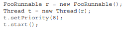
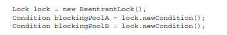

### **What are Threads ???**

A thread is a separate process on your computer; you can run multiple threads all at the same time. The way the CPU (central processing unit) actually handles this is usually by switching rapidly between threads to give the illusion of multiple processes all happening simultaneously, although if you have more than one CPU, of course your computer can run code on both at the same time. 

It is this feature of your computer that allows you to run multiple applications at the same time. 

Multi-threaded code has the disadvantage of becoming quite complex very quickly, although Java has some great classes for dealing with multithreading and simplifying it. 

The complexity arises when multiple threads need to access the same resources; having multiple threads modifying a single shared research (an array or whatever) is a potential recipe for disaster and needs to be handled carefully. 

### **What are Threads in JAVA?**

In Java, "thread" means two different things: 

■ An instance of class java.lang.Thread 

■ A thread of execution

An instance of Thread is just… an object. Like any other object in Java, it has variables and methods, and lives and dies on the heap. But a thread of execution is an individual process (a "lightweight" process) that has its own call stack. In Java, there is one call stack per thread.

The main() method, which starts the whole ball rolling, runs in one thread, called the main thread. If you looked at the main call stack, you'd see that main() is the first method on the stack—the method at the bottom. 

But as soon as you create a new thread, a new stack materializes and methods called from that thread run in a call stack that's separate from the main() call stack. That second new call stack is said to run concurrently with the main thread.

The JVM, which gets its turn at the CPU by whatever scheduling mechanism the underlying OS uses, operates like a mini-OS and schedules its own threads, regardless of the underlying operating system. 

Different JVMs can run threads with a different thread-scheduling mechanism. For example, one JVM might be sure that all threads get their turn, with a fairly even amount of time allocated for each thread in a nice, happy, round-robin fashion. But in other JVMs, a thread might start running and then just hog the whole show, never stepping out so others can have a turn.  

**User & Daemon Threads**

A **daemon** is a computer program that runs as a background process, rather than being under the direct control of an interactive user.

**Daemon thread** in JAVA is a low priority **thread** that runs in the background to perform tasks such as garbage collection. 

A **user thread** is a **thread** that is created by the application (**user**), whereas, a daemon **thread** is created by the **Java** VM to serve the **user threads**.

JVM exits an application (i.e. JVM will shut down) only when all user threads are complete, regardless of the state of any daemon threads. JVM doesn't care about letting daemon threads complete.

### **Creating Threads in Java**

##### **1) Implement the Runnable interface**

Override the run() method with the code you want to execute. Pass this implementation of Runnable interface to the constructor of Thread, then call start().

A common way to think about this is that the Thread is the "worker,"  (somebody has to run your job…) and the Runnable is the "job" to be done.

<table>
  <tr>
    <td>class MyTask implements Runnable{
	@Override
	public void run() {
		System.out.println("Executing Runnable thread");
	}
}	
public class ThreadCreation {
	public static void main(String[] args) {
		
//We can pass an object of the runnable implementation
		MyTask m1 = new MyTask(); //Or Runnable m1 = new MyTask();  
		Thread t1 = new Thread(m1);
		t1.start();

//We can simplify this code by not creating a reference variable to MyThread 
		Thread t2 = new Thread(new MyTask());
		t2.start();

//We can simplify this by not creating a reference variable to Thread
		(new Thread(new MyTask())).start();
		
//We can pass the implementation of runnable using anonymous classes
		Thread t3 = new Thread(new Runnable() {
			@Override
			public void run() {
				System.out.println("Thread using anonymous class");
			}
		});
		t3.start();
		
//We can pass the implementation of runnable using lambda
		Runnable runnable = () -> { 
			System.out.println("Thread using lambda");
		};
		Thread t4 = new Thread(runnable);
		t4.start();
	}
}</td>
  </tr>
</table>

Giving the same Runnable instance to multiple threads objects means that several threads of execution will be running the same job (and that the same job will be done multiple times).

##### 2) Extend the java.lang.Thread class

Override the run() method with the code you want to execute. Then create a new object from your class and call start(). 

The Thread class itself implements Runnable. (After all, it has a run() method that we were overriding.)

<table>
  <tr>
    <td>class MyNewThread extends Thread{
	@Override
	public void run() {
		System.out.println("Executing thread" + Thread.currentThread().getName());
	}
}

public class ThreadCreation2 {

	public static void main(String[] args) {
		
//Create an object of the class extending Thread, then call start()
		MyNewThread t1 = new MyNewThread();
		t1.start();
		
		
//We can simplify this by not creating a reference variable to MyNewThread
		(new MyNewThread()).start();
		
		
//We can directly pass the implementation using anonymous classes
		Thread t2 = new Thread() {
		    @Override
		    public void run() {
				System.out.println("Thread using anonymous class");
		    }
		};
		t2.start();
		
		
//We can pass the implementation using lambda
		Thread t4 = new Thread(() -> System.out.println("Thread using lambda"));
		t4.start();
	}
}</td>
  </tr>
</table>

**In the real world, you're much more likely to implement Runnable than extend Thread. Why? **

Subclassing should be reserved for specialized versions of more general superclasses. So the only time it really makes sense (from an OO perspective) to extend Thread is when you have a more specialized version of a Thread class. 

Generally, chances are that the thread work you want is just a job to be done by a thread. In that case, you should implement the Runnable interface, which also leaves your class free to extend some other class.

### **Starting a Thread**

When a thread has been instantiated but not started (i.e. the start() method has not been invoked on the Thread instance), the thread is said to be in the **new state**. 

Once the start() method is called, the thread is considered **alive** (even though the run() method may not have actually started executing yet). 

A thread is considered **dead** (no longer alive) after the run() method completes. The isAlive() method is the best way to determine if a thread has been started but has not yet completed its run() method.

**What happens after you call start()? **

■ A new thread of execution starts (with a new call stack). 

■ The thread moves from the new state to the runnable state. 

■ When the thread gets a chance to execute, its target run() method will run. Be sure you remember the following: You call start() on a Thread instance, not on a Runnable instance. 

### The Thread Scheduler 

**Part of JVM** (although most JVMs map Java threads directly to native threads on the underlying OS) that decides which thread should run at any given moment, and also takes threads out of the run state. 

Assuming a single processor machine, only one thread can actually run at a time. Only one stack can ever be executing at one time. And it's the thread scheduler that decides which one thread—of all that are eligible (in the runnable state) —will actually run. 

**The order & duration for which runnable threads are chosen to run is not guaranteed.**

For example, one thread can run to completion before the others have a chance to get in, or they'll all take turns nicely, or they'll do a combination of both. 

There is a way using the join() method, however, to start a thread but tell it not to run until some other thread has finished. 

**We can’t control** the thread scheduler (i.e. we can't tell a specific thread to run), but we can **sometimes** **influence** it using the following methods.

**Q: What happens to a thread when its target run() method completes?**

When a thread completes its run() method, the thread ceases to be a thread of execution. The stack for that thread dissolves, and the thread is considered dead (or "terminated").

It's still a Thread object, just not a thread of execution. So, you can still call methods on the Thread instance, like any other Java object. *** What you can't do, is call start() again.**

**Q: Can we start a thread twice in java?**

No. It will throw an **IllegalThreadStateException** (a kind of RuntimeException). 

This happens whether or not the run() method has completed from the first start() call. 

A runnable thread or a dead thread cannot be restarted. 

**Q: Why not call run() method directly instead of start() ?**

t1.run();	t2.run();

This causes the Worker.run() methods to execute sequentially and they will be in the same stack as main i.e. no new thread created. To execute these methods simultaneously, we call start() methods that eventually create a new thread with a new stack space.

### Thread States and Transitions 

**■ New State**

When a Thread instance has been created but the start() method has not been invoked. 

It is a live Thread object, but not yet a thread of execution. At this point, the thread is considered not alive. 

				          |----------Alive---------|

■ **Runnable** 

When a thread is eligible to run but the scheduler has not selected it to be the running thread. A thread first enters a runnable state when the start() method is invoked, but a thread can also return to the runnable state after either running or coming back from a blocked, waiting, or sleeping state. In the runnable state, a thread is considered alive. 

■ **Running** 

When a thread is selected by thread scheduler from the runnable pool to be the currently executing process. A thread can transition out of a running state for several reasons.

■ **Waiting/blocked/sleeping **

This is the state a thread is in when it’s still alive but not eligible to run. In other words, it is not runnable, but it might return to a runnable state later if a particular event occurs. 

A thread may be blocked waiting for a resource (like I/O or an object's lock), in which case the event that sends it back to runnable is the availability of the resource.

A thread may be sleeping because the thread's run code tells it to sleep for some period of time, in which case, the event that sends it back to runnable is the expiry of sleep time. 

Or the thread may be waiting because the thread's run code causes it to wait, in which case, the event that sends it back to runnable causes another thread to send a notification that it may no longer be necessary for the thread to wait. 

**■ Dead **

A thread is considered dead when its run() method completes. It may still be a viable Thread object, but no longer a separate thread of execution. A dead thread can never be brought back to life! Invoking start() on a dead Thread instance, gives a runtime exception. 

### Preventing Thread Execution

Cases when a thread leaves running state but not sent back to either runnable or dead

* Sleeping 

* Waiting 

* Blocked because it needs an object's lock

**Sleeping **

sleep() can "slow a thread down" by forcing it to go into a sleep mode & doesn't return to runnable until it wakes up (where it still has to beg to be the currently running thread). 

For example: Imagine a thread that runs in a loop, downloading the latest stock prices and analyzing them. Downloading prices one after another would be a waste of time and precious bandwidth, as most would be quite similar. 

To solve this pause a thread (sleep) for five minutes after each download.

**Note:** sleep() method can throw a checked **InterruptedException**, so you must acknowledge the exception.

**Q: ****[What kind of behaviour causes an interrupted exception**?](https://stackoverflow.com/questions/225194/what-kind-of-behaviour-causes-an-interrupted-exception)

If some other Thread calls non static method t1.interrupt(), while the thread is sleeping.

**When a thread wakes up after sleep() expires, it will return to the runnable state and not the running state.**

**Remember that sleep() is a static method of class Thread, so don't be fooled into thinking that one thread can put another thread to sleep.**

### Thread Priorities 

Threads always run with some priority, usually represented as a number between 1 and 10. 

The JVM specification does not require a VM to implement a time-slicing scheduler, where each thread is allocated a fair amount of time and then sent back to runnable to give another thread a chance. 

The scheduler in most JVMs (not all) uses preemptive, priority-based scheduling. If a thread enters the runnable state and has higher priority than any of the threads in the pool and the currently running thread, then the lower-priority running thread usually will be bumped back to runnable and the highest priority thread will be chosen to run. 

***** Don't rely on thread priorities when designing your multithreaded application. **

Because thread-scheduling priority behavior is not guaranteed, use thread priorities as a way to improve the efficiency of your program, but just be sure your program doesn't depend on that behavior for correctness.

For equal priority threads, a JVM implementation of the scheduler is free to do just about anything it likes, for instance

* Pick a thread to run, and run it there until it blocks or completes. 

* Time-slice the threads in the pool to give everyone an equal opportunity to run.

**Default Thread Priority**

A thread gets a default priority that is the priority of the thread of execution that creates it. 

For example, the thread referenced by t will have the same priority as the main thread, since the main thread is executing the code that creates the MyThread instance.

**Setting a Thread's Priority**

Priorities are set using setPriority() method on a Thread instance with a positive integer, usually between 1 and 10, and the JVM will never change a thread's priority. 

However, some JVMs might not recognize 10 distinct values. So if you have, say, ten threads, each with a different priority, and the current application is running in a JVM that allocates a range of only five priorities, then two or more threads might be mapped to one priority.

Although the default priority is 5, the Thread class has the following three constants (static final variables) that define the range of thread priorities: 

Thread.MIN_PRIORITY (1) Thread.NORM_PRIORITY (5) Thread.MAX_PRIORITY (10)

**The static yield( ) Method **

yield() causes the currently running thread head back to runnable to allow other threads of the same priority to get their turn. So the intention is to use yield() to promote graceful turn-taking among equal-priority threads. 

A yield() won't ever cause a thread to go to the waiting/sleeping/ blocking state. At most, a yield() will cause a thread to go from running to runnable, but again, there's no guarantee the yielding thread won't just be chosen again over all the others! 

**The non-static join( ) Method**

The preceding code takes the currently running thread (if this were in the main() method, then that would be the main thread) and joins it to the end of the thread referenced by t. 

This blocks the current thread from becoming runnable until the thread referenced by t is no longer alive. In other words, the code t. join() means "Join me (the current thread) to the end of t, so that t must finish before I (the current thread) can run again."

There is an overloaded version of join() that takes a timeout duration and says, "wait until thread t is done, but if it takes longer than 5,000 milliseconds, then stop waiting and become runnable anyway." 

[https://www.studytonight.com/java/joining-a-thread.php](https://www.studytonight.com/java/joining-a-thread.php)

So far, we've looked at three ways a running thread could leave the running state: 

■ A call to sleep() Guaranteed to cause the current thread to stop executing for at least the specified sleep duration (although it might be interrupted before its specified time).

■ A call to yield() Not guaranteed to do much of anything, although typically, it will cause the currently running thread to move back to runnable so that a thread of the same priority can have a chance. (A thread might yield and then immediately reenter the running state)

■ A call to join() Guaranteed to cause the current thread to stop executing until the thread it joins with (in other words, the thread it calls join() on) completes, or if the thread it's trying to join with is not alive, the current thread won't need to back out.

Besides those three, following are scenarios in which a thread might leave the running state: 

■ The thread's run() method completes. 

■ A call to wait() on an object (we don't call wait() on a thread). 

■ A thread can't acquire the lock on the object whose method code it's attempting to run. 

■ The thread scheduler can decide to move the current thread from running to runnable in order to give another thread a chance to run. No reason is needed—the thread scheduler can trade threads in and out whenever it likes.

### Thread Synchronization

### In a multi-threaded environment, it is possible that 2 or more threads are accessing the same resource/critical section/mutable data at around the same time. This can be fatal and lead to erroneous results. 

##### Critical Section Problem 

Ex: Lucy and Fred making withdrawals from their account. 

### **To make sure that only one thread accesses the resource/critical section at a given point of time we use synchronisation**

You don't need to worry about local variables— each thread gets its own copy of a local variable. Two threads executing the same method at the same time will use different copies of the local variables, and they won't bother each other. **However, you do need to worry about static and nonstatic fields if they contain data that can be changed.**

##### Synchronized Keyword

### In Java, we can mark a method or block as synchronized, which means that only one thread will be able to enter that method or block at a given point of time.

[https://howtodoinjava.com/java/multi-threading/java-synchronized/](https://howtodoinjava.com/java/multi-threading/java-synchronized/)

##### Object vs class level locking

[https://howtodoinjava.com/java/multi-threading/object-vs-class-level-locking/](https://howtodoinjava.com/java/multi-threading/object-vs-class-level-locking/)

Points to be noted in the link above

1. Re-entrant

2. Null Pointer when object is null in sync block

3. Performance cost

4. When a lock is taken on an object? Why should the object be declared final?

**Key Points:**

1) A thread can acquire more than one lock. For example, a thread can enter a synchronized method, thus acquiring a lock, and then immediately invoke a synchronized method on a different object, thus acquiring that lock as well. As the stack unwinds, locks are released again. Also, if a thread acquires a lock and then attempts to call a synchronized method on that same object, no problem. The JVM knows that this thread already has the lock for this object, so the thread is free to call another synchronized method on the same object, using the lock the thread already has.

**2) What Happens If a Thread Can't Get the Lock?**

If a thread tries to enter a synchronized method and the lock is already taken, the thread is said to be blocked on the object's lock. Essentially, the thread goes into a kind of pool for that particular object and has to sit there until the lock is released and the thread can again become runnable/running. Just because a lock is released doesn't mean any particular thread will get it. There might be three threads waiting for a single lock, for example, and there's no guarantee that the thread that has waited the longest will get the lock first.

3) Not all methods in a class need to be synchronized. A class can have both synchronized and non-synchronized methods.

If a class has both synchronized and non-synchronized methods, multiple threads can still access the class's non-synchronized methods! If you have methods that don't access the data you're trying to protect, then you don't need to synchronize them. 

When thinking about blocking, it's important to pay attention to which objects are being used for locking: 

■ Threads calling non-static synchronized methods in the same class will only block each other if they're invoked using the same instance. That's because they each lock on this instance, and if they're called using two different instances, they get two locks, which do not interfere with each other. 

■ Threads calling static synchronized methods in the same class will always block each other—they all lock on the same Class instance. 

■ A static synchronized method and a non-static synchronized method will not block each other, ever. The static method locks on a Class instance, while the non-static method locks on the **this** instance— these actions do not interfere with each other at all. 

■ For synchronized blocks, you have to look at exactly what object has been used for locking. Threads that synchronize on the same object will block each other. Threads that synchronize on different objects will not.

**4) So When Do I Need to Synchronize?**

For changeable data in a non-static field, you usually use a non-static method to access it. By synchronizing that method, you will ensure that any threads trying to run that method using the same instance will be prevented from simultaneous access. But a thread working with a different instance will not be affected because it's acquiring a lock on the other instance. That's what we want—threads working with the same data need to go one at a time, but threads working with different data can just ignore each other and run whenever they want to; it doesn't matter.

For changeable data in a static field, you usually use a static method to access it. And again, by synchronizing the method, you ensure that any two threads trying to access the data will be prevented from simultaneous access, because both threads will have to acquire locks on the Class object for the class the static method's defined in. 

**5) However—what if you have a non-static method that accesses a static field? Or a static method that accesses a non-static field (using an instance)? In these cases, there's a very good chance that things will not work the way you want. **

If you've got a static method accessing a nonstatic field and you synchronize the method, you acquire a lock on the Class object. But what if there's another method that also accesses the non-static field, this time using a non-static method? It probably synchronizes on the current instance (this) instead. Remember that a static synchronized method and a non-static synchronized method will not block each other—they can run at the same time. 

Similarly, if you access a static field using a non-static method, two threads might invoke that method using two different this instances. Which means they won't block each other because they use different locks. Which means two threads are simultaneously accessing the same static field—exactly the sort of thing we're trying to prevent.

Well, there are ways to do that, but it's beyond what you need for the exam. 

**_To keep things simple, in order to make a class thread-safe, methods that access changeable fields need to be synchronized. Access to static fields should be done using static synchronized methods. Access to non-static fields should be done using non-static synchronized methods._**

**Thread-Safe Classes**

When a class has been carefully synchronized to protect its data, we say the class is "thread-safe."

Many classes in the Java APIs already use synchronization internally in order to make the class "thread-safe." The method Collections.synchronizedList() returns a List whose methods are all synchronized and "thread-safe" according to the documentation. This makes it safe to use in a multithreaded environment.

However, even when a class is "thread-safe," it is often dangerous to rely on these classes to provide the thread protection you need. As an example, consider the following class:

**Can the NameList class be used safely from multiple threads?** It's tempting to think that yes, since the data in names is in a synchronized collection. 

However that's not the case—the removeFirst() may sometimes throw a IndexOutOfBoundsException. **What's the problem?** 

Let's try to use NameList like this:

Case I:

Case II:

The thing to realize here is that in a "thread-safe" class like the one returned by synchronizedList(), each individual method is synchronized. So names.size() is synchronized, and names.remove(0) is synchronized. But nothing prevents another thread from doing something else to the list in between those two calls. And that's where problems can happen.

There's a solution here: Don't rely on Collections.synchronizedList(). Instead, synchronize the code yourself:

Now the entire removeFirst() method is synchronized, and once one thread starts it and calls names.size(), there's no way the other thread can cut in and steal the last name. The other thread will just have to wait until the first thread completes the removeFirst() method.

*** When using a class that is described as "thread-safe", it means the individual methods are synchronized. But that may not be enough—you may be better off putting in synchronization at a higher level (i.e., put it in the block or method that calls the other methods). Once you do that, the original synchronization (in this case, the synchronization inside the object returned by Collections.synchronizedList()) may well become redundant.

##### Thread Deadlock

Deadlock can occur when two threads are waiting for each other's locks to be released; Neither can run until the other gives up its lock, therefore, the locks will never be released!

The following example demonstrates deadlock:

Assume that read() is started by one thread and write() is started by another. If there are two different threads that may read and write independently, there is a risk of deadlock at line 8 or 16. The reader thread will have resourceA, the writer thread will have resourceB, and both will get stuck waiting for the other.

The preceding simple example is easy to fix; just swap the order of locking for either the reader or the writer at lines 16 and 17 (or lines 8 and 9). 

### Inter-Thread Communication

Inter-thread communication allows synchronized threads to communicate the status of an event with each other using a set of methods: wait(), notify(), and notifyAll(), which are all inherited from the Object class.

For example, if one thread is a mail-delivery thread and one thread is a mail-processor thread, the mail-processor thread has to keep checking to see if there's any mail to process.  But this design is not optimal because the mail-processor can't do anything while the machine is busy checking to see if there's any mail to process and while there are other mails to process. We need to improve the situation.

**Using the wait and notify mechanism**

Mail-processor thread could check for mail, and if it doesn't find any, it can go in a waiting state. When the mail deliverer puts something in the mailbox, notify the mail-processor so that it can go back to runnable and do some work. 

*** Wait() causes the current thread to wait indefinitely until some other thread calls notify() or notifyAll() on the same object. 

**_A thread can't invoke a wait or notify method on an object unless it owns that object's lock._** **Thus,** **_wait(), notify(), and notifyAll() must be called from within a synchronized context! Why? _****Because there should not be a race condition between wait() and notify().**

**Ex: Single producer and single consumer and a single length buffer, then if 1 item is produced and the consumer consumes the item. Now if consumer calls notify and at the same time producer calls wait (if no synchronized block was used) then the producer will wait indefinitely if notify was completed before wait.**

Let's take a look at some code that shows one object waiting for another object to notify it:

Every object has a lock, similarly, every object can have a list of threads that are waiting for a signal (a notification) from the object. 

A thread gets on this waiting list by executing the wait() method of the target object. 

From that moment, it doesn't execute any further instructions until the notify() method of the target object is called. 

If many threads are waiting on the same object, only one will be chosen (in no guaranteed order) to proceed with its execution. If no threads are waiting, then no particular action is taken. 

##### **Producer consumer problem** (Understanding wait() notify())

[https://howtodoinjava.com/java/multi-threading/wait-notify-and-notifyall-methods/](https://howtodoinjava.com/java/multi-threading/wait-notify-and-notifyall-methods/)

The threads use a shared object to communicate.

**Q: Does the lock become available whenever wait() or notify() is called?**

When the wait() method is invoked on an object, the thread executing that code gives up its lock on the object immediately. 

However, when notify() is called, that doesn't mean the thread gives up its lock at that moment. The lock is not released until the thread moves out of synchronized code. 

**Exceptions Caused when using these methods**

1. **IllegalMonitorStateException**

***** The methods wait() and notify(), remember, are instance methods of Object. If no object specified...it will be called on the current object.**

# **Now if the thread calling wait() does not own the lock on the object, it will throw an IllegalMonitorStateException. This exception is not a checked exception, so you don't have to catch it explicitly. **

A thread becomes the owner of the object's monitor or owns the lock in one of the ways:

* By executing a synchronized method of that object.

* By executing the body of a synchronized block that synchronizes on the object.

2. **InterruptedException**

**Call the interrupt() method on your thread. This will cause the sleeping or waiting to be cancelled and an InterruptedException will be thrown. ****There is a try/catch block around the wait() method to catch the InterruptedException.**

**Using notifyAll( ) When Many Threads May Be Waiting**

When notifyAll() is used on the object, all of the threads waiting on the particular object are notified, i.e. moved from waiting state to runnable and they start competing to get the lock.

This is especially important if you have several threads waiting on one object, but for different reasons, and you want to be sure that the right thread is notified.

An object can have many threads waiting on it, and using notify() will affect only one of them. Which one, exactly, is not specified and depends on the JVM implementation, so you should never rely on a particular thread being notified in preference to another.

In cases in which there might be a lot more waiting, the best way is by using notifyAll(). 

For example, when one class performs writing a book and many readers are waiting to read the completed book at any given moment.

If notify() is used instead of notifyAll(), only one reader R1 or R2 would be notified instead of both R1 and R2.

What is meant by notified? 

Let’s say we call notify(), now any of R1 or R2 will be sent to the Runnable state (i.e. notified). Now the scheduler will execute this thread. The other is still in a wait state.

Let’s say we call notifyAll(), now both R1 and R2 will be sent to the Runnable state (i.e. notified). Now the scheduler will execute these threads. Let’s say it starts executing R1. The scheduler now decides to execute R2, it will do a context switch to R2, moving the R1 back to runnable. But R2 will not be able to acquire lock, hence moved to Blocked state. And R1 will finish execution first. On the availability of the resource, blocked threads are sent back to runnable. Now R2 can execute.

NOTE: When user calls wait. Thread is sent to wait state.

When a thread was in runnable and tries to acquire a lock, but can’t do then it goes to a blocked state and will return to runnable when resource becomes available.

##### **Reader Writer Problem** (Diff between notify() and notifyAll())

### [https://java2blog.com/wait-notify-and-notifyall-method-in/](https://java2blog.com/wait-notify-and-notifyall-method-in/)

**Using wait( ) in a Loop** 

In the (Reader/Writer) example, when the Readers run, they just start waiting right away. They don't do anything to see if the event they're waiting for has already happened. 

This works well as we ensured that the reader threads started waiting before the writer thread executes the notify() or notifyAll(). 

**But what happens if, for example, the Writer runs first and calls notify() before the Readers have started waiting? **

If the Writer has already called notifyAll(), it's not going to call notifyAll() again—and the waiting Readers will keep waiting forever. 

***** Whenever you want to wait for something, you need to check if it has already happened. Generally, the best way to solve this is to put in some sort of loop **

<table>
  <tr>
    <td>synchronized (book) {

   System.out.println(Thread.currentThread().getName()+" is waiting for the book to be completed: "+book.getTitle());

   while (!book.isCompleted()) { 
     try {
       book.wait();
     } catch (InterruptedException e) {    
       e.printStackTrace();
     }
   }

   System.out.println(Thread.currentThread().getName()+": Book has been completed now!! you can read it");
  }</td>
  </tr>
</table>

**Why using a while loop and not an if statement?**

There's also a possible situation called spontaneous wakeup that may exist in some situations—a thread may wake up even though no code has called notify() or notifyAll(). (Sometimes, the JVM may call notify() for reasons of its own). What this means is that when your thread wakes up from a wait(), you don't know for sure why it was awakened.

By putting the wait() method in a while loop and rechecking the condition that represents what we were waiting for, we ensure that whatever the reason we woke up, we will re-enter the wait() if (and only if) the thing we were waiting for has not happened yet. 

**Implement Print odd and even numbers using wait and notify**

**S****emaphores**

Java provides the *Semaphore* class in the *java.util.concurrent* package that allows to control access to a shared resource through the use of a counter. 

If the counter is greater than zero, access is allowed. If it is zero, then access is denied.

**Implement Print odd and even numbers using ****semaphores**

[https://www.baeldung.com/java-even-odd-numbers-with-2-threads](https://www.baeldung.com/java-even-odd-numbers-with-2-threads)

A permission is given to odd thread and no permission to even thread initially. Odd thread gives permission to even thread and vice versa.

**Sync3 threads using above semaphores and wait/notify**

This wait and notify implementation gives example to the reasoning below.

Always call the wait() method in a loop because if multiple threads are waiting for a lock and one of them got the lock and reset the condition, then the other threads need to check the condition after they wake up to see whether they need to wait again or can start processing. Useful in syn3Threads

**An Important Note**

Which methods belong to which class

**java.lang.Object		**wait(), notify(), and notifyAll()

**java.lang.Runnable		**run()

**java.lang.Thread		static—**sleep() and yield() **NonStatic—**join() and start()

TODO: countDownLatch, cyclic barrier

# **Difference between sleep and wait in java**

[https://java2blog.com/difference-between-sleep-and-wait-in/](https://java2blog.com/difference-between-sleep-and-wait-in/)

# **Difference between lock and monitor in java**

**Concurrency with the java.util.concurrent Package**

**Why supporting multithreaded programming is essential for any modern programming language?**

Because servers, desktop computers, laptops, and most mobile devices contain multiple CPUs. If you want your applications to take advantage of all of the processing power (even for a single core...for ex:  if a thread is IO bound like making db calls or network calls then the other thread can be executed) present in a modern system, you must create multithreaded applications.

The low-level threading constructs such as Thread, Runnable, wait(), notify(), and synchronized blocks are too primitive for many requirements and force developers to create their own high-level threading libraries. Custom threading libraries can be both error prone and time consuming to create.

The java.util.concurrent package provides high-level APIs that support many common concurrent programming use cases. When possible, you should use these high-level APIs in place of the traditional low-level threading constructs (synchronized, wait, notify). 

Some features (such as the new locking API) provide functionality similar to what existed already, but with more flexibility at the cost of slightly awkward syntax.** **

The** java.util.concurrent.atomic** package enables multithreaded applications to safely access individual variables without locking

The **java.util.concurrent.locks** package provides a locking framework that can be used to create locking behaviors that are the same or superior to those of Java's synchronized keyword.

**Atomic Variables**

**Atomic Variables should be used when two or more threads are accessing and modifying the shared count variable. **

**Here is a class that increments and reports the current value of an integer variable:**

**A Thread that will increment the counter 10,000 times:**

**The code from within this application's main method:**

**When incrementing a field like this (count++), what happens internally: **

1. The value stored in count is copied to a temporary variable. 

2. The temporary variable is incremented. 

3. The value of the temporary variable is copied back to the count field.

**For two threads running simultaneously, we will get incorrect results.**

*** While you could make this code thread-safe with synchronized blocks, the act of obtaining and releasing a lock flag would probably be more time consuming than the work being performed. 

The java.util.concurrent.atomic package provide variables whose values can be modified atomically. There are several classes for different data types, such as AtomicInteger, AtomicLong, AtomicBoolean, and AtomicReference, to name a few. 

Thread-safe replacement for the Counter class from the previous example:

In reality, even getAndIncrement() takes several steps. This implementation uses CAS stands for Compare And Swap. 

A basic outline of what is happening now is as follows: 

1. The value stored in count is copied to a temporary variable. 

2. The temporary variable is incremented. 

3. Compare the value currently in count with the original value. If it is unchanged, then swap the old value for the new value. 

Step 3 happens atomically. If step 3 finds that some other thread has already modified the value of count, then repeat steps 1–3 until we increment the field without interference. 

The compareAndSet(int expect, int update) method provides the CAS behavior. 

**Locks**

Much of the functionality provided by the classes and interfaces of java.util.concurrent.locks package duplicates that of traditional synchronized locking (the synchronized keyword) for roughly the same purpose: creating segments of code that require exclusive execution (one thread at a time).

In Java 5, when java.util.concurrent was first introduced, the new locking classes performed better than the synchronized keyword, but there is no longer a vast difference in performance. 

**So why would you use these newer locking classes? **

The java.util.concurrent.locks package provides

■ The ability to duplicate traditional synchronized blocks. 

■ Nonblock scoped locking—obtain a lock in one method and release it in another (this can be dangerous, though). 

■ Multiple wait/notify/notifyAll pools per lock—threads can select which pool (Condition) they wait on. 

■ The ability to attempt to acquire a lock and take an alternative action if locking fails. 

■ An implementation of a multiple-reader, single-writer lock.

**ReentrantLock**

The java.util.concurrent.locks package provides locking through:

1. java.util.concurrent.locks.Lock interface 

2. java.util.concurrent.locks.ReentrantLock class (implementation of above interface)

**Basic traditional synchronized block.**

**Equivalent code using the java.util.concurrent.locks package. **

**Note: **ReentrantLock can be stored in a Lock reference as it implements Lock interface. 

**What’s New with Reentrant lock?**

**1) Ability to attempt (and fail) to acquire a lock. **

With traditional synchronization, once you hit a synchronized block, your thread either immediately acquires the lock or blocks until it can.

But the ability to quickly fail allows us to process a different resource (lock) and come back to the failed lock later instead of just waiting for a lock to be released and thereby making more efficient use of system resources. 

Variation of tryLock() method: Allows to specify time you are willing to wait to acquire the lock

**2) Deadlock avoidance. **

For example, if you have two objects to lock against.

**With traditional synchronization**, you must acquire locks in same order across all threads:

		**Thread A					Thread B**

**You should never acquire the locks in the opposite order because it could lead to deadlock.** While thread A has only the o1 lock, thread B acquires the o2 lock. You are now at an impasse because neither thread can obtain the second lock it needs to continue.

**With ReentrantLock, **you can acquire locks in any order across all threads:

			**Thread A					Thread B**

Now in thread B, locks are obtained in the reverse order in which thread A obtained them. Now, even if thread A was only in possession of the l1 lock, there is no possibility that thread B could block because we use the nonblocking tryLock method. 

**Note: **Always unlock any acquired lock, but ONLY the lock(s) that were acquired. 

If a thread attempts to release a lock that it does not own, an IllegalMonitorStateException will be thrown. 

Using the technique above, you can avoid deadlocking scenarios, but you must deal with the possibility that both locks could not be acquired. Using a simple loop, you can repeatedly attempt to obtain both locks until successful 

(**Note:** This approach is CPU intensive)

**It is remotely possible that this example could lead to LIVELOCK.** 

Imagine if thread A always acquires lock1 at the same time that thread B acquires lock2. Each thread's attempt to acquire the second lock would always fail, and you'd end up repeating forever. 

**Avoiding LIVELOCK in this scenario**

Introduce a short random delay with Thread.sleep(int) any time you fail to acquire both locks.

**The java.util.concurrent.locks package contains a locking mechanism that is an alternative to synchronized methods and blocks. You get greater flexibility at the cost of a more verbose syntax (such as having to manually call lock.unlock() and having an automatic release of a synchronization monitor at the end of a synchronized code block).**

**Condition**

The java.util.concurrent.locks.Condition interface is the modern replacement for the wait and notify methods. 

**Steps to use a Condition:**

**1) Create a Condition from a Lock object**

**2) Using Condition to wait until another thread performs some activity**

Before calling await on a Condition, a thread must first acquire a Lock on the object used to produce the Condition. It is possible that the awaiting thread may be interrupted and you must handle the possible InterruptedException.

 

When you call the await method, the Lock associated with the Condition is released. Before the await method returns, the lock will be reacquired.

**3) In another thread, you perform the activity that the first thread was waiting on and then signal that first thread to resume (return from the await method). **

The signalAll() method causes all threads awaiting on the same Condition to wake up. 

You can also use the signal() method to wake up a single awaiting thread. 

* Remember that "waking up" is not the same thing as proceeding. Each awoken thread will have to reacquire the Lock before continuing.

**Advantage of a Condition over the traditional wait/notify operations **

By having multiple conditions for a lock, you can effectively categorize the threads waiting on a lock and can, therefore, wake up a subset of the waiting threads. 

Conditions can also be used when you can't use a BlockingQueue to coordinate the activities of two or more threads.

# **[Difference between Semaphore and Condition (ReentrantLock**)](https://stackoverflow.com/questions/12641933/difference-between-semaphore-and-condition-reentrantlock)

# [https://stackoverflow.com/questions/12641933/difference-between-semaphore-and-condition-reentrantlock](https://stackoverflow.com/questions/12641933/difference-between-semaphore-and-condition-reentrantlock)

**ReentrantReadWriteLock**

Imagine an online game that uses java.util.ArrayList to store top 20 scores in last 30 days. As scores expire, they are removed from the list, and as new scores displace existing scores, remove and insert operations are performed. 

A lot of people (threads) will be reading the list at the same time. Occasionally, the list will be modified—sometimes by multiple threads—probably at the same time that it is being read by a large number of threads.

A traditional java.util.List implementation such as java.util.ArrayList is not thread-safe. Concurrent threads can safely read from an ArrayList and possibly even modify the elements stored in the list, but if any thread modifies the structure of the list (add or remove operation), then unpredictable behavior can occur.

**For example: **You might encounter several problems, including ArrayIndexOutOfBoundsException, duplicate values, skipped values, and null values. 

<table>
  <tr>
    <td>public class MaxValueCollection { 
    private List integers = new ArrayList<>(); 
    
    public void add(Integer i) { 
        integers.add(i); 
    } 

    public int findMax() { 
        return Collections.max(integers); 
    } 

    public int remove() { 
        if(!integers.isEmpty()){
            return integers.remove(0); 
        }  
    }
}</td>
  </tr>
</table>

With a non-thread-safe collection, it is important that if a thread is attempting to modify the collection, it must have exclusive access to the collection. 

**We can use a ReadWriteLock to allow multiple threads to concurrently read the high score list but allow only a single thread to add a new score. **

ReentrantReadWriteLock implements the ReadWriteLock interface. 

ReentrantReadWriteLock is not actually a Lock; instead it produces two specialized Lock instances:

* Read lock - multiple threads can hold the read lock at the same time

* Write lock - only one thread can hold the write lock at a time

Example: Making a non-thread-safe collection (an ArrayList) thread-safe, allowing concurrent reads but exclusive access by a writing thread:

**Ways to make a collection thread-safe:**

1) Surround all the code that accessed the collection in synchronized blocks or use any external Lock implementation as done above.

But in this case there are high chances of errors and deadlock situations, if proper care has not been taken.

2) Use a method such as Collections.synchronizedList(new ArrayList()). 

(Synchronized collections achieve thread-safety through locking, and the entire collections are locked. Locking is implemented via synchronized blocks within the wrapped collection's methods.)

However, they might come with a penalty in performance, as only one single thread can access the collection at a time (a.k.a. synchronized access).

**Using synchronization to safeguard a collection creates a performance bottleneck and reduces the liveness of your application. **

**The java.util.concurrent package provides several types of collections that are thread-safe but do not use coarse-grained synchronization. **

**Copy-on-Write Collections**

* CopyOnWriteArrayList is a List implementation that will never modify its internal array of data. Any mutating operations on the List (add, set, remove, etc.) will cause a new modified copy of the array to be created, which replaces the original read-only array. 

* The read-only (immutable) nature of the underlying array in a CopyOnWriteArrayList allows it to be safely shared with multiple threads. 

This eliminates the need to implement synchronization or locking when manipulating a collection using multiple threads.

**Q: Why should a thread use an Iterator to iterate over this collection?**

When you use list.iterator(), the returned Iterator will always reference the old, unchanged collection of elements as it was when list.iterator() was called, even if another thread modifies the collection. 

Any mutating methods called on a copy-on-write–based Iterator or ListIterator (such as add, set, or remove) will throw an UnsupportedOperationException.

**Key Points**

* The java.util.concurrent package provides two copy-on-write–based collections: CopyOnWriteArrayList and CopyOnWriteArraySet. 

* Use copy-on-write collections when your data sets are relatively small and the number of read operations greatly outnumber modifications to the collections. Each modification to the collection is expensive as entire internal array must be duplicated.

**Just because a collection is thread-safe does not mean the elements it contains can be safely modified by multiple threads. **

**You might have to use atomic variables, locks, synchronized code blocks, or immutable (readonly) objects to make objects referenced by a collection thread-safe.**

### Concurrent Collections

The java.util.concurrent package also contains several concurrent collections that can be concurrently read and modified by multiple threads, but without the copy-on-write behavior. 

For example:

■ ConcurrentHashMap 

■ ConcurrentSkipListMap 

■ ConcurrentSkipListSet

■ ConcurrentLinkedDeque 

■ ConcurrentLinkedQueue 

**Concurrent Collections Iterators**

An Iterator for a concurrent collection is **weakly consistent**; it can return elements from the point in time the Iterator was created or later (i.e. you might observe elements that are being inserted by other threads when concurrently reading from the collection).

Imagine attempting to count the number of people in a checkout line at the grocery store. While you are counting the people in line, some people may join the line and others may leave. Your count might end up close but not exact by the time you reach the end. This is the type of behavior you might see with a weakly consistent collection. 

Unlike in most collections, the size method is NOT a constant-time operation. Because of the asynchronous nature of these queues, determining the current number of elements requires a traversal of the elements, and so may report inaccurate results if this collection is modified during traversal. 

Additionally,** the bulk operations** **addAll**, removeAll, retainAll, containsAll, equals, and toArray are **not guaranteed** to be performed **atomically**. For example, an iterator operating concurrently with an addAll operation might view only some of the added elements.

The **benefit** to this type of behavior is that it is permissible for multiple threads to concurrently read and write a collection without having to create multiple internal copies of the collection, as is the case in a copy-on-write collection. If your application cannot deal with these inconsistencies, you might have to use a copy-on-write collection.

**How to use HashMap in multithreaded environment**

1) If using HashMap, then you must write relevant code inside synchronized blocks or use any external Lock implementation. But in that case there are high chances of error and deadlock situations, if proper care is not taken.

2) Use any thread safe collections like Hashtable, Collections.SynchronizedMap or ConcurrentHashMap.

**Hashtable:** Uses synchronized methods to achieve thread safety. 

At a time only one thread could read or write into a Hashtable. In other words, thread acquires lock on entire Hashtable instance. Hence its performance is also slow and we cannot utilize advantages of multithreaded architecture. 

Also it does not allow null keys or values whereas HashMap allows one null key and multiple null values.

**Collections.SynchronizedMap(Map map): **Converts any thread-unsafe implementation to a thread-safe implementation. 

Similar to Hashtable and it also acquires lock on entire Map instance. 

It internally wraps all methods of Map interface with synchronized keyword. For instance:

Similar to a HashMap, Synchronized HashMap allows one key and multiple null values as it just wraps the methods of HashMap with synchronized keyword. Rest behaviour is same as original Collection. 

**** Note:** Collections.SynchronizedSortedMap() method converts thread-unsafe TreeMap and other sortedMap implementation to corresponding thread-safe collection.  

**ConcurrentHashMap: **Allows more than one thread to read and write concurrently. 

Internally it divides the Map instance into different segments. And each thread acquires lock only on a segment. More on internal working : [https://medium.com/@itsromiljain/curious-case-of-concurrenthashmap-90249632d335](https://medium.com/@itsromiljain/curious-case-of-concurrenthashmap-90249632d335)

Writes to ConcurrentHashMap: At a time only a single thread can write in a segment. But two threads are allowed to write concurrently in different segments. 

Reads from ConcurrentHashMap: Any number of threads can read from the same segment. A thread can also read from a segment even if another thread is writing in the same segment. But in this case only last updated value will be seen by reading thread. 

ConcurrentHashMap does not allow null keys and values.

A concurrent Map enhances a standard Map by adding atomic operations that validate the presence and value of an element before performing an operation: putIfAbsent(K key, V value), remove(Object key, Object value), replace(K key, V value), and replace(K key, V oldValue, V newValue).

For example, the putIfAbsent method is equivalent to performing the following code as an atomic operation:

**** Note: **ConcurrentSkipListMap is an implementation of ConcurrentNavigableMap. This interface is a type of SortedMap that provides navigation methods like lowerEntry, floorEntry, ceilingEntry, higherEntry which return Map.Entry instances based on the key passed. Similar set of methods available for returning keys too. 

The elements are sorted based on their natural sorting order of keys. The order can be customized using a Comparator provided during the time of initialization. 

**Key Points**

ConcurrentSkipListSet elements are sorted and require the use of the Comparable or Comparator interfaces to enable ordering. Corresponds to a treeset

# **ConcurrentLinkedQueue**

An unbounded thread-safe [Queue](https://developer.android.com/reference/java/util/Queue.html) based on linked nodes. This queue orders elements FIFO (first-in-first-out). New elements are inserted at the tail of the queue, and the queue retrieval operations obtain elements at the head of the queue. 

A ConcurrentLinkedQueue is an appropriate choice when many threads will share access to a common collection. 

Like most other concurrent collection implementations, this class does not permit the use of null elements.

Iterators are weakly consistent, returning elements reflecting the state of the queue at some point at or since the creation of the iterator. 

They do not throw [ConcurrentModificationException](https://developer.android.com/reference/java/util/ConcurrentModificationException.html), and may proceed concurrently with other operations. 

**Blocking queues**

The copy-on-write and the concurrent collections are centered on the idea of multiple threads sharing data. Sometimes, instead of shared data (objects), you need to transfer data between two threads. 

A BlockingQueue is a type of shared collection that is used to exchange data between two or more threads while causing one or more of the threads to wait until the point in time when the data can be exchanged. 

General Behavior 

A blocking collection, depending on the method being called, may cause a thread to block until another thread calls a corresponding method on the collection. For example, if you attempt to remove an element by calling take() on any BlockingQueue that is empty, the operation will block until another thread inserts an element. 

One use case of a BlockingQueue is called the producer-consumer problem. In a producer-consumer scenario, one thread produces data, then adds it to a queue, and another thread must consume the data from the queue. A queue provides the means for the producer and the consumer to exchange objects. 

The java.util.concurrent package provides several BlockingQueue implementations:

**Some Key Points**

* **Bounded Blocking Queues**

Bounded Blocking Queues have an upper bound on the number of elements that can be added, and will block on put(e) and similar operations if the collection is full.

ArrayBlockingQueue is bounded but LinkedBlockingDeque and LinkedBlockingQueue are optionally bounded.

* **DelayQueue**

The elements added to a DelayQueue will implement the java.util.concurrent.Delayed interface which defines a single method: public long getDelay(TimeUnit unit). The elements of a DelayQueue can only be taken once their delay has expired.

* **Synchronous Queue **

1) SynchronousQueue blocks until another thread is ready to take the element, one thread is trying to put.

2) You cannot peek at a synchronous queue because an element is only present when you try to remove it; Similarly you cannot insert an element (using any method) unless another thread is trying to remove it.

3) SynchronousQueue has zero capacity, hence You cannot iterate over SynchronousQueue as there is nothing to iterate.

4) This queue does not permit null elements, adding null elements will result in [NullPointerException](http://javarevisited.blogspot.sg/2012/06/common-cause-of-javalangnullpointerexce.html).

5) For purposes of other Collection methods (for example contains), a SynchronousQueueacts as an empty collection.

* **The LinkedTransferQueue **

An **unbounded** FIFO queue that supports the features of a ConcurrentLinkedQueue, SynchronousQueue, and LinkedBlockingQueue.

* It can function as a concurrent Queue implementation similar to ConcurrentLinkedQueue. 

* It also supports unbounded blocking (consumption blocking) similar to LinkedBlockingQueue via the take() method. 

* Like a SynchronousQueue, it can be used to make two threads rendezvous to exchange an object. Unlike a SynchronousQueue, it has internal capacity, so the transfer(E) method is used to block until the inserted object (and any previously inserted objects) is consumed by another thread. 

Because a LinkedTransferQueue implements the BlockingQueue, TransferQueue, and Queue interfaces, it can be used to showcase all the different methods that can be used to add and remove elements using the various types of queues. 

Creating a LinkedTransferQueue is easy. Because LinkedTransferQueue is not bound by size, a limit to the number of elements CANNOT be supplied to its constructor.

There are many methods to add a single element to a LinkedTransferQueue. Note that any method that blocks or waits for any period may throw an InterruptedException.

Shown next are the various methods to access a single value in a LinkedTransferQueue. Again, any method that blocks or waits for any period may throw an InterruptedException.

Implementation of blocking queue

[https://dzone.com/articles/java-concurrency-blocking-queu](https://dzone.com/articles/java-concurrency-blocking-queu)

Producer Consumer Problem with Blocking Queue

[https://java2blog.com/blockingqueue-in-java/](https://java2blog.com/blockingqueue-in-java/)

[https://dzone.com/articles/the-evolution-of-producer-consumer-problem-in-java](https://dzone.com/articles/the-evolution-of-producer-consumer-problem-in-java)

**Use Executors and ThreadPools**

With traditional threading, we need to handle:

1. Creating and scheduling some Java code for execution and 

2. Optimizing the execution of that code for the hardware resources you have available (using all CPUs, for example)

With Executors, you handle need 1, but you get to use an off-the-shelf solution for need 2. The java.util.concurrent package provides several different off-the-shelf solutions (Executors and ThreadPools).

In a way, an Executor is an alternative to starting new threads. Using Threads directly can be considered low-level multithreading, while using Executors can be considered high-level multithreading. 

**Identifying Parallel Tasks**

Imagine a computer program that can play chess against thousands of people simultaneously. Each player submits their move, the computer calculates its move, and finally it informs the player of that move.

**Why do we need an alternative to new Thread(r).start()? What are the drawbacks?** 

If we use our online chess game scenario, then having 10,000 concurrent players might mean 10,001 concurrent threads. (One thread awaits network connections from clients and performs a Thread(r).start() for each player.) The player thread would be responsible for reading the player's move, computing the computer's move, and making the response.

**How Many Threads Can You Run? Limiting factors in running 10,000 threads**. 

1) A quad-core CPU (with four processors per unit) might be able to execute two threads per core for a total of eight concurrently executing threads. You can start 10,000 threads, but not all of them will be running at the same time. The underlying operating system's task scheduler rotates the threads so that they each get a slice of time on a processor. 

Ten thousand threads all competing for a turn on a processor wouldn't make for a very responsive system. Threads would either have to wait so long for a turn or get such small turns (or both) that performance would suffer.

2) Each thread consumes system resources. It takes processor cycles to perform a context switch (saving the state of a thread and resuming another thread), and each thread consumes system memory for its stack space. Stack space is used for temporary storage and to keep track of where a thread returns to after completing a method call. Depending on a thread's behavior, it might be possible to lower the cost (in RAM) of creating a thread by reducing a thread's stack size.

**To reduce a thread's stack size, the Oracle JVM supports using the nonstandard-Xss1024k option to the java command. Note that decreasing the value too far can result in some threads throwing exceptions when performing certain tasks, such as making a large number of recursive method calls.**

3) Operating systems typically have limits on the number of threads an application can create. These limits can prevent a buggy application from spawning countless threads and making your system unresponsive. 

Consult your operating system's documentation to discover possible limits and configuration options.

**CPU-Intensive vs. I/O-Intensive Tasks**

**If you correctly configure your OS and you have enough memory for each thread's stack space plus your application's primary memory (heap), will you be able to run an application with 10,000 threads? **

CPU can only run a small number of concurrent threads (in the neighborhood of 8 to 16 threads). Yet, many network server applications, such as our online chess game, would have started a new thread for each connected client. 

A system might be able to run an application with such a high number of threads because most of the threads are not doing anything. For instance, in online chess server application, most threads would be blocked waiting on I/O operations such as InputStream.read or OutputStream.write method calls. 

When a thread makes an I/O request using InputStream.read and the data to be read isn't already in memory, the calling thread will be put to sleep ("blocked") by the system until the requested data can be loaded. This is much more efficient than keeping the thread on the processor while it has nothing to do. I/O operations are extremely slow when compared to compute operations—reading a sector from a hard drive takes much longer than adding hundreds of numbers. **A processor might execute hundreds of thousands, or even millions, of instructions while awaiting the completion of an I/O request.** 

The type of work (either CPU intensive or I/O intensive) a thread will be performing is important when considering how many threads an application can safely run. Imagine your world-class computer chess playing program takes one minute of processor time (no I/O at all) to calculate each move. In this scenario, it would only take about 16 concurrent players to cause your system to have periods of maximum CPU utilization.

**If your tasks will be performing I/O operations, you should be concerned about how increased load (users) might affect scalability. If your tasks perform blocking I/O, then you might need to utilize a thread-per-task model. If you don't, then all your threads may be tied up in I/O operations with no threads remaining to support additional users. Another option would be to investigate whether you can use nonblocking I/O instead of blocking I/O.**

**Decoupling Tasks from Threads**

A java.util.concurrent.Executor is used to execute the run method in a Runnable instance much like a thread. Unlike a more traditional new Thread(r).start(), an Executor can be designed to use any number of threading approaches, including

■ Not starting any new threads at all (task is run in the calling thread) 

■ Starting a new thread for each task 

■ Queuing tasks and processing them with only enough threads to keep the CPU utilized

**Create custom implementations of an Executor**

Executor implementation that doesn't start any new threads; instead, it executes the Runnable using the thread that invoked the Executor.

Executor implementation that would use a new thread for each task:

Using an Executor implementation

**By coding to the Executor interface, the submission of tasks is decoupled from the execution of tasks. The result is that you can easily modify how threads are used to execute tasks in your applications. For instance, we can adjust the number of threads that are started.**

**Advantage of adjusting this number of threads?**

There is no "right number" of threads for task execution. The type of task (CPU intensive versus I/O intensive), number of tasks, I/O latency, and system resources all factor into determining the ideal number of threads to use. You should perform testing of your applications to determine the ideal threading model. 

**Standard Java Executor implementations **

The Executors class (notice the "s" at the end) is a factory for Executor implementations.

The Executor instances returned by Executors are actually of type ExecutorService (which extends Executor). An ExecutorService provides management capability and can return Future references that are used to obtain the result of executing a task asynchronously. We'll talk more about Future in a few pages!

**Three types of ExecutorService instances can be created by the factory methods in the Executors class: cached thread pool executors, fixed thread pool executors, and single thread pool executors.**

**Cached Thread Pools**

A cached thread pool will create new threads as they are needed and reuse threads that have become free. Threads that have been idle for 60 seconds are removed from the pool. 

* Without some type of external limitation, a cached thread pool may be used to create more threads than your system can handle.

**Fixed Thread Pools**

A fixed thread pool is constructed using a numeric argument that specifies the number of threads used to execute tasks. This prevents an application from overloading a system with too many threads. Tasks that cannot be executed immediately are placed on an unbounded queue for later execution.

*** If you compute the number of threads in a fixed thread pool on some attribute of the system resources your application is executing on, you can create an application that scales with changes in system hardware. **

**To query the number of available processors:**

**ThreadPoolExecutor**

Both the Executors factory methods i.e. *Executors.newCachedThreadPool() *and *Executors.newFixedThreadPool(4) *return ExecutorService references but create objects of type java.util.concurrent.ThreadPoolExecutor (which implements ExecutorService and Executor). 

Thus you can cast the fixed or cached thread pool ExecutorService references to ThreadPoolExecutor if you need access to the additional methods.  

The following example shows how you could adjust the thread count of a pool at runtime:

**Single Thread Pools**

A single thread pool uses a single thread to execute tasks. Tasks that cannot be executed immediately are placed on an unbounded queue for later execution. 

Unlike the otherwise equivalent newFixedThreadPool(1) the returned single thread executor is guaranteed not to be reconfigurable to use additional threads.

[https://stackoverflow.com/questions/21300924/difference-between-executors-newfixedthreadpool1-and-executors-newsinglethread](https://stackoverflow.com/questions/21300924/difference-between-executors-newfixedthreadpool1-and-executors-newsinglethread)

**Scheduled Thread Pool**

In addition to the three basic ExecutorService behaviors outlined already, the Executors class has factory methods to produce a ScheduledThreadPoolExecutor. 

A ScheduledThreadPoolExecutor enables tasks to be executed after a delay or at repeating intervals. Here, we see some thread scheduling code in action:

If any execution of the task encounters an exception, subsequent executions are suppressed. Otherwise, the task will only terminate via cancellation or termination of the executor. If any execution of this task takes longer than its period, then subsequent executions may start late, but will not concurrently execute.

Summarizing: 

Basically 3 interfaces:

Executor 	

	Void execute(Runnable)

ExecutorService extends Executor

 boolean isShutdown();

 boolean isTerminated();

<T>  Future<T> submit(Callable<T> var1);

 <T> Future<?> submit(Runnable var1);

 List<Future<T>> invokeAll(Collection<? extends Callable<T>> var1)

ScheduledExecutorService extends ExecutorService 

ScheduledFuture<?> schedule(Runnable var1, long var2, TimeUnit var4);

ScheduledFuture<V> schedule(Callable<V> var1, long var2, TimeUnit var4);

ScheduledFuture<?> scheduleAtFixedRate(Runnable var1, long var2, long var4, TimeUnit var6);

ScheduledFuture<?> scheduleWithFixedDelay(Runnable var1, long var2, long var4, TimeUnit var6);

3 basic ExecutorService behaviors 

**The Callable Interface**

An ExecutorService can be passed a Callable instead of a Runnable.

**The java.util.concurrent.Callable interface serves the same purpose as the Runnable interface, but provides the ability to return a result on completion. **

Because an ExecutorService may execute Callable asynchronously (just like a Runnable), you need a way to check the completion status of a Callable and obtain the result later. 

A java.util.concurrent.Future is used to obtain the status and result of a Callable. Without a Future, you'd have no way to obtain the result of a completed Callable and you might as well use a Runnable (which returns void) instead of a Callable. 

Callable example that loops a random number of times and returns the random loop count:

Submitting a Callable to an ExecutorService returns a Future reference. When you use the Future to obtain the Callable's result, you will have to handle two possible exceptions: 

■ **InterruptedException** Raised when the thread calling the Future's get() method is interrupted before a result can be returned

**■ ExecutionException **Raised when an exception was thrown during the execution of the Callable's call() method

**Note: I/O activities (use of System.out.println()) in your Runnable and Callable instances can be a serious bottleneck & you need to avoid repeated calls to println(). Solutions: 1) use StringBuilder to concatenate all output strings and have a single println() call before the call() method returns. **

**2) use a logging framework (see java.util.logging) in place of any println() calls.**

**ThreadLocalRandom** (A new way in Java 7 to create random numbers) 

Math.random() instances are thread-safe, but gives poor performance in a multi-threaded environment due to contention – given that multiple threads share same Random instance.

ThreadLocalRandom is a combination of ThreadLocal and Random classes, which is unique to the current thread. Thus, it works better performance in a multithreaded environment by simply avoiding any contention  – concurrent access to the Random objects.

The random number obtained by one thread is not affected by the other thread, whereas java.util.Random provides random numbers globally.

**ExecutorService Shutdown**

An ExecutorService should be shut down once it is done processing tasks so as to free up system resources and to allow graceful application shutdown. 

Because the threads in an ExecutorService may be non-daemon threads, they may prevent normal application termination (i.e. your application stays running after completing its main method). You could perform a System.exit(0) call, but it would preferable to allow your threads to complete their current activities (especially if they are writing data).

**[Shutdow**n](https://docs.oracle.com/javase/8/docs/api/java/util/concurrent/ExecutorService.html#shutdown--)**: **Initiates an orderly shutdown in which previously submitted tasks are executed, but no new tasks will be accepted. This method does not wait for previously submitted tasks to complete execution. Use awaitTermination to do that.

**[awaitTerminatio**n](https://docs.oracle.com/javase/8/docs/api/java/util/concurrent/ExecutorService.html#awaitTermination-long-java.util.concurrent.TimeUnit-)**: **Blocks until all tasks have completed execution after a shutdown request, or the timeout occurs, or the current thread is interrupted, whichever happens first.

**[shutdownNo**w](https://docs.oracle.com/javase/8/docs/api/java/util/concurrent/ExecutorService.html#shutdownNow--)** : **Attempts to stop all actively executing tasks and the tasks that were awaiting execution are drained (removed) from the task queue.

The ExecutorService.shutdownNow() method will call Thread.interrupt() in an attempt to terminate any unfinished tasks. But there are no guarantees to stop actively executing tasks because any task that fails to respond to interrupts may never terminate

JAVA Executor Framework

Broadly 2 concepts

* FixedSizeThreadPoolExecutor

[https://howtodoinjava.com/java/multi-threading/java-thread-pool-executor-example/](https://howtodoinjava.com/java/multi-threading/java-thread-pool-executor-example/)

[https://howtodoinjava.com/java/multi-threading/java-fixed-size-thread-pool-executor-example/](https://howtodoinjava.com/java/multi-threading/java-fixed-size-thread-pool-executor-example/)

* ScheduledThreadPoolExecutor

[https://howtodoinjava.com/java/multi-threading/task-scheduling-with-executors-scheduledthreadpoolexecutor-example/](https://howtodoinjava.com/java/multi-threading/task-scheduling-with-executors-scheduledthreadpoolexecutor-example/)

Architecture of Executor framework

[https://docs.oracle.com/javase/tutorial/essential/concurrency/exinter.html](https://docs.oracle.com/javase/tutorial/essential/concurrency/exinter.html)

<table>
  <tr>
    <td>interface Executor{
    public void execute();
}
interface ExecutorService extends Executor{
    public void submit();
}
class ThreadPoolExecutor implements ExecutorService{
        public void execute(){
            System.out.println("Execute");
        }
         public void submit(){
            System.out.println("Submit");
        }
}
class Executors{
    public static ExecutorService newFixedThreadPool(){
        return new ThreadPoolExecutor();
    }
}
public class MyClass {
    public static void main(String args[]) {
       ThreadPoolExecutor t = (ThreadPoolExecutor) Executors.newFixedThreadPool();
       t.execute();
     
        ExecutorService e = Executors.newFixedThreadPool();

       e.execute();
         
    }
}

</td>
  </tr>
</table>

Difference between Runnable and Callable

Callable is parameterized interface

[https://howtodoinjava.com/java/multi-threading/java-callable-future-example/](https://howtodoinjava.com/java/multi-threading/java-callable-future-example/)

Callable + Future

[https://howtodoinjava.com/java/multi-threading/executor-service-example/](https://howtodoinjava.com/java/multi-threading/executor-service-example/)

CompletableFuture

[https://www.callicoder.com/java-8-completablefuture-tutorial/](https://www.callicoder.com/java-8-completablefuture-tutorial/)

BlockingQueue

[https://howtodoinjava.com/java/multi-threading/how-to-use-blockingqueue-and-threadpoolexecutor-in-java/](https://howtodoinjava.com/java/multi-threading/how-to-use-blockingqueue-and-threadpoolexecutor-in-java/)

Atomic Integer And Volatile to ensure thread safety

[https://dzone.com/articles/java-multi-threading-volatile-variables-happens-be-1](https://dzone.com/articles/java-multi-threading-volatile-variables-happens-be-1)

**Use the Parallel Fork/Join Framework **

The Fork-Join Framework provides a highly specialized ExecutorService. 

The Executor Framework is centered on the concept of submitting multiple tasks to an ExecutorService to take advantage of all processors by using threads to complete tasks. 

Sometimes, instead of multiple tasks, you have one large task. For example, initialize a 100,000,000-element array with randomly generated values. The Fork-Join Framework makes it easier to tackle big tasks like this, while leveraging all of the CPUs in a system.

**Divide and Conquer**

Certain types of large tasks can be split up into smaller subtasks; those subtasks might, in turn, be split up into even smaller tasks and so on.

For example, imagine the task to paint a single long fence that borders several houses. The "paint the fence" task could be subdivided so that each household would be responsible for painting a section of the fence. Each household could then subdivide their section into subsections to be painted by individual family members. In this example, there are three levels of recursive calls to paint the fence. 

Assuming everyone paints their subsections, the result is the entire fence being painted.

**When using the Fork-Join Framework, your tasks will be coded to decide how many levels of recursion (how many times to subdivide) are appropriate. You'll want to split things up into enough subtasks that you have enough tasks to keep all of your CPUs utilized. Sometimes, the best number of tasks can be a little hard to determine because of factors we will discuss later. You might have to benchmark different numbers of task divisions to find the optimal number of subtasks that should be created.**

**When not to use Fork-Join ?**

Just because you can use Fork-Join to solve a problem doesn't always mean you should. If our initial task is to paint eight fence planks, then Joe might just decide to paint them himself. The effort involved in subdividing the problem and assigning those tasks to workers (threads) can sometimes be more than the actual work you want to perform. 

The number of elements (or fence planks) is not the only thing to consider—the amount of work performed on each element is also important. Imagine if Joe was asked to paint a mural on each fence plank. Because processing each element (fence plank) is so time consuming, in this case, it might be beneficial to adopt a divide-and-conquer solution even though there is a small number of elements.

**ForkJoinPool**

You submit a single task to a ForkJoinPool and await its completion. The ForkJoinPool and the task itself work together to divide and conquer the problem. Any problem that can be recursively divided can be solved using Fork-Join. Anytime you want to perform the same operation on a collection of elements (painting thousands of fence planks or initializing 100,000,000 array elements), consider using Fork-Join.

To create a ForkJoinPool, simply call its no-arg constructor:

The no-arg ForkJoinPool constructor creates an instance that will use the Runtime.availableProcessors() method to determine the level of parallelism. 

The level of parallelism determines the number of threads that will be used by the ForkJoinPool. There is also a ForkJoinPool(int parallelism) constructor that allows you to override the number of threads that will be used.

**ForkJoinTask **

With the Fork-Join Framework, a java.util.concurrent.ForkJoinTask instance (actually a subclass) is created to represent the task that should be accomplished. This is different from other executor services that primarily used either Runnable or Callable. 

A ForkJoinTask has following important methods: compute(), fork(), and join(). 

A ForkJoinTask subclass is where you will perform most of the work involved in completing a Fork-Join task. ForkJoinTask is an abstract base class; we will discuss the two subclasses, RecursiveTask and RecursiveAction, later. The basic structure of any ForkJoinTask is shown in this pseudocode example:

**Fork**

* With the Fork-Join Framework, each thread in the ForkJoinPool has a queue of the tasks it is working on; this is unlike most ExecutorService implementations that have a single shared task queue. 

* You can call fork() only from within a ForkJoinTask that is being executed by a ForkJoinPool. The fork() method places a ForkJoinTask in the current thread's task queue. 

Initially, only a single thread in a ForkJoinPool will be busy when you submit a task. That thread will begin to subdivide the tasks into smaller tasks. Each time a task is subdivided into two subtasks, you fork (or queue) the first task and compute the second task. 

*** In the event you need to subdivide a task into more than two subtasks, each time you split a task, you would fork every new subtask except one (which would be computed).

**Work Stealing (Key feature of the Fork-Join Framework)**

Work stealing is how the other threads in a ForkJoinPool will obtain tasks. 

When initially submitting a Fork-Join task for execution, a single thread from a ForkJoinPool begins executing (and subdividing) that task. Each call to fork() placed a new task in the calling thread's task queue. The tasks that have been queued the longest represent larger amounts of work. 

In the ForkJoinPaintTask example, the task that represents 100 percent of the work would begin executing, and its first queued (forked) task would represent 50 percent of the fence, the next 25 percent, then 12.5 percent, and so on. 

We are splitting each task into two parts: queuing one part and executing the second part.

But this can vary for any other type of tasks in the real world, depending on how many times the task will be subdivided and whether we are splitting the task into halves or quarters or some other division.

The nonbusy threads in a ForkJoinPool will attempt to steal the oldest (and therefore largest) task from any Fork-Join thread with queued tasks. 

Given a ForkJoinPool with four threads, one possible sequence of events could be that the initial thread queues tasks that represent 50 percent and 25 percent of the work, which are then stolen by two different threads. The thread that stole the 50 percent task then subdivides that task and places a 25 percent task on its queue, which is then stolen by a fourth thread, resulting in four threads that each process 25 percent of the work.

If everything was always this evenly distributed, you could just presplit the work into a number of tasks equal to the number of threads in your system and use a regular ExecutorService. 

But in practice, each of the four threads will not finish their 25 percent of the work at the same time—one thread will be the slow thread that doesn't get as much work done. 

There are many reasons for this: 

* The data being processed may affect the amount of computation (25 percent of an array might not mean 25 percent of the workload)

* a thread might not get as much time to execute as the other threads since the OS and other applications are also consuming CPU time. 

In order to finish executing the Fork-Join task as soon as possible, the threads that finish their portions of the work first will start to steal work from the slower threads—this way, you will be able to keep all of the CPU involved. 

If you only split the tasks into 25 percent of the data (with four threads), then there would be nothing for the faster threads to steal from when they finish early. In the beginning, if the slower thread stole 25 percent of the work and started processing it without further subdividing and queuing, then there would be no work on the slow thread's queue to steal. You should subdivide the tasks into a few more sections than are needed to evenly distribute the work among the number of threads in your ForkJoinPools because threads will most likely not perform exactly the same. Subdividing the tasks is extra work—if you do it too much, you might hurt performance. Subdivide your tasks enough to keep all CPUs busy, but not more than is needed. Unfortunately, there is no magic number to split your tasks into—it varies based on the complexity of the task, the size of the data, and even the performance characteristics of your CPUs.

Back to fence painting, make the isFenceSectionSmall() logic as simple as possible (low overhead) and easy to change. You should benchmark your Fork-Join code (using the hardware that you expect the code to typically run on) and find an amount of task subdivision that works well. It doesn't have to be perfect; once you are close to the ideal range, you probably won't see much variation in performance unless other factors come into play (different CPUs, etc.).

**Join**

When you call join() on the (left) task, it should be one of the last steps in the compute method, after calling fork() and compute(). Calling join() says "I can't proceed unless this (left) task is done." Several possible things can happen when you call join():

* The task you call join() on might already be done. Remember you are calling join() on a task that already had fork() called. The task might have been stolen and completed by another thread. In this case, calling join() just verifies the task is complete and you can continue on. 

* The task you call join() on might be in the middle of being processed. Another thread could have stolen the task, and you'll have to wait until the joined task is done before continuing. 

* The task you call join() on might still be in the queue (not stolen). In this case, the thread calling join() will execute the joined task.

**How to implement in JAVA?**

**RecursiveAction**

ForkJoinTask is an abstract base class that defines methods, such as fork() and join().

To create a ForkJoinTask that does not return a result, you should subclass RecursiveAction. RecursiveAction extends ForkJoinTask and has a single abstract compute method that you must implement:

**The following example will initialize an array to contain random values.**

The invokeAll(task1, task2) method can replace three methods calls i.e. fork/compute/join.

task1 will be executed (compute is called), and all additional tasks will be forked and joined.

To begin the application, we create a large array and initialize it using Fork-Join:

**RecursiveTask**

To create a ForkJoinTask that does return a result, then you should subclass RecursiveTask. RecursiveTask extends ForkJoinTask and has a single abstract compute method that you must implement:

**Eg: Find position of greatest element in an array; return first occurrence incase of duplicate elements **

To begin the application, we reuse the RecursiveAction example to create a large array and initialize it using Fork-Join. After initializing the array with random values, we reuse the ForkJoinPool with our RecursiveTask to find the position with the greatest value:

**Key Points:**

**If your application will repeatedly submit tasks to a ForkJoinPool, then you should reuse a single ForkJoinPool instance and avoid the overhead involved in creating a new instance.**

**You do not need to shut down a Fork-Join pool before exiting your application because the threads in a Fork-Join pool typically operate in daemon mode**

**Fork-Join enables work stealing among worker threads in order to keep all CPUs utilized and to increase the performance of highly parallelizable tasks. **

**A pool of worker threads of type ForkJoinWorkerThread are created when you create a new ForkJoinPool(). By default, one thread per CPU is created.**

**Additional Overhead while using Fork-Join**

**The RandomInitRecursiveAction example**, which initializes an array to random values, has no additional overhead because what happens when processing one subsection of an array has no bearing on the processing of another subsection. Technically, only a little overhead is introduced because of Fork-Join Framework and the if statement that determines whether or not the problem should be subdivided.

**The FindMaxPositionRecursiveTask example**, which finds the largest value in an array, does introduce a small additional amount of work because you must compare the results from each subsection and determine which is greater. This is only a small amount, however, and adds little overhead. 

**Some tasks may introduce so much additional work that any advantage of using parallel processing is eliminated (the task runs slower than serial execution)**. 

If you find yourself performing a lot of processing after calling join(), then you should evaluate your application to determine if there is a performance benefit to using parallel processing. 

**Be aware** 

* **It can be difficult to get performance gains that scale with the number of CPUs  **Typically, four CPUs will result in less than a 4× speedup when moving from a serial to a parallel solution.

* **Performance benefits might only be seen with a certain number of CPUs**

A task might run on one CPU in 5 seconds, on two CPUs in 6 seconds, and on four CPUs in 3.5 seconds.

The Fork-Join Framework is designed to have minimal overhead as long as you don't over-subdivide your tasks and the amount of work required to join results can be kept small. 

A good example of a task that incurs additional overhead but still benefits from Fork-Join is array sorting. When you split an array into two halves and sort each half separately, you then have to combine the two sorted arrays, as shown in the following example:

**Note: **Everything after the call to invokeAll is related to merging two sorted subsections of an array into a single larger sorted subsection.

**_Because Java applications are portable, the system running your application may not have the hardware resources required to see a performance benefit. Always perform testing to determine which problem and hardware combinations see performance increases when using Fork-Join._**

